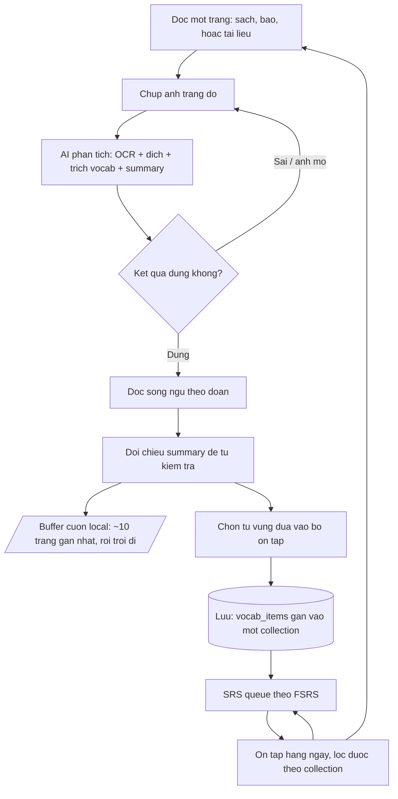

> ⚰️ **BIA MỘ (2026-09-18)** — PRD thế hệ PWA (FR đến 19). Đã thay bằng [docs/prd.md](../prd.md) v2 (09-17, FR đến FR-21). Lưu để truy chuỗi lịch sử.

# Reado — Product Requirements Document

## Document Control

| Field | Value |
|---|---|
| Product | Reado |
| Version | 0.6 |
| Status | Draft |
| Owner | fen |
| Created | 2026-09-07 |
| Last updated | 2026-09-08 |
| Source | [idea.md](../idea.md) |
| Related | [vision.md](vision.md), [research/vocabulary-card-design.md](research/vocabulary-card-design.md), [research/vocabulary-structure.md](research/vocabulary-structure.md), [research/review-scheduling.md](research/review-scheduling.md) |

**Quy ước:** phần diễn giải bằng tiếng Việt; heading, requirement ID và technical
term giữ nguyên English. Đây là source of truth duy nhất — không có bản dịch song
song.

> **v0.3 — đồng bộ theo mô hình collection.** Ba thay đổi ở tầng khái niệm, mọi thứ
> khác suy ra từ chúng:
>
> 1. **`book` + `page_number` được thay bằng `collection`** — một bối cảnh đọc do
>    người dùng tự đặt tên, xử được cả nguồn báo và web vốn không có số trang.
> 2. **Trang không còn được lưu.** Bản song ngữ và summary chỉ sống trong phiên đọc.
>    G-03 chết theo, FR-07 và FR-13 bị bỏ, NFR-04 được thoả bằng thiết kế.
> 3. **Chống trùng chuyển từ ràng buộc `unique` sang bộ lọc lúc trích xuất**, nên
>    một từ nhiều nghĩa được nhiều dòng. Q-07 tan.
>
> Nghiên cứu nền và các hướng đã cân nhắc rồi loại bỏ nằm ở
> [research/vocabulary-structure.md](research/vocabulary-structure.md).

> **v0.4 — tầng lịch ôn được viết ra.** v0.3 dùng chữ "FSRS" ở chín chỗ mà chưa nói
> hệ thống cần **giữ** những gì để FSRS chạy được. v0.4 lấp chỗ đó. Không có thay đổi
> nào ở tầng khái niệm; tất cả là hệ quả của việc đọc kỹ cơ chế:
>
> 1. **Ranh giới ngày trở thành cấu hình.** Nửa đêm hệ thống không phải ranh giới ngày
>    của người học đêm, và streak ở FR-14 đứt oan nếu dùng nó.
> 2. **FR-19 mới — Leech Handling.** FR-10 lọc từ *đã thuộc*; chưa có gì xử lý từ
>    *không bao giờ thuộc*. Ở Reado, một leech thường là dấu hiệu **thẻ sai** chứ không
>    phải người học kém, vì thẻ do AI sinh.
> 3. **Q-11 và Q-12 mới.** Q-11 là chỗ duy nhất mà cơ chế của Anki không cover được
>    thiết kế R2 của Reado, và nó ảnh hưởng cả FR-10.
>
> Toàn bộ lý lẽ ở [research/review-scheduling.md](research/review-scheduling.md).

> **v0.5 — hai chỗ FR va nhau được xử, và prompt có spec.** Không có yêu cầu mới nào;
> v0.5 chỉ làm cho những thứ đã yêu cầu trở nên **kiểm được**:
>
> 1. **FR-14 chốt hiện con số nào.** FR-09 cho card mới đến hạn ngay trong ngày, nên
>    capture 25 trang tạo hàng trăm card cùng `due_at` hôm nay; nhưng FR-11 chỉ đưa
>    `daily_new_limit` vào hàng đợi. Trang chủ hiện tổng số là hiện đúng con số gây
>    choáng mà `daily_new_limit` tồn tại để ngăn.
> 2. **FR-02 có cách thi hành ràng buộc `example`.** *"Câu thật trên trang"* trước đây
>    là lời hứa không kiểm được, nên sẽ bị bỏ qua lúc implement — mà nó là chỗ neo duy
>    nhất còn lại của nguyên lý *Authentic Input* sau khi bỏ lưu trang.
> 3. **[prompt-spec.md](prompt-spec.md) mới.** Prompt và output schema từng bị xếp vào
>    *chi tiết triển khai* ở mục 13, nhưng A-01, A-02 và M-07 đều đứng trên nó. Doc này
>    cũng ghi rõ một chỗ trống chặn A-02: prompt baseline thủ công chưa có trong repo.
>
> Kèm theo, [AGENTS.md](../AGENTS.md) ở root nói thứ tự đọc, những gì không được tranh
> luận lại, và những câu hỏi phải hỏi thay vì tự quyết.

> **v0.6 — các open questions còn lại được owner trả lời.** Không có FR mới; v0.6 chỉ
> ghi lại lời giải 2026-09-08 cho Q-01, Q-02, Q-03, Q-06, Q-08, Q-09, Q-10, Q-12:
>
> 1. **Q-03 — BYOK.** API key nằm trên device, do user tự nhập kèm base URL (mặc định
>    Gemini); proxy hoãn sang *Later*. Key không nhúng vào bundle — NFR-07 được thoả
>    theo nghĩa key thuộc về chính user đó (xem mục 8).
> 2. **Ba quyết định sư phạm/operational.** Q-06: không lemmatize. Q-12: tắt learning
>    steps ở MVP. Q-10: buffer cuộn 10 trang, xoá khi hết phiên.
> 3. **Q-08 + Q-09 hoãn có chủ đích** — chốt khi có dữ liệu review thật, cùng lượt với
>    ngưỡng leech của FR-19.
>
> Chi tiết đầy đủ ở bảng cuối [mục 12](#12-open-questions) và quyết định log trong
> tracker cũ [mvp-plan-pwa-gen.md](mvp-plan-pwa-gen.md) (kế nhiệm: [ROADMAP.md](../../ROADMAP.md)).

---

## 1. Problem Statement

Owner là developer đang tự học tiếng Anh bằng cách đọc sách báo nguyên bản. Quy
trình hiện tại hoàn toàn thủ công:

1. Đọc một trang — sách giấy, bài báo mạng, hoặc tài liệu chuyên ngành lúc làm việc.
2. Chụp ảnh trang đó, gửi lên Gemini kèm một prompt tự soạn.
3. Nhận về: bản song ngữ Anh–Việt theo từng đoạn nhỏ, danh sách từ vựng và cụm từ
   hay kèm phiên âm theo trình độ CEFR, và bản tóm tắt ý chính.

Quy trình này **hiệu quả về mặt học tập** nhưng rò rỉ ở ba điểm:

| Điểm rò rỉ | Hệ quả |
|---|---|
| Output là prose trong chat history | Không tra cứu lại được, không lên lịch ôn được |
| Prompt phải dán lại mỗi lần | Ma sát mỗi trang, chất lượng output không nhất quán |
| Không có cơ chế ôn tập | Từ vựng đã hiểu rồi vẫn quên; công sức mỗi trang mất trắng |

Điểm rò rỉ thứ ba là nghiêm trọng nhất: **giai đoạn hiểu đã được giải quyết, giai
đoạn giữ lại thì chưa tồn tại.**

---

## 2. Goals

| ID | Goal |
|---|---|
| G-01 | Tự động hoá toàn bộ bước 2 của quy trình hiện tại: một ảnh trang sách vào, dữ liệu có cấu trúc ra, không dán prompt |
| G-02 | Biến từ vựng đã trích xuất thành bộ ôn tập spaced repetition, không cần gõ hay copy tay |
| G-03 | Cho phép người dùng tự tổ chức từ vựng thành **collection** theo bối cảnh đọc, và ôn tập theo phạm vi đó |
| G-04 | Đạt một MVP dùng được end-to-end cho một người dùng duy nhất (owner) trong vài tuần |

> **Đổi ở v0.3.** G-03 trước đây là *"giữ lại toàn bộ lịch sử đọc để tra cứu được
> theo sách và theo trang"*. Mục tiêu đó đã bị **bỏ hẳn** — Reado không lưu trang
> nữa. Lý do và cái giá phải trả nằm ở
> [research/vocabulary-structure.md mục 6.2](research/vocabulary-structure.md#62-sáu-bảng-đã-chết).

## 3. Non-Goals

Đây là phần bảo vệ MVP. Những thứ dưới đây **cố ý không làm** ở phiên bản này,
dù chúng có thể hợp lý về sau.

| ID | Non-goal | Lý do |
|---|---|---|
| NG-01 | Pronunciation practice, speech recognition, shadowing | Reado là công cụ đọc; đây là sản phẩm khác |
| NG-02 | Listening / audio content | Ngoài phạm vi nguyên lý *Authentic Input* của việc đọc |
| NG-03 | Nội dung do app soạn sẵn, kho bài đọc | Vi phạm design principle 1 trong [vision.md](vision.md) |
| NG-04 | Chia sẻ deck, social feed, leaderboard | Chưa có người dùng thứ hai |
| NG-05 | Multi-user, authentication, phân quyền | MVP một người dùng; thêm vào sẽ làm chậm G-04 |
| NG-06 | Monetization, subscription, billing | Chỉ xem xét sau khi owner tự dùng đủ lâu để tin sản phẩm có giá trị |
| NG-07 | Ebook / PDF import | Giữ đúng **một** input path là ảnh chụp. Nguồn nào cũng chụp được — trang giấy chụp bằng camera, màn hình chụp bằng screenshot — nên thêm path thứ hai không mở ra nguồn mới, chỉ nhân đôi bề mặt phải bảo trì |
| NG-08 | Grammar explanation, bài tập ngữ pháp | Mở rộng scope không phục vụ job hiện tại |
| NG-09 | Tự viết SRS algorithm | Dùng FSRS đã kiểm chứng; xem [vision.md](vision.md#retention-is-a-solved-problem--use-the-solution) |

---

## 4. Target User

### Primary persona — Solo self-directed learner

| Thuộc tính | Mô tả |
|---|---|
| Ai | Developer, đọc hiểu tiếng Anh ở mức B1–B2, đang chủ động nâng lên |
| Bối cảnh | Đọc sách giấy lúc rảnh, báo mạng và tài liệu chuyên ngành lúc làm việc; luôn có điện thoại bên cạnh |
| Động lực | Muốn đọc được sách thật, không muốn học qua tài liệu dành cho người học |
| Rào cản | Không nhớ được từ đã tra; mỗi trang phải làm lại quy trình thủ công |
| Trình độ kỹ thuật | Cao — tự chịu được việc tự cấu hình API key |

Ở R1, primary persona **chính là owner**. Đây là chủ ý: một người dùng thật, dùng
hàng ngày, cho feedback loop chặt hơn mọi bản nghiên cứu thị trường.

### Secondary segment (chưa build, chỉ ghi nhận)

Người học Việt Nam ở trình độ trung cấp có cùng thói quen đọc sách nguyên bản.
Nhóm này định hình hướng thương mại hoá về sau, nhưng **không** được phép ảnh
hưởng tới scope của R1.

---

## 5. Jobs To Be Done

| ID | Job | Diễn giải |
|---|---|---|
| JTBD-01 | "Khi tôi đọc xong một trang nhưng chưa chắc mình hiểu đúng, tôi muốn thấy nghĩa của từng đoạn ngay lập tức, để không đứt mạch đọc và không bỏ dở giữa chừng." | Giai đoạn comprehend |
| JTBD-02 | "Khi tôi gặp một từ hay mà tôi biết mình sẽ quên, tôi muốn nó tự vào bộ ôn tập kèm câu gốc, để lần sau gặp lại tôi đã nhận ra nó." | Giai đoạn retain |

Hai job này là toàn bộ lý do Reado tồn tại. Mọi FR bên dưới phải truy được về một
trong hai.

---

## 6. Core User Journey

Vòng lặp đóng ở hai chỗ: `Daily → Queue` (ôn lại theo lịch) và `Daily → Read`
(nhận ra từ cũ khi đọc trang mới, đây là tín hiệu tiến bộ thật).

Nhánh `Buffer` là **ngõ cụt có chủ ý**. Bản song ngữ và summary phục vụ JTBD-01
xong thì trôi đi — chúng không được lưu, không lên server, không export. Chỉ từ vựng
đi tiếp vào vòng lặp. Đây là điểm khác lớn nhất so với v0.2, và cái giá của nó được
ghi thẳng ở [nguyên lý 5 của vision.md](vision.md#5-durable-data-not-disposable-chat).

---

## 7. Functional Requirements

Mỗi FR có acceptance criteria dạng Given / When / Then. Một FR chỉ được coi là
xong khi **toàn bộ** criteria của nó pass.

**Thay đổi ở v0.3.** Số hiệu FR được **giữ nguyên** cho requirement còn sống, để
tham chiếu chéo từ các doc research không gãy. FR bị bỏ thì để lại bia mộ tại chỗ
thay vì xoá; FR mới lấy số tiếp theo và được đặt vào epic đúng nghĩa của nó, nên
thứ tự số trong tài liệu không còn liên tục.

| FR | Trạng thái ở v0.3 |
|---|---|
| FR-01, FR-02, FR-05, FR-06, FR-08, FR-10, FR-11, FR-12, FR-16 | Sửa |
| FR-07, FR-13 | **Bỏ** — xem bia mộ tại chỗ |
| FR-17, FR-18 | **Mới** |
| FR-03, FR-04, FR-09, FR-14, FR-15 | Không đổi về bản chất |

| FR | Trạng thái ở v0.4 |
|---|---|
| FR-11, FR-12, FR-15 | Sửa — thêm criterion ở tầng lịch |
| FR-19 | **Mới** |
| Còn lại | Không đổi |

| FR | Trạng thái ở v0.5 |
|---|---|
| FR-02 | Sửa — thêm criterion thi hành ràng buộc `example` |
| FR-14 | Sửa — chốt con số hiển thị khi hạn mức thẻ mới có hiệu lực |
| Còn lại | Không đổi |

### Epic E1 — Capture & Analyze

#### FR-01 — Page Capture

Người dùng đưa được ảnh một trang sách vào hệ thống.

- **Given** người dùng đang ở màn hình capture, **when** họ chụp ảnh bằng camera
  hoặc chọn ảnh có sẵn, **then** ảnh được nạp và hiển thị preview trước khi submit.
- **Given** một ảnh đã nạp, **when** người dùng thấy ảnh bị lệch hoặc thừa viền,
  **then** họ crop hoặc xoay được ảnh trước khi submit.
- **Given** người dùng đang capture, **when** họ gán trang này vào một **collection**,
  **then** họ chọn được collection đã có hoặc tạo collection mới ngay tại chỗ mà
  không rời flow.
- **Given** người dùng không muốn dừng lại để phân loại, **when** họ submit mà không
  chọn collection nào, **then** từ vựng của trang rơi vào **kho tạm** — collection
  mặc định — và vẫn ôn tập được bình thường, không bị treo chờ xử lý.

#### FR-02 — AI Page Analysis

Hệ thống gửi ảnh tới AI và nhận về **structured output**, không phải prose.

- **Given** một ảnh trang rõ nét và CEFR level đã cấu hình, **when** người
  dùng submit, **then** hệ thống trả về đúng ba nhóm dữ liệu:
  - `segments[]` — mỗi phần tử gồm `source_en` và `translation_vi`, chia theo đoạn
    nhỏ đúng thứ tự xuất hiện trên trang. **Chỉ để hiển thị, không lưu** (FR-05);
  - `vocabulary[]` — mỗi phần tử gồm `term`, `pos`, `ipa`, `meaning_vi`, `cefr`, và
    `example` là câu gốc chứa nó trên trang. **Đây là nhóm duy nhất được lưu**;
  - `summary_vi` — tóm tắt ý chính của trang. **Chỉ để hiển thị, không lưu** (FR-06).
- **Given** AI trả về một vocabulary item, **when** hệ thống kiểm tra trước khi cho
  lưu, **then** `example` phải là câu **xuất hiện thật trên trang** chứ không phải
  câu AI tự đặt, và `pos` phải có giá trị — dùng `other` nếu không xác định được.
- **Given** ràng buộc trên cần kiểm được bằng máy, **when** hệ thống nhận
  `vocabulary[]`, **then** nó đối chiếu từng `example` với **văn bản gốc của trang do
  chính lần gọi đó trả về** — tức phần `source_en` ghép lại của `segments[]` — sau khi
  chuẩn hoá khoảng trắng và dấu câu.
- **Given** một `example` **không** đối chiếu được, **when** kết quả hiện ra ở màn hình
  duyệt (FR-03), **then** item đó được **đánh dấu rõ ràng là chưa xác minh** và
  **không** được chọn sẵn để lưu; người dùng vẫn giữ hay sửa được nếu muốn.
- **Given** một `example` không đối chiếu được, **when** hệ thống xử lý, **then** nó
  **không** tự loại item đó đi trong im lặng — tỷ lệ không khớp là tín hiệu chất lượng
  prompt, và ẩn nó đi là mất luôn tín hiệu.
- **Given** analysis đang chạy, **when** người dùng chờ, **then** hệ thống hiển thị
  trạng thái tiến trình rõ ràng, không để màn hình đứng im.
- **Given** AI trả về dữ liệu không đúng schema, **when** hệ thống parse, **then**
  hiển thị lỗi và cho retry, **và không** lưu bản ghi hỏng.
- **Given** cùng một ảnh được submit hai lần liên tiếp do lỗi mạng, **when** cả hai
  lần đều thành công, **then** hệ thống không lưu hai bộ vocabulary trùng nhau.

`segments[]` và `summary_vi` vẫn được yêu cầu từ AI dù không lưu, vì chúng là toàn
bộ JTBD-01 — người dùng cần hiểu trang ngay lúc đọc. Thứ bị bỏ là **lưu trữ**, không
phải tính năng. Ranh giới đó được nói kỹ ở
[research/vocabulary-structure.md mục 6.2](research/vocabulary-structure.md#62-sáu-bảng-đã-chết).

Ba criterion về việc đối chiếu `example` biến một ràng buộc **chỉ là lời hứa** thành
một ràng buộc **kiểm được**. Không có chúng, yêu cầu *"câu thật trên trang"* không có
cách thi hành nào và sẽ bị bỏ qua lúc implement — mà đó là chỗ neo duy nhất còn lại của
nguyên lý 1 trong [vision.md](vision.md#1-authentic-input-over-graded-readers) sau khi
quyết định không lưu trang. Ranh giới giữa authentic input và graded reader nằm đúng ở
một câu ví dụ có thật hay không.

Điểm thiết kế đáng chú ý: `segments[]` vốn *không được lưu*, nhưng nó là **nguyên liệu
để xác minh** trong cùng một lần gọi. Nên hai nhóm dữ liệu tưởng như rời nhau lại phụ
thuộc nhau, và điều đó là một lý do nữa để giữ đúng **một** lần gọi (A-01): tách OCR
thành bước riêng thì mất luôn cơ chế xác minh này.

Prompt cụ thể, output schema, và thuật toán đối chiếu nằm ở
[prompt-spec.md](prompt-spec.md).

#### FR-03 — Review & Correct Before Save

OCR và AI đều sai được. Người dùng phải là người chốt.

- **Given** analysis đã trả kết quả, **when** người dùng xem lại, **then** họ sửa
  được mọi field của từng vocabulary item.

  Ở v0.2 criterion này còn cho sửa cả `translation_vi` của từng segment. Bỏ ở v0.3:
  bản dịch không được lưu, nên sửa nó là công sức đổ vào thứ sẽ trôi đi trong phiên.
- **Given** một vocabulary item không cần thiết, **when** người dùng loại nó,
  **then** nó không được lưu.
- **Given** người dùng chưa xác nhận, **when** họ thoát khỏi màn hình, **then**
  hệ thống cảnh báo trước khi mất kết quả analysis.

#### FR-04 — Capture Failure Handling

- **Given** một ảnh quá mờ, quá tối, hoặc không chứa văn bản đọc được, **when**
  submit, **then** hệ thống báo cụ thể vấn đề và gợi ý chụp lại, thay vì trả về
  dữ liệu bịa.
- **Given** trang không phải tiếng Anh, **when** submit, **then** hệ thống
  báo không hỗ trợ và không tính phí lần gọi đó vào lịch sử.

### Epic E2 — Read (thức thời)

Epic này phục vụ JTBD-01 và **không lưu gì cả**. Nó chạy trên một buffer cuộn nằm
local trong phiên đọc; hết phiên là hết. Đây là thay đổi lớn nhất của v0.3.

#### FR-05 — Bilingual Parallel Reading View

- **Given** một trang vừa được phân tích trong phiên hiện tại, **when** người dùng
  xem nó, **then** các segment hiển thị theo cặp `source_en` và `translation_vi`,
  đúng thứ tự gốc.
- **Given** đang ở reading view, **when** người dùng muốn tự thử sức, **then** họ
  ẩn/hiện được toàn bộ bản dịch bằng một thao tác.
- **Given** một segment đang hiển thị, **when** người dùng chạm vào một vocabulary
  item xuất hiện trong đó, **then** hệ thống hiện nghĩa và IPA của nó ngay tại chỗ.
- **Given** người dùng đã phân tích nhiều trang liên tiếp, **when** họ cuộn ngược
  lại, **then** khoảng **mười trang gần nhất** của phiên còn xem được; trang cũ hơn
  đã trôi khỏi buffer và **không** khôi phục được.
- **Given** một trang sắp trôi khỏi buffer mà người dùng chưa chọn từ vựng nào từ
  nó, **when** điều đó xảy ra, **then** hệ thống cảnh báo trước — vì sau đó công sức
  phân tích trang đó mất trắng.

#### FR-06 — Page Summary

- **Given** một trang trong phiên hiện tại, **when** người dùng xem nó, **then**
  `summary_vi` có sẵn nhưng **mặc định thu gọn**, để không làm hỏng việc tự đọc hiểu
  (design principle 6 trong [vision.md](vision.md)).
- **Given** trang đã trôi khỏi buffer, **when** người dùng tìm lại summary của nó,
  **then** nó không còn — đây là hành vi đúng, không phải lỗi.

#### FR-07 — Book & Page Organization — BỎ ở v0.3

> Reado không lưu `books` và `pages` nữa, nên không còn gì để liệt kê hay mở lại.
> Nhu cầu tổ chức chuyển sang **FR-17 — Collection Management**; phần search trong
> lịch sử đọc biến mất hẳn cùng với G-03. Bia mộ này được giữ lại thay vì xoá, để
> tham chiếu cũ tới FR-07 còn truy được về lý do.

### Epic E3 — Collections & Vocabulary

#### FR-08 — Vocabulary List

- **Given** người dùng mở danh sách từ vựng, **when** dữ liệu hiển thị, **then**
  mỗi item cho thấy `term`, `pos`, `ipa`, `meaning_vi`, `cefr`, câu gốc, và tên
  collection chứa nó.
- **Given** danh sách đã dài, **when** người dùng lọc, **then** lọc được theo
  **collection**, theo `cefr`, và theo trạng thái ôn tập.
- **Given** cùng một `term` có nhiều dòng vì mang nghĩa khác nhau, **when** danh
  sách hiển thị, **then** các dòng đó nằm cạnh nhau và phân biệt được bằng `pos`
  cùng câu gốc — **không** gộp lại thành một.

#### FR-09 — Select Items For Review

- **Given** vocabulary vừa được trích xuất, **when** người dùng chọn, **then** họ
  quyết định item nào trở thành review card — mặc định là **tất cả**, bỏ chọn
  từng item nếu đã biết.
- **Given** một item được chọn, **when** nó được lưu, **then** nó vào SRS queue với
  trạng thái `new` và đến hạn ngay trong ngày.

#### FR-10 — Lọc từ đã thuộc lúc trích xuất

Viết lại hoàn toàn ở v0.3. Chống trùng không còn nằm ở tầng dữ liệu mà ở tầng trích
xuất, vì **trùng lặp là câu hỏi sư phạm chứ không phải câu hỏi toàn vẹn dữ liệu**:
gặp lại một từ chưa thuộc là chuyện *tốt*, chỉ từ đã thuộc mới đáng bỏ qua.

- **Given** AI trả về danh sách vocabulary cho một trang, **when** hệ thống lọc
  trước khi đưa ra cho người dùng chọn, **then** những từ người dùng **đã thuộc** —
  đo bằng FSRS stability vượt một ngưỡng cấu hình được — bị loại khỏi danh sách.
- **Given** việc so khớp, **when** hệ thống chuẩn hoá `term` thành `term_normalized`,
  **then** khác biệt về hoa/thường và khoảng trắng đầu cuối không làm sót.
- **Given** một từ đã có trong kho nhưng **chưa** thuộc, **when** nó xuất hiện lại ở
  trang khác, **then** nó vẫn được đề xuất; người dùng bỏ qua, hoặc lưu thành một
  dòng mới nếu lần này nó mang nghĩa khác.
- **Given** hệ thống lưu một `term` đã tồn tại, **when** ghi vào kho, **then**
  **không** ràng buộc `unique` nào chặn lại. Một dòng là một nghĩa.

Bộ lọc này là **cơ chế chống trùng duy nhất còn lại** sau khi ràng buộc `unique` bị
bỏ, nên chất lượng của nó quan trọng hơn vẻ ngoài. Hai câu hỏi còn treo — ngưỡng "đã
thuộc" đặt ở đâu, và có lemmatize `term_normalized` không (Q-06) — nằm ở mục 12. Lý
lẽ đầy đủ ở
[research/vocabulary-structure.md mục 6.3](research/vocabulary-structure.md#63-vì-sao-không-có-ràng-buộc-unique).

#### FR-17 — Collection Management

Mới ở v0.3. Thay cho FR-07 đã bỏ.

- **Given** người dùng mở danh sách collection, **when** dữ liệu hiển thị, **then**
  mỗi collection cho thấy tên, số từ đang có, và thời điểm thêm từ gần nhất.
- **Given** người dùng muốn tổ chức lại, **when** họ thao tác, **then** họ tạo, đổi
  tên, và xoá được collection.
- **Given** một collection còn từ bên trong, **when** người dùng xoá nó, **then** hệ
  thống nói rõ số từ bị ảnh hưởng và cho chuyển chúng sang collection khác thay vì
  xoá theo.
- **Given** kho tạm là collection mặc định, **when** người dùng thao tác trên nó,
  **then** đổi tên được nhưng **không xoá được** — luôn phải có một chỗ tiếp nhận từ
  chưa phân loại.
- **Given** người dùng mở kho tạm, **when** danh sách hiển thị, **then** từ được sắp
  theo thời điểm thêm, để chọn nguyên lô "20 từ quét chiều hôm qua" trong một thao
  tác rồi chuyển sang collection khác.
- **Given** một từ được chuyển sang collection khác, **when** việc chuyển hoàn tất,
  **then** thẻ của nó **giữ nguyên toàn bộ lịch FSRS** — collection là nhãn ngữ cảnh,
  không phải danh tính của thẻ.

Criterion cuối đáng nói riêng: nó là điều kiện để việc dọn kho tạm không bị người
dùng né vì sợ mất tiến độ ôn tập. Nếu chuyển collection mà reset lịch thì không ai
dọn, và toàn bộ giá trị của FR-18 mất theo.

### Epic E4 — Review

#### FR-11 — Daily Review Queue

- **Given** có card đến hạn, **when** người dùng mở màn hình review, **then** hệ
  thống xếp hàng đợi theo **FSRS** và cho biết còn bao nhiêu card hôm nay.
- **Given** không còn card nào đến hạn, **when** người dùng mở review, **then** hệ
  thống nói rõ đã xong, **không** tự đẩy card chưa tới hạn ra để lấp chỗ.
- **Given** số card mới vượt `daily_new_limit`, **when** hàng đợi được dựng,
  **then** hệ thống chỉ đưa vào tối đa `daily_new_limit` card mới trong ngày và
  hoãn phần còn lại sang các ngày sau; card đến hạn ôn lại **không** bị giới hạn
  này.
- **Given** người dùng đang ôn theo phạm vi hẹp (FR-18), **when** hàng đợi được
  dựng, **then** `daily_new_limit` áp **toàn cục, trước khi lọc phạm vi** — bốn
  collection đang hoạt động vẫn chỉ ra tổng cộng `daily_new_limit` card mới mỗi
  ngày, không phải bốn lần con số đó. Phạm vi quyết định *card nào* được chọn trong
  hạn mức, không nới hạn mức.
- **Given** hệ thống cần biết hôm nay đã giới thiệu bao nhiêu card mới, **when** nó
  đếm, **then** con số được **suy ra từ review log** — số lần chấm trong ngày mà card
  lúc đó đang ở trạng thái `new` — chứ **không** từ một cột counter riêng. Counter và
  log lệch nhau là loại lỗi không ai quan sát được.
- **Given** ranh giới giữa hai ngày, **when** hệ thống quyết định "hôm nay", **then**
  nó dùng một **giờ chuyển ngày cấu hình được** (mặc định 4 giờ sáng), không dùng nửa
  đêm hệ thống.

Giới hạn card mới là yêu cầu bắt buộc, không phải tuỳ chọn. Không có nó, một buổi
capture 25 trang sẽ sinh hơn 200 card đến hạn cùng một ngày, và khối lượng đó đủ
để người dùng bỏ app ngay ở tuần thứ hai — tức phá M-02 và M-07. Xem
[research/vocabulary-card-design.md](research/vocabulary-card-design.md) mục 5.

Hai criterion cuối là hệ quả của việc đọc kỹ cơ chế, và criterion về giờ chuyển ngày
đáng nói riêng vì nó **cứu M-02**: người ôn đều mỗi đêm lúc 1h sáng sẽ bị nửa đêm hệ
thống tính thành ôn cách ngày, nên streak ở FR-14 vừa sai vừa làm chính phép đo thành
vô nghĩa — và nó sai với **đúng nhóm người dùng chăm nhất**. Xem
[research/review-scheduling.md mục 6.2](research/review-scheduling.md#62-chưa-có-định-nghĩa-một-ngày).

Một điểm về hình dạng hàng đợi, ghi ở đây để FR-18 không bị đọc sai: điều kiện đến hạn
`due_at <= now()` **không** đủ để dựng cả queue, vì FR-09 cho card mới đến hạn ngay
trong ngày nên nó cũng thoả điều kiện đó, trong khi criterion trên chặn card mới và
**không** chặn card ôn lại. Hai hạn mức khác nhau cần hai nhánh. Hình dạng query cụ thể
thuộc solution design doc (mục 13).

#### FR-12 — Card Grading

- **Given** một card đang hiển thị mặt trước, **when** người dùng nhìn nó, **then**
  mặt trước chỉ có `term` và `pos` — `pos` ở đây là cách nói *"đang hỏi nghĩa nào"*
  khi cùng một từ có nhiều dòng.
- **Given** một card đang hiển thị mặt trước, **when** người dùng lật thẻ, **then**
  thấy `meaning_vi`, `ipa`, câu gốc, và **tên collection** nơi từ này được gặp.
- **Given** người dùng đã lật thẻ, **when** họ chấm mức độ nhớ, **then** FSRS tính
  lại lịch và card nhận `due_at` mới.
- **Given** mỗi lần chấm, **when** nó được ghi nhận, **then** hệ thống lưu review
  log để sau này đánh giá lại được chất lượng scheduling. Log là **ảnh chụp trạng thái
  card ngay trước lúc chấm**, cộng thêm mức đã chấm — không phải kết quả sau khi chấm.
- **Given** người dùng vừa chấm nhầm, **when** họ bấm undo, **then** card trở lại
  **đúng** trạng thái trước lần chấm đó, kể cả `due_at` và toàn bộ state của FSRS.

Criterion undo khả thi **chỉ vì** log giữ trạng thái cũ; nếu log lưu kết quả sau thì
không có gì để quay về. Đây là loại lỗi người dùng gặp trong tuần đầu — bấm nhầm
*Again* cho một thẻ đã thuộc ba tháng — tức đúng lúc lòng tin vào sản phẩm còn mỏng
nhất. Xem
[research/review-scheduling.md mục 4](research/review-scheduling.md#4-log-là-ảnh-chụp-trước-khi-chấm).

#### FR-13 — Source Context On Card — BỎ ở v0.3

> Không còn trang gốc nào được lưu để mở lại. Nguyên lý 4 của
> [vision.md](vision.md#4-context-is-the-memory-anchor) vẫn được phục vụ, nhưng bằng
> hai thứ nhẹ hơn nằm ngay trên thẻ ở FR-12: **câu gốc** và **tên collection**. Bia
> mộ này giữ lại để tham chiếu cũ tới FR-13 còn truy được về lý do.

#### FR-14 — Daily Progress

- **Given** người dùng mở trang chủ, **when** dữ liệu hiển thị, **then** thấy số
  card đến hạn hôm nay, số trang đã phân tích, và streak ngày ôn liên tục.
- **Given** số card mới đang chờ vượt `daily_new_limit`, **when** trang chủ hiển thị
  số card đến hạn, **then** con số đó là **số card thực sự sẽ được ôn hôm nay** — tức
  đã áp hạn mức thẻ mới — **không** phải tổng số card đang có `due_at` trong quá khứ.
- **Given** người dùng muốn biết còn tồn bao nhiêu, **when** trang chủ hiển thị,
  **then** phần tồn đó (nếu hiện) phải là **một con số riêng, có nhãn riêng**, không
  gộp vào con số "đến hạn hôm nay".
- **Given** một card đã bị đưa ra khỏi hàng đợi vì là leech (FR-19), **when** các con
  số trên được tính, **then** card đó **không** được tính vào bất kỳ con số nào.
- **Given** streak được tính, **when** hệ thống xác định một ngày có ôn hay không,
  **then** nó dùng **giờ chuyển ngày** của FR-11, không dùng nửa đêm hệ thống.

Ba criterion đầu tồn tại vì ba FR va nhau ở đúng con số này: FR-09 cho card mới đến hạn
**ngay trong ngày**, nên một buổi capture 25 trang tạo ra hàng trăm card cùng `due_at`
hôm nay; nhưng FR-11 chỉ đưa `daily_new_limit` card mới vào hàng đợi. Hiện tổng số là
hiện đúng con số gây choáng mà `daily_new_limit` tồn tại để ngăn — tức trang chủ tự phá
cơ chế bảo vệ M-02 và M-07 mà phần còn lại của PRD dựng lên.

Criterion cuối là hệ quả trực tiếp của giờ chuyển ngày ở FR-11: nếu streak dùng nửa đêm
hệ thống trong khi hàng đợi dùng 4 giờ sáng, hai con số trên cùng một màn hình sẽ nói
hai điều khác nhau về cùng một ngày.

#### FR-18 — Scoped Review

Mới ở v0.3. Đây là feature mà collection tồn tại để phục vụ.

- **Given** người dùng mở màn hình review, **when** họ chọn phạm vi, **then** ba chế
  độ dùng được: ôn trong **một** collection, **trộn vài** collection, hoặc **tất
  cả**.
- **Given** người dùng đang ôn theo phạm vi hẹp, **when** họ chấm điểm một card,
  **then** FSRS state được cập nhật **bình thường** — việc lọc chỉ đổi *tập con nào
  được ôn hôm nay*, không đổi cách chấm điểm.
- **Given** có card đến hạn nằm **ngoài** phạm vi đang chọn, **when** màn hình review
  hiển thị, **then** số lượng đó phải **nhìn thấy được**.
- **Given** người dùng muốn ôn card **chưa** đến hạn, **when** họ làm vậy, **then**
  đó là một chế độ riêng, được ghi vào `review_logs` với `mode = cram`, và **không**
  cập nhật FSRS state.

Ba criterion cuối tồn tại vì lọc hàng đợi có thể **phá vỡ hợp đồng ngầm của
scheduler**: FSRS giả định card đến hạn thì được ôn trong ngày đó. Bỏ qua một
collection vài tuần liền tạo một khoản nợ mà scheduler không biết, nên nợ đó phải
được hiện ra chứ không ẩn đi. Phân tích đầy đủ ở
[research/vocabulary-structure.md mục 4.2](research/vocabulary-structure.md#42-lọc-hàng-đợi-có-thể-phá-vỡ-hợp-đồng-của-scheduler).

#### FR-19 — Leech Handling

Mới ở v0.4.

- **Given** một card bị chấm *Again* nhiều lần vượt một ngưỡng cấu hình được, **when**
  ngưỡng bị vượt, **then** card **ra khỏi hàng đợi ôn tập** và được đánh dấu để người
  dùng xem lại.
- **Given** một card vừa bị đánh dấu, **when** người dùng xem nó, **then** hệ thống
  **đề nghị sinh lại thẻ** — vì thẻ do AI sinh nên nguyên nhân khả dĩ nhất là
  `meaning_vi` dịch lệch hoặc câu gốc không đủ để biết đang hỏi nghĩa nào.
- **Given** người dùng xem một card bị đánh dấu, **when** họ quyết định, **then** họ
  chọn được: sinh lại thẻ, sửa tay, đưa trở lại hàng đợi, hoặc xoá hẳn.
- **Given** một card đã ra khỏi hàng đợi, **when** hàng đợi hàng ngày được dựng,
  **then** card đó **không** được tính vào số card đến hạn ở FR-11 và FR-14.

FR-10 lọc từ **đã thuộc**; FR-19 lọc từ **không bao giờ thuộc**. Hai FR là hai đầu của
cùng một câu hỏi — *cái gì xứng đáng còn ở trong bộ ôn tập* — và đó chính là câu hỏi mà
mục 12 đã nhận ra khi gộp Q-06 với Q-08.

Đây là FR riêng chứ không phải criterion của FR-11 vì nó có hành vi riêng, UI riêng và
cấu hình riêng. Chỗ Reado khác Anki: Anki chỉ biết *"người dùng học kém từ này"* nên
hành động duy nhất hợp lý là chôn thẻ, còn Reado **tự sinh cái thẻ đó** nên có thêm một
cách đọc — và cách đọc đó dẫn tới hành động hữu ích hơn. Nó cũng là **tín hiệu chất
lượng extraction đến muộn nhưng chính xác hơn M-03**, vì nó dựa trên việc dùng thật qua
nhiều tuần chứ không phải phản ứng lúc mới duyệt. Ngưỡng cụ thể chưa chốt: ngưỡng của
Anki là mốc tham chiếu, nhưng nếu giả thuyết "leech ở Reado thường là thẻ sai" đúng thì
ngưỡng nên **thấp hơn**, vì phát hiện thẻ sai sớm thì rẻ hơn. Xem
[research/review-scheduling.md mục 7](research/review-scheduling.md#7-hai-đầu-của-cùng-một-câu-hỏi).

### Epic E5 — Settings & Data

#### FR-15 — CEFR Level Setting

> **Tên FR này đã hẹp hơn nội dung của nó.** Nó giữ `cefr_level`, `daily_new_limit`,
> và từ v0.4 thêm các núm điều tiết của FSRS. Tên được giữ nguyên để tham chiếu chéo từ
> các doc research không gãy — đọc nó là *"Learning Settings"*.

- **Given** người dùng đặt CEFR level (A2–C1), **when** một trang được phân tích,
  **then** việc trích xuất vocabulary nhắm vào đúng mức đó — không trả về từ quá
  cơ bản so với trình độ đã khai.
- **Given** level được đổi, **when** người dùng capture trang tiếp theo, **then**
  level mới có hiệu lực; các trang đã phân tích **không** bị phân tích lại.
- **Given** người dùng thấy khối lượng ôn tập không hợp, **when** họ vào settings,
  **then** `daily_new_limit` (FR-11) chỉnh được, mặc định là 10.
- **Given** hệ thống cần một mức retention mục tiêu để tính lịch, **when** nó tính,
  **then** giá trị đó là `request_retention`, mặc định **0.9**, và nó được lưu cùng
  chỗ với hai giá trị trên.
- **Given** tham số FSRS được lưu, **when** chúng được ghi, **then** **số version của
  thuật toán** được ghi kèm. Ở R1 cả hai để trống — R1 dùng tham số mặc định.

Toàn bộ các giá trị này nằm cùng một chỗ: bảng `settings` đúng một hàng, vì Reado là
sản phẩm một người dùng (NG-05). Xem
[research/vocabulary-structure.md mục 6.1](research/vocabulary-structure.md#61-năm-bảng).

`request_retention` là **núm quan trọng nhất của cả hệ thống ôn tập** — nó là thứ duy
nhất đánh đổi trực tiếp giữa "nhớ được bao nhiêu" và "phải ôn bao nhiêu thẻ mỗi ngày",
nên nó không được hardcode. Nhưng **có nên cho người dùng chỉnh hay không thì chưa
chốt**: cho chỉnh sớm thì dễ tự bắn chân, ẩn đi thì mất công cụ điều tiết khối lượng
duy nhất ngoài `daily_new_limit`. R1 để mặc định.

Việc ghi kèm số version không phải bookkeeping thừa: FSRS-5 dùng 19 tham số, FSRS-6
dùng 21, nên lưu một mảng trần rồi nâng thư viện là **silent breakage** — mảng sai độ
dài, và không có gì báo cho tới khi lịch bắt đầu lệch.

#### FR-16 — Data Export

- **Given** người dùng muốn mang dữ liệu đi, **when** họ export, **then** nhận được
  toàn bộ vocabulary kèm `pos`, `ipa`, `meaning_vi`, `cefr`, câu gốc, và **tên
  collection**, ở định dạng nhập được vào Anki (CSV/TSV).
- **Given** người dùng chỉ muốn một phần, **when** họ export, **then** chọn được
  **theo collection** thay vì buộc phải lấy hết.
- **Given** người dùng muốn cả lịch ôn tập, **when** họ export, **then** trạng thái
  FSRS và review log đi kèm ở định dạng máy đọc được (JSON).

Bỏ ở v0.3: phần export page kèm segment. Không còn page nào được lưu để mà export.

---

## 8. Non-Functional Requirements

| ID | Yêu cầu | Tiêu chí |
|---|---|---|
| NFR-01 | Analysis latency | Một trang sách khổ thường: mục tiêu ≤ 15s, p95 ≤ 30s. Con số này là **giả định cần đo lại** ở R1 rồi chốt |
| NFR-02 | AI cost ceiling | Chi phí trung bình mỗi trang phải được **đo và ghi lại** ở R1. Owner đặt ngưỡng chấp nhận sau khi có số thật; không đoán trước |
| NFR-03 | Offline review | Việc ôn tập phải dùng được khi không có mạng. Chỉ bước analysis mới bắt buộc online. Buffer cuộn của FR-05 nằm local nên nó không thêm ràng buộc nào; ở R2, đề xuất `word_relations` phải tải sẵn được để duyệt offline |
| NFR-04 | Privacy & copyright | **Đã được thoả bằng thiết kế ở v0.3, không còn là rủi ro mở.** Ảnh gốc không lưu, toàn văn trang không lưu — thứ duy nhất giữ lại từ một trang là **một câu trích cho mỗi từ vựng**. Bề mặt bản quyền vì thế nhỏ hơn hẳn so với v0.2, và không có gì để rò rỉ hay phải xoá |
| NFR-05 | Data portability | FR-16 phải luôn hoạt động. Người dùng không bị lock-in — đây là điều kiện để owner tin tưởng dồn dữ liệu học tập nhiều năm vào đây |
| NFR-06 | Durability of saved data | Card và review history không được mất khi app crash hay khi analysis lỗi. Dữ liệu đã confirm là dữ liệu đã an toàn |
| NFR-07 | Secret management | API key của AI provider không được nhúng vào client bundle hay lộ trong network trace phía người dùng. **BYOK (chốt 2026-09-08, Q-03):** key do chính user nhập khi dùng, lưu local — không có key của bên thứ ba trong bundle; key đi thẳng từ device tới provider qua HTTPS là key của chính user đó |
| NFR-08 | Cold start to capture | Từ lúc mở app tới lúc chụp được trang: ≤ 3 thao tác. Ma sát ở bước này giết thói quen nhanh nhất |

---

## 9. Success Metrics

Chia làm leading (đo được sớm, phản ánh hành vi) và lagging (đo được muộn, phản
ánh kết quả học tập thật).

### Leading

| ID | Metric | Ngưỡng tin là thành công |
|---|---|---|
| M-01 | Số trang capture mỗi tuần | ≥ 10 trang/tuần, duy trì 4 tuần liên tục |
| M-02 | Review streak | ≥ 5 ngày ôn tập trong 7 ngày |
| M-03 | Tỷ lệ vocabulary item bị sửa tay sau analysis | ≤ 10% — cao hơn nghĩa là prompt hoặc schema cần chỉnh |
| M-04 | Tỷ lệ analysis thất bại phải chụp lại | ≤ 15% |
| M-08 | Tỷ lệ từ được dọn khỏi kho tạm vào collection có tên | ≥ 50% sau 4 tuần — thấp hơn nghĩa là FR-17 không đáng công, và FR-18 mất phần lớn giá trị vì mọi thứ nằm chung một chỗ |

### Lagging

| ID | Metric | Ngưỡng tin là thành công |
|---|---|---|
| M-05 | Retention rate của card đã ôn ≥ 3 lần | ≥ 85% chấm đúng ở lần gặp lại |
| M-06 | Nhận ra từ cũ khi đọc trang mới | Owner tự ghi nhận được hiện tượng này — tín hiệu định tính nhưng là bằng chứng mạnh nhất rằng vòng lặp đang hoạt động |
| M-07 | Quy trình Gemini thủ công bị bỏ hẳn | Owner không còn quay lại cách cũ. Đây là **acceptance test thật của cả sản phẩm** |

M-07 là metric quan trọng nhất trong tài liệu này. Nếu owner vẫn chụp ảnh gửi
Gemini thủ công, Reado đã thất bại bất kể các số còn lại.

---

## 10. Release Scope

### R1 — MVP (mục tiêu G-04)

Toàn bộ vòng lặp ở mục 6 chạy được end-to-end, một người dùng.

| Bao gồm | Loại trừ |
|---|---|
| FR-01, FR-02, FR-03, FR-04 | — |
| FR-05, FR-06 | Buffer cuộn giữ ~10 trang; **cảnh báo trước khi trang trôi** có thể để R2 |
| FR-08, FR-09, FR-10, FR-17 | FR-08 chỉ cần lọc theo collection; **bỏ lọc theo CEFR và trạng thái** sang R2 |
| FR-11, FR-12, FR-14, FR-18 | FR-14 chỉ cần số card đến hạn và streak. FR-18 chỉ cần ba chế độ phạm vi; ~~chế độ cram để R2~~ — **cram theo tag được owner kéo sớm về cuối R1 (2026-09-08, task 3.13)** — xem [rich-vocab-cram-ddl.md](rich-vocab-cram-ddl.md) |
| FR-15, FR-16 | FR-15 chỉ cần `cefr_level` và `daily_new_limit` chỉnh được; `request_retention` để mặc định, **không** mở cho người dùng ở R1 |
| FR-19 | — |
| NFR-03, NFR-04, NFR-05, NFR-06, NFR-07, NFR-08 | NFR-01 và NFR-02 chỉ **đo và ghi nhận** ở R1, chưa chốt ngưỡng |

FR-16 nằm trong R1 dù nghe như tính năng phụ. Lý do: nó là bảo hiểm. Nếu R1 sai
hướng kỹ thuật, dữ liệu học tập vẫn cứu được.

**R1 dùng tham số FSRS mặc định.** Không optimize, không mở núm retention. Lý do:
ngay cả với tham số mặc định thì FSRS vẫn tốt hơn thuật toán cũ của Anki, nên việc
optimize là phần tinh chỉnh chứ không phải điều kiện để R1 hoạt động. Nhưng
`review_logs` phải **đầy đủ ngay từ R1** — nó là dữ liệu huấn luyện, và dữ liệu không
ghi ở R1 thì R2 không có cách nào lấy lại.

**FR-19 nằm trong R1** dù leech chỉ xuất hiện sau vài tuần dùng. Lý do: ngưỡng dựa trên
số lần lapse tích luỹ, nên nếu R1 không đếm thì tới R2 mới đếm là mất toàn bộ lịch sử —
cùng logic với `review_logs` ở trên. Phần đắt của FR-19 là luồng sinh lại thẻ, và phần
đó hoãn được; phần đếm và đưa card ra khỏi hàng đợi thì không.

**Collection là phần bắt buộc của R1**, không phải tính năng thêm thắt: nó thay cho
khái niệm `book` chứ không đứng cạnh, nên FR-17 và FR-18 không hoãn được sang R2 mà
không kéo theo cả FR-01 và FR-08.

### R2 — Sau khi R1 đã dùng hàng ngày ít nhất 4 tuần

- **Feature B — Expand:** bảng `word_relations`, cùng hai chế độ ôn **Phân biệt** và
  **Gợi nhớ theo nhóm**. Xem
  [research/vocabulary-structure.md mục 5](research/vocabulary-structure.md#5-feature-b--expand-quan-hệ-ngữ-nghĩa-r2)
- Chế độ cram **theo các chiều còn lại (collection, độ khó...)** — ôn card chưa đến hạn, không đụng FSRS state (phần còn lại của FR-18; cram theo tag đã về cuối R1 — task 3.13, owner 2026-09-08)
- Lọc vocabulary nâng cao (phần còn lại của FR-08)
- Cảnh báo trước khi trang trôi khỏi buffer (phần còn lại của FR-05)
- Thống kê tiến bộ theo thời gian
- Chốt ngưỡng cho NFR-01 và NFR-02 bằng số liệu thật
- Chỉnh prompt / schema dựa trên M-03

### Later — chỉ xem xét khi R1 và R2 đã chứng minh giá trị

Multi-user và authentication (NG-05), monetization (NG-06), đồng bộ nhiều thiết
bị, và mọi thứ liên quan tới secondary segment. Không thiết kế trước cho các mục
này ở R1 ngoài việc **không tự chặn đường** tới chúng.

---

## 11. Assumptions & Dependencies

| ID | Nội dung | Rủi ro nếu sai |
|---|---|---|
| A-01 | Một multimodal LLM làm được OCR + dịch + trích vocab trong **một lần gọi**, trả về structured output theo schema | Nếu sai, phải tách OCR thành bước riêng — thay đổi kiến trúc pipeline |
| A-02 | Chất lượng output tự động ngang bằng prompt thủ công hiện tại của owner | Nếu kém hơn, M-07 không đạt và sản phẩm mất lý do tồn tại |
| A-03 | Ảnh chụp bằng điện thoại ở điều kiện ánh sáng thường là đủ để OCR chính xác | Nếu sai, cần hướng dẫn chụp hoặc tiền xử lý ảnh |
| A-04 | Owner tự khai CEFR level của mình là đủ chính xác để lọc từ vựng | Nếu sai, từ vựng trích ra lệch trình độ; cần cơ chế hiệu chỉnh |
| A-05 | FSRS dùng được qua một thư viện có sẵn, không phải tự cài đặt | Nếu sai, chi phí R1 tăng đáng kể |
| A-06 | Chi phí AI ở mức sử dụng cá nhân là chấp nhận được | Nếu sai, cần cache, giảm chất lượng ảnh, hoặc đổi model |
| A-07 | Người dùng chịu tạo và duy trì collection thay vì để mọi thứ nằm trong kho tạm | Nếu sai, FR-18 mất phần lớn giá trị và mô hình thoái hoá về một kho phẳng. M-08 là metric đo giả định này |
| A-08 | Người dùng không cần đọc lại trang đã đọc | Nếu sai, quyết định bỏ lưu trang ở v0.3 phải xem lại, và cùng với nó là NFR-04 |

**Dependency bên ngoài:** một AI provider có multimodal + structured output.
Owner đang dùng Gemini và có kinh nghiệm với nó, nên đây là lựa chọn mặc định —
nhưng lớp gọi AI nên được cô lập để đổi provider mà không viết lại app.

---

## 12. Open Questions

Những quyết định chưa chốt. PRD ghi nhận chúng thay vì đoán, vì mỗi câu trả lời
đều thay đổi đáng kể phần triển khai.

Bảng dưới nhảy từ Q-03 sang Q-06: Q-04, Q-05 và Q-07 đã có lời giải ở v0.3 và nằm ở
bảng cuối mục này. Số hiệu được giữ nguyên thay vì đánh lại, để tham chiếu cũ không
trỏ nhầm chỗ.

> **Cập nhật 2026-09-08 (v0.6):** Q-01, Q-02, Q-03, Q-06, Q-10 và Q-12 đã được owner
> trả lời — xem bảng cuối mục. Q-08, Q-09 được **hoãn có chủ đích**: chốt khi có dữ
> liệu review thật (trước khi bật FR-10), cùng lượt với ngưỡng leech của FR-19. Các
> dòng cũ phía dưới được giữ nguyên (quy ước bia mộ).

| ID | Câu hỏi | Vì sao nó quan trọng | Cần chốt trước |
|---|---|---|---|
| Q-01 | Platform: mobile-first PWA hay native app? | Quyết định toàn bộ tech stack, cách truy cập camera, và liệu có push notification thật cho việc nhắc ôn hàng ngày | Bất kỳ dòng code nào |
| Q-02 | Dữ liệu lưu local-only hay cloud ngay từ đầu? | Local đơn giản nhất cho R1; cloud đặt nền cho *Later* nhưng thêm chi phí và độ phức tạp ngay lập tức | Thiết kế data model |
| Q-03 | API key đặt trên device hay sau một backend proxy? | Ràng buộc trực tiếp với NFR-07, và phụ thuộc câu trả lời Q-01 | Thiết kế kiến trúc |
| Q-06 | Bộ lọc ở FR-10 có lemmatize hay không? | `running` và `run`, `took` và `take` là một dòng hay hai. Bớt cấp bách sau khi bỏ ràng buộc `unique`, nhưng vẫn quyết định chất lượng bộ lọc "đã thuộc" | Chốt cách chuẩn hoá `term` |
| Q-08 | Ngưỡng "đã thuộc" ở FR-10 đặt ở đâu? | Đo bằng FSRS stability, nhưng bao nhiêu thì đủ chưa biết. Lọc quá tay thì bỏ sót nghĩa mới của từ cũ; quá lỏng thì thẻ trùng chất đống. Đây là cơ chế chống trùng **duy nhất** còn lại | Trước khi bật FR-10 trong thực tế |
| Q-09 | Bộ lọc "đã thuộc" so khớp trong phạm vi một collection hay toàn cục? | Toàn cục thì chặt hơn, nhưng chặn luôn cả nghĩa mới của một từ đã học ở collection khác | Chốt truy vấn của FR-10 |
| Q-10 | Buffer cuộn giữ bao nhiêu trang, và hết phiên có xoá không? | "Khoảng mười trang" ở FR-05 là con số cảm tính. Quá ít thì mất công phân tích; quá nhiều thì đúng là đang lưu trang bằng cửa sau | Chốt hành vi của FR-05 |
| Q-11 | Hai chế độ ôn của R2 làm FSRS **ước lượng thấp `stability`** — xử lý thế nào? | Đây là chỗ **duy nhất** cơ chế của Anki không cover được thiết kế Reado. Bỏ log của chế độ R2 khỏi việc tính lịch bảo vệ được *số học* của scheduler, nhưng không xoá được sự thật là người dùng đã truy xuất từ đó. Với Anki thì cram là cửa thoát hiểm hiếm dùng; với Reado thì `distinguish` và `recall` là **feature trung tâm**. Hệ quả lan sang **FR-10**: bộ lọc "đã thuộc" sẽ bỏ sót từ thực ra đã thuộc chắc, sinh thẻ trùng — và người dùng sẽ quy kết cho AI extraction chứ không cho scheduler. Ba đường xử lý ở [research/review-scheduling.md mục 8.1](research/review-scheduling.md#81-ba-đường-đi-chưa-chọn). **Chốt một phần 2026-09-08 (owner):** cram theo chủ đề đi đường "chấp nhận" + không đụng FSRS state (xem [rich-vocab-cram-ddl.md](rich-vocab-cram-ddl.md) mục 5); distinguish/recall vẫn mở | **Trước khi bật R2** — ở R1 chưa phát sinh, vì mục 10 đã hoãn cả cram lẫn hai chế độ R2 |
| Q-12 | Có bật learning steps **trong ngày** không? | Bật thì một card mới được ôn lại vài phút sau trong cùng buổi, tức học nhanh hơn nhưng con số "còn bao nhiêu card hôm nay" ở FR-11 và FR-14 **mất tính tất định** — nó tăng lên trong lúc đang ôn. Tắt thì mọi interval tính theo ngày, số đếm chính xác, nhưng card mới phải đợi tới mai | Chốt hành vi hàng đợi của FR-11 |

Q-06 và Q-08 thực chất là một câu hỏi: **cái gì đáng được đưa vào bộ ôn tập lần
nữa?** Đó là câu hỏi sư phạm, không phải câu hỏi kỹ thuật. Phần nghiên cứu nền và
các hướng cần tra tiếp nằm ở
[research/vocabulary-card-design.md](research/vocabulary-card-design.md).

FR-19 là cùng câu hỏi đó hỏi từ đầu ngược lại, nên ngưỡng leech của nó thuộc cùng một
nhóm quyết định với Q-08 — chốt cả hai một lượt thì nhất quán hơn là chốt rời.

### Đã trả lời ở v0.3

| ID | Câu hỏi | Lời giải |
|---|---|---|
| Q-04 | Có lưu ảnh gốc của trang không? | **Không.** Cũng không lưu cả toàn văn trang. Chỉ giữ một câu trích cho mỗi từ vựng — xem NFR-04 |
| Q-05 | Segment chia theo đoạn văn hay theo câu? | **Hạ cấp, không còn là quyết định chặn đường.** Segment không được lưu nên chọn sai chỉ ảnh hưởng một phiên đọc, sửa được bằng prompt bất cứ lúc nào |
| Q-07 | Một `term` mang được mấy nghĩa? | **Bao nhiêu cũng được — mỗi nghĩa một dòng.** Ràng buộc `unique` bị bỏ khỏi schema, nên "một dòng một nghĩa" thành lời khai trung thực và không cần tầng `senses`. Xem [research/vocabulary-structure.md mục 6.3](research/vocabulary-structure.md#63-vì-sao-không-có-ràng-buộc-unique) |

### Đã trả lời 2026-09-08 (v0.6)

| ID | Câu hỏi | Lời giải của owner |
|---|---|---|
| Q-01 | Platform: PWA hay native? | **PWA mobile-first**, chấp nhận iOS không có push thật (đã thống nhất 2026-09-08 trước v0.6) |
| Q-02 | Local-only hay cloud ngay từ đầu? | **Local-first, SQLite.** Đa thiết bị để *Later* (đã thống nhất 2026-09-08 trước v0.6) |
| Q-03 | API key trên device hay sau proxy? | **BYOK ở MVP:** key nằm trên device, user tự nhập kèm base URL tùy chọn (mặc định Gemini); không backend proxy. Proxy hoãn sang *Later*. Hệ quả với NFR-07 ghi ở mục 8 |
| Q-06 | Có lemmatize `term_normalized` không? | **Không.** `run`/`running` là hai dòng; bộ lọc FR-10 chấp nhận giảm độ phủ |
| Q-10 | Buffer cuộn bao nhiêu trang, xoá không? | **10 trang, xoá khi hết phiên** |
| Q-12 | Bật learning steps trong ngày không? | **Tắt ở MVP.** Thẻ mới sau lần chấm đầu đi thẳng vào review (interval ≥ 1 ngày); con số FR-11/FR-14 có tính tất định. Bật lại được bằng setting ở R2 |
| Q-08 | Ngưỡng "đã thuộc" đặt ở đâu? | **Hoãn có chủ đích.** Chốt khi có dữ liệu review thật, cùng lượt Q-09 và ngưỡng leech FR-19 — trước khi bật FR-10 trong thực tế |
| Q-09 | Bộ lọc so trong collection hay toàn cục? | **Hoãn có chủ đích** — cùng lượt và cùng mốc với Q-08 |

---

## 13. Out Of Scope

Ngoài các Non-Goals ở mục 3, tài liệu này **không** đề cập:

- Kiến trúc kỹ thuật, tech stack, data model, thiết kế API — thuộc về một
  solution design doc, sẽ viết sau khi **Q-01 đến Q-03** được chốt. Phần schema đã
  có hình hài ở
  [research/vocabulary-structure.md mục 6](research/vocabulary-structure.md#6-schema),
  nhưng đó là kết quả nghiên cứu chứ chưa phải solution design.
- Thiết kế UI/UX chi tiết, wireframe, design system.
- ~~Nội dung prompt cụ thể gửi cho AI — là chi tiết triển khai của FR-02, sẽ được
  version riêng vì nó cần tinh chỉnh liên tục theo M-03.~~
  > **Đổi ở v0.5.** Prompt **đã có doc riêng**: [prompt-spec.md](prompt-spec.md). Phần
  > "version riêng" vẫn đúng, nhưng "chi tiết triển khai" thì sai: A-01, A-02 và M-07
  > đều đứng trên chính artefact đó, và doc đó cũng là chỗ duy nhất định nghĩa hợp đồng
  > schema giữa AI và `vocab_items`. Không có nó thì mỗi lần implement lại tự nghĩ ra
  > một structure và không ai có chuẩn để so.
