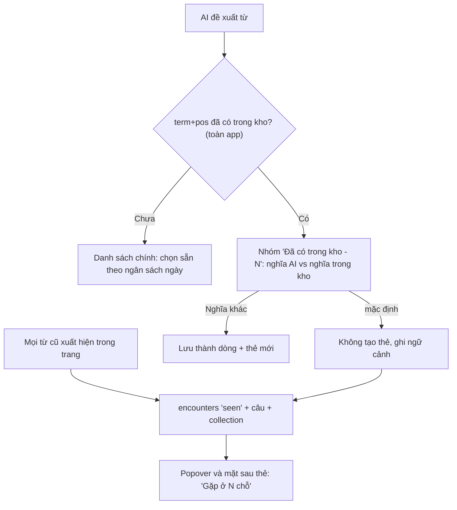

# Plan: vocab-identity-r1 — một từ, một thẻ, nhiều ngữ cảnh

> **Trạng thái:** closed (2026-10-05) - T0–T4 xong (code + test: full 562/566, 4 skip, 0 fail). Nợ không
> chặn khép plan: baseline T0 (chờ fen export), xem tay ca budget = 0, "Ghi gặp lại", PDF thật, mặt sau
> thẻ ở Dynamic Type lớn (có thể là lỗi có sẵn) — ghi ở `docs/session-brief.md` §2.

> ADR: **ADR-066**. Migration: **v7** (`currentVersion` hiện = 6, không nhánh nào tranh số).
> Đảo **Q-09** (ADR-032) cho FR-10; mở rộng FR-09, FR-22. D1-D4 đã fen chốt 2026-10-05
> (D4 = để sau, **không làm spike PDF trong plan này**).

## Vấn đề & bằng chứng

Fen đọc 3-4 trang mỗi ngày (PDF là chính) và thu khoảng **~20 từ mỗi ngày — quá nhiều**.
Ba nguyên nhân cụ thể trong code:

- **Chọn sẵn 5 từ mỗi trang** (`ReviewDraftBuilder.preselectLimit = 5`,
  `Analysis/ReviewDraft.swift:113`). 4 trang thì được 20 từ.
- **Hạn mức thẻ mới mặc định là 10 mỗi ngày** (`daily_new_limit DEFAULT 10`,
  `Database/Migration.swift:221`). Lưu 20 mà học 10 thì tồn đọng tăng khoảng 10 từ/ngày,
  tức khoảng 300 từ/tháng.
- **Từ trùng vẫn sinh thẻ mới.** FR-10 chỉ gặp từ *đã thuộc* (`stability ≥ 21`) trong cùng
  collection (Q-09). Từ đang học, hoặc từ đã có ở collection khác, vẫn hiện bình thường,
  vẫn có thể được chọn sẵn, và lưu ra một `vocab_items` + `cards` mới
  (`VocabRepository.saveCapture`).
- **FR-22 biết từ được gặp lại nhưng không biết gặp ở đâu.** Bảng `encounters` chỉ có
  `(id, vocab_item_id, kind, created_at)`, không có câu và không có nguồn.

**Ý tưởng của fen (2026-10-05):** so khớp theo `term + pos` trên **toàn app**. Gặp lại ở
chỗ khác thì **ghi thêm ngữ cảnh**, không tạo thẻ mới.

**Vì sao đảo Q-09 lúc này:** lý do gốc của Q-09 (ADR-032) và của vocabulary.md §6.3 là
*"gặp lại từ chưa thuộc là tốt"*. Điều đó vẫn đúng. Nhưng lúc chốt Q-09 (2026-09-22) chưa
có FR-22, nên cách duy nhất để "gặp lại" được ghi nhận là tạo thêm một dòng. Giờ đã có
`encounters` (reencounter-r1, đã so khớp **toàn app** cho FR-22 từ đầu), nên giữ được phần
tốt (ghi lần gặp lại) mà không phải trả giá bằng thẻ trùng — thống nhất phạm vi so khớp
giữa FR-10 và FR-22.

**Giữ nguyên:**
- "Một dòng = một nghĩa" (vocabulary.md §6.3): không thêm `unique`, không thêm tầng `senses`.
- Nghĩa khác của cùng khoá vẫn lưu thành dòng mới, do người dùng quyết.

**Phương án khác đã cân nhắc:** không làm gì (tồn đọng tiếp tục tăng, đo được qua baseline
T0, bị loại) · chỉ tăng `daily_new_limit` mặc định (không giải quyết thẻ trùng, chỉ che
triệu chứng) · tầng `senses` riêng để phân biệt nghĩa khi so khớp (quá nặng cho R1, out-of-
scope).

**Tiêu chí thành công** (đo sau 2 tuần, so baseline T0):
- Từ mới mỗi ngày ≈ `daily_new_limit`;
- Thẻ `new` tồn **không tăng**;
- Không có thẻ trùng mới;
- Fen thấy mặt sau thẻ có ngữ cảnh gặp lại.

**Investigation / ADR liên quan đã đọc:** ADR-032 (Q-06/Q-08/Q-09 gốc, lý do Q-09 = "mỗi
collection ≈ một cuốn sách"), ADR-056 (Q-13 phương án B — gập thay vì xoá, nền tảng UI cho
nhóm "Đã có trong kho" ở plan này).

## Fen đã chốt (2026-10-05)

- **D1 — ngân sách chọn sẵn mỗi ngày:** (a) bằng `daily_new_limit`, không thêm setting riêng.
- **D2 — nhóm "Đã có trong kho":** gồm **mọi** từ đã có (đang học, đã thuộc, mọi collection).
- **D3 — ôn theo bộ:** từ gặp lại ở bộ khác **không** kéo vào khi ôn theo bộ đó; thẻ ở lại
  collection gốc. Để R2.
- **D4 — gạch chân trong màn đọc PDF:** **để sau**, không làm trong đợt này (không có T5).

## Điểm sáng (tái dùng được, ít code mới)

| Có sẵn | Ở đâu | Dùng cho |
|---|---|---|
| `EncounterMatcher` so khớp **xuyên collection**, biên từ, cụm dài thắng | `Encounter/EncounterMatcher.swift` | Tìm câu chứa từ cũ để ghi ngữ cảnh |
| Ghi `seen` **cùng transaction** lúc lưu trang | `VocabRepository.swift` (`saveCapture`) | Chỉ cần ghi thêm câu + nguồn, không đổi luồng |
| Nhóm gặp + "nghĩa trong kho" (Q-13, ADR-056) | `ReviewDraftResult.matureHidden`, `MatureHiddenDraft.knownMeanings` | Mở rộng thành nhóm "Đã có trong kho" |
| Thứ tự thẻ mới đã cộng số `seen` (ADR-047) | `ReviewQueue.swift` | Từ gặp nhiều nơi tự lên trước, không cần sửa |
| Không có `unique` trên `vocab_items` | vocabulary.md §6.3 | "Nghĩa khác - dòng mới" vẫn chạy như cũ |
| FSRS tách khỏi `encounters` (ADR-048) | — | Ghi ngữ cảnh không làm bẩn lịch ôn |
| `EncounterRepository.loadLexicon` đã quét **toàn app** (dùng cho FR-22) | `Encounter/EncounterRepository.swift` | Chung một nguồn dữ liệu cho FR-10 toàn app |

## Điểm nghẽn và rủi ro

| # | Điểm nghẽn | Vì sao nghẽn | Cách giảm |
|---|---|---|---|
| N1 | **Đồng âm cùng `term+pos`** (`bank` ngân hàng / bờ sông) | Khoá không phân biệt nghĩa; mặc định "không tạo thẻ" có thể làm mất nghĩa mới nếu fen lướt nhanh | Nhóm gặp hiện **nghĩa AI vừa đưa** cạnh **nghĩa trong kho**; một chạm "Nghĩa khác — lưu thẻ mới" |
| N2 | **Dạng từ AI trả khác dạng trên trang** (AI `take`, trang `took`) | Không lemmatize (Q-06) → `EncounterMatcher` quét segment không thấy → không ghi được ngữ cảnh | Item rơi vào nhóm "Đã có" thì **ghi `seen` tường minh** bằng câu `example` của AI (chỉ khi `verified`), độc lập với matcher quét segment; khử trùng mỗi vocab một dòng mỗi lần lưu |
| N4 | **Ôn theo bộ (FR-18)** không thấy từ gặp lại ở bộ khác | Thẻ chỉ thuộc collection gốc (D3) | Chấp nhận ở R1; ghi vào ADR-066 |
| N5 | **Thẻ trùng cũ vẫn còn** | Plan chỉ chặn từ nay về sau | Đem baseline (T0); công cụ gộp để Later, gộp lịch FSRS tự động dễ hỏng dữ liệu |
| N6 | `loadLexicon` mỗi lần lưu khi kho lớn dần | Đọc toàn bộ `vocab_items` | Đo thời gian lưu ở kho ~2-5k từ trong test T3; quá 200ms thì cache theo phiên (không làm trước, chỉ đo) |
| N7 | **Ngân sách chọn sẵn có thể "giấu" từ hay** ở trang 3, 4 | Từ vẫn hiện nhưng không tự tick | Dòng nhắc "Hôm nay đã chọn đủ N từ mới, phần còn lại tuỳ bạn"; thứ tự AI theo giá trị học (prompt v6) giữ từ đáng nhất lên đầu |
| N9 | **Docs phải sửa nhiều chỗ** | Q-09 nằm trong ADR-032, ADR-056, FR-10 GWT, vocabulary.md §6.3, CLAUDE.md §5 | T0 gom hết một lượt, `grep -n "Q-09"` |
| N10 | **Fen là nút thắt duy nhất xem tay** | Mọi task UI cần chạm thật | Mỗi task ghi rõ 1-2 thao tác xem tay, không dồn cuối |

## Spec

- **FR / journey:**
  - **FR-09:** chọn sẵn theo ngân sách ngày (`daily_new_limit` trừ số đã lưu hôm nay, D1),
    không còn cố định 5 mỗi trang.
  - **FR-10:** so khớp **toàn app** (đảo Q-09), nhóm "Đã có trong kho" (D2: mọi trạng thái,
    mọi collection) thay cho "Đã thuộc".
  - **FR-22:** `encounters` ghi kèm câu + nguồn; popover và mặt sau thẻ hiện nơi gặp.
  - J1 bước 4, J2 bước 4: mô tả nhóm gập đổi; bỏ đoạn "đổi đích tính lại nhóm gập theo bộ
    mới" (ADR-053/fr10-close-r1) — khoá giờ toàn app, không đổi theo đích lưu.
- **Nguyên lý (vision.md):**
  - #3 *Capture at the point of friction*: không bắt lưu lại từ đã có ("cả thái cực ngược
    lại: lưu tất cả mọi từ trong trang").
  - #4 *Context is the memory anchor*: nhiều ngữ cảnh cho một thẻ.
  - *Retention...*: "mỗi ngày giữ thêm vài từ là đủ" — D1 phục vụ trực tiếp.
  - Không đụng NG nào.
- **In-scope:** ngân sách chọn sẵn • so khớp toàn app • nhóm "Đã có trong kho" • ngữ cảnh
  trong `encounters` • hiện ngữ cảnh ở popover và mặt sau thẻ • export các cột mới.
- **Out-of-scope:** gộp thẻ trùng cũ (N5, Later) • lemmatize • tầng `senses` • ôn theo bộ
  kéo từ gặp ở bộ khác (D3, R2) • đổi prompt • **spike gạch chân PDF (D4, không làm)**.
- **Không đụng:**
  - FSRS, `cards`, `review_logs`.
  - `Prompt.version` (giữ **v6**).
  - `PDFPageText`, OCR.
  - Thứ tự hàng đợi ADR-047 (đã cộng `seen` sẵn).
- **Q mở / chỗ thiếu hợp đồng:** không còn — D1-D4 đã fen chốt.

## Tầng 1 — HLD

### Luồng lưu trang (sau plan)



### ReadoKit

- **Migration v7:**
  - `ALTER TABLE encounters ADD COLUMN sentence TEXT;`
  - `ALTER TABLE encounters ADD COLUMN collection_id TEXT REFERENCES collections(id) ON DELETE SET NULL;`
  - Cả hai cho phép NULL (dòng cũ giữ NULL), không rebuild bảng, `kind` CHECK không đổi.
  - **Cần kiểm:** SQLite cho `ADD COLUMN` có `REFERENCES` khi default NULL. Viết test migration.
- **`EncounterMatcher`:** thêm `contexts(in segments: [String]) -> [EncounterContext]`
  (`vocabItemID + câu chứa match`). Tách câu bằng `NLTokenizer(unit: .sentence)`
  (NaturalLanguage, framework hệ thống, không thêm dependency). Giữ nguyên `matches(in:)` /
  `vocabItemIDs(in:)`.
- **`EncounterRepository.insertSeen`:** nhận thêm `contexts` + `collectionID`. Vẫn **không
  tự mở transaction** (caller giữ nguyên kỷ luật). Mỗi vocab một dòng mỗi lần lưu.
- **`VocabRepository`:**
  - Thêm `knownSenses(on:) -> [String: [KnownSense]]`, **không tham số collection**.
  - `KnownSense` gồm `vocabItemID`, `meaningVI`, `collectionName`, `isMature`, `isLeech`.
  - `matureSenses(on:collectionID:)` giữ lại cho code cũ (không xoá, không ai gọi sau khi
    T3 xong thì cân nhắc dọn ở task khác); call site capture chuyển sang `knownSenses`.
  - `saveCapture` nhận thêm `contextOnlyItems`: các item để trong nhóm "Đã có", chỉ ghi
    `seen` với `example`, không tạo thẻ (giải N2).
- **`ReviewDraftBuilder.drafts`:**
  - `matureSenses` param → `knownSenses`.
  - `matureHidden` → `existingHidden` (đổi tên + giữ hành vi gập của ADR-056).
  - Thêm `preselectBudget: Int` thay cho hằng `preselectLimit` cố định (giữ hằng cũ làm
    default để test cũ không vỡ).
  - `regroup` khi đổi đích (ADR-053) **không còn cần tính lại** vì khoá giờ là toàn app.
    Giữ hàm (không xoá, test cũ còn dùng), nhưng `AnalysisView` không cần gọi khi đổi đích
    nữa — cân nhắc bỏ `.onChange(of: analysisTargetCollectionID)` gọi `regroupMatureIfNeeded()`.
- **Ngân sách (T1):** `newSavedToday` = số `vocab_items.created_at` trong
  `ReviewQueue.currentDayWindow`. `preselectBudget = max(0, daily_new_limit - newSavedToday)`.
- **Export (FR-16):** `ExportEncounter` thêm `sentence`, `collectionId` (cho phép rỗng);
  `version` giữ 1 (thêm field, không đổi nghĩa field cũ).

### Reado (app)

- `AppModel+Settings.matureSensesForCapture()` → `knownSensesForCapture()` (bỏ phụ thuộc
  `analysisTargetCollectionID`).
- `AnalysisView`: truyền `knownSenses` + `preselectBudget`. Nhóm gặp đổi nhãn "Đã có trong
  kho - N", mỗi dòng hiện nghĩa AI vs nghĩa trong kho + tên bộ, kèm nút "Nghĩa khác — lưu".
- Popover FR-22 (`Shared/EncounterText.swift`): thêm "Gặp ở N chỗ" + 1-2 câu gần nhất.
- Mặt sau thẻ (`Review/ReviewQueueView+Card.swift`): dưới câu gốc thêm mục "Gặp lại" (tối
  đa 3 câu gần nhất kèm tên bộ). Dữ liệu qua model thẻ ở `ReviewQueue.swift`.

### File cấm / luật

- Không edit tay `project.pbxproj`; thêm file Swift bằng cách tạo trong thư mục
  (synchronized folders).
- Migration theo mẫu các bản trước, test `MigrationAndSeedTests`.

## Điểm tự quyết (đã chốt — Sonnet không quyết lại)

| # | Câu hỏi | Chốt | Ai chốt |
|---|---|---|---|
| Q1 | Ngân sách ngày có bỏ trần 5/trang? | **Giữ trần 5/trang.** Suất chọn sẵn = `min(preselectLimit (5), budget)` | fen 2026-10-05 |
| Q2 | Trang toàn từ cũ (0 từ mới được chọn) có ghi ngữ cảnh? | **Có.** Nút đáy đổi thành "Ghi gặp lại N từ" | fen 2026-10-05 |
| Q3 | `newSavedToday` có tính từ nhập CSV (FR-20) không? | **Có tính** (CSV ghi `created_at` = lúc nhập, không phân biệt được nguồn; nhập CSV hiếm, chỉ ảnh hưởng gợi ý chọn sẵn, không đụng dữ liệu) | plan — ghi ADR-066 |
| Q4 | Đổi tên `matureHidden`/`MatureHiddenDraft` → `existingHidden`? | **Không đổi tên** (10 test `regroup` + nhiều call site; đổi tên = churn rủi ro). Đổi nghĩa + doc comment | plan |
| Q5 | Giữ tham số `matureSenses:` cũ của `drafts`/`regroup`? | **Giữ** (test cũ dùng); thêm `knownSenses:` mới, ưu tiên khi không rỗng | plan |
| Q6 | Câu ngữ cảnh dài (OCR thiếu dấu câu → "câu" = cả đoạn)? | Cắt cửa sổ ±120 ký tự quanh từ khớp, nối "…", tối đa ~300 ký tự | plan |
| Q7 | Trang context-only có lưu phiên đọc (FR-05/06)? | **Có**, cùng luật cũ (bộ có tên + có nội dung) — trang vẫn được đọc | plan |
| Q8 | Từ leech trong nhóm "Đã có"? | Vào nhóm, nhãn "đang ở Từ hay quên"; **không** ghi `seen` (giữ `testSaveCaptureSkipsSeenForLeechedWords`); key toàn leech thì ẩn nút chọn | plan (theo plan gốc T3) |
| Q9 | Popover ghi "Gặp ở N chỗ" hay "Gặp lại N lần"? | **"Gặp lại N lần"** (N = số dòng `seen`; mỗi lần lưu trang = 1) | plan |
| Q10 | JSON export: `collectionId` hay `collectionID`? | **`collectionID`** (theo `ExportVocabItem` sẵn có; không có CodingKeys) | plan — sửa câu trong HLD cũ |
| Q11 | Thêm `.linkedFramework("NaturalLanguage")` vào `Package.swift`? | **Không** trước; `import NaturalLanguage` tự link. Nếu link lỗi → dừng, báo fen | plan |

---

## Tầng 2 — Tasks

Thứ tự: **T0 → T1 (đợt 1, ship riêng được) → T2 → T3 → T4**. T0 làm trước (baseline đo
trước/sau cần có sớm + gỡ nợ docs một lượt); T1 nên làm ngay sau — giảm tồn đọng sớm nhất
mà không đụng schema.

### T0 — docs + baseline (không code)

- **Baseline từ dữ liệu thật** (fen export JSON qua FR-16 — Settings → Dữ liệu → Xuất dữ
  liệu, hoặc chạy trên DB):

```sql
-- số khoá trùng và số dòng thừa
SELECT term_normalized, pos, COUNT(*) AS n FROM vocab_items
GROUP BY 1, 2 HAVING n > 1 ORDER BY n DESC;
-- thẻ mới đang tồn
SELECT COUNT(*) FROM cards WHERE state = 'new' AND suspended_at IS NULL;
-- từ mới lưu mỗi ngày, 14 ngày gần nhất
SELECT substr(created_at, 1, 10) AS d, COUNT(*) FROM vocab_items
GROUP BY d ORDER BY d DESC LIMIT 14;
```

Ghi kết quả vào `docs/journal/<ngày>.md`. Đây là thước đo trước/sau của cả plan.
- **ADR-066:**
  - Đảo Q-09 cho FR-10 (giữ nguyên "toàn app" cho FR-22 — vốn đã vậy từ reencounter-r1),
    kèm lý do ("FR-22 đã ghi được gặp lại, không cần thẻ trùng để giữ phần tốt của Q-09 cũ").
  - Ghi D1-D4 (D4 = để sau).
  - Hệ quả: N4 (ôn theo bộ không kéo từ bộ khác), N5 (thẻ trùng cũ còn đó, Later).
- **Sửa docs:**
  - `prd.md`: FR-09 GWT 1, FR-10 GWT 1 và 3, FR-22 thêm GWT ngữ cảnh. Thêm ghi chú phiên bản.
  - `db.md`: cột mới của `encounters`.
  - `vocabulary.md` §6.3: thêm một đoạn nối sang ADR-066.
  - `CLAUDE.md` §5: dòng Q-09.
  - `journeys.md`: J1/J2b bước duyệt.
- **DoD:** `grep -n "Q-09" docs CLAUDE.md` không còn câu nào mâu thuẫn • baseline đã ghi •
  fen OK ADR-066.

(T1–T4 chi tiết — mỗi task có chữ ký, số dòng, test cụ thể)

### T1 — ngân sách chọn sẵn mỗi ngày (không đổi schema)

**ReadoKit**

1. `ReadoKit/Sources/ReadoKit/Vocab/VocabRepository.swift` — thêm (cạnh `saveCapture`):
   ```swift
   /// FR-09 / ADR-066 D1: số từ đã lưu trong NGÀY HỌC hiện tại (giờ chuyển ngày FR-11).
   /// Tính cả từ nhập CSV (Q3 — không phân biệt được nguồn).
   public static func newSavedToday(on db: SQLiteDatabase, now: Date) throws -> Int {
       let window = ReviewQueue.currentDayWindow(on: db, now: now)
       return Int(try db.scalarInt64(
           "SELECT COUNT(*) FROM vocab_items WHERE created_at >= ? AND created_at < ?;",
           [.text(window.start), .text(window.end)]) ?? 0)
   }
   ```
   `ReviewQueue.currentDayWindow(on:now:)` ở `Review/ReviewQueue.swift:264` trả
   `DayBoundary.DayWindow { start: String; end: String }` — **chuỗi ISO, không phải Date**.
2. `ReadoKit/Sources/ReadoKit/Analysis/ReviewDraft.swift`:
   - `drafts(from:selectedLevels:matureSenses:)` (L129) thêm tham số cuối
     `preselectBudget: Int = preselectLimit`.
   - Trong vòng lặp (L134-169) đổi `preselectedCount < preselectLimit` thành
     `preselectedCount < min(preselectLimit, max(0, preselectBudget))` (Q1). Giữ nguyên
     `isEligibleForPreselect` (L176) và việc unverified/suspect không chiếm suất.

**App**

3. `Reado/App/AppModel+Settings.swift` — thêm cạnh `matureSensesForCapture()` (L109), theo
   đúng pattern `guard let database … read(...)`:
   ```swift
   /// FR-09 / ADR-066 D1: suất chọn sẵn còn lại hôm nay = daily_new_limit − đã lưu hôm nay.
   func preselectBudgetForCapture() -> (budget: Int, dailyLimit: Int) {
       guard let database else { return (ReviewDraftBuilder.preselectLimit, 0) }
       let now = clock.now
       return read("ngân sách chọn sẵn", fallback: (ReviewDraftBuilder.preselectLimit, 0)) {
           let limit = try SettingsService.load(on: database).dailyNewLimit
           let saved = try VocabRepository.newSavedToday(on: database, now: now)
           return (max(0, limit - saved), limit)
       }
   }
   ```
4. `Reado/Analysis/AnalysisView.swift`:
   - `@State private var budgetExhausted = false` và `@State private var dailyNewLimit = 0` cạnh
     `aiPreselectedCount` (L24).
   - `syncDraftsIfNeeded()` (L340-357): trước khi gọi `drafts(...)` (L344), lấy
     `let quota = model.preselectBudgetForCapture()`; truyền `preselectBudget: quota.budget`;
     sau khi gán `drafts`: `budgetExhausted = quota.budget == 0 && drafts.contains { $0.verification == .verified }`,
     `dailyNewLimit = quota.dailyLimit`. Tính **một lần** (như `aiPreselectedCount`), không tính
     lại khi đổi đích.
   - Header Section "Đã chọn X/Y" (L651-663): khi `budgetExhausted` hiện
     `Label("Hôm nay đã đủ \(dailyNewLimit) từ mới — phần còn lại tuỳ bạn chọn", systemImage: "checkmark.circle")`
     (`Typo.meta`, `.secondary`) — thay chỗ dòng "AI chọn sẵn" (dòng đó tự ẩn vì
     `aiPreselectedCount == 0`).

**Test** — `ReadoKit/Tests/ReadoKitTests/ReviewDraftBuilderTests.swift` (helper `vocabIn` L8):
- `testDraftBuilderBudgetZeroPreselectsNothing` — 8 verified, `preselectBudget: 0` → 0 chọn.
- `testDraftBuilderBudgetThreePreselectsFirstThreeEligible` — thứ tự AI giữ nguyên.
- `testDraftBuilderBudgetAboveLimitStillCapsAtFive` — `preselectBudget: 10`, 8 verified → 5 (Q1).
- `testDraftBuilderBudgetUnverifiedDoesNotConsumeSlot` — budget 2, unverified đứng đầu.
- Test cũ `...PreselectsTopFiveOfEightVerified` phải còn xanh không sửa (default = 5).

File mới `ReadoKit/Tests/ReadoKitTests/NewSavedTodayTests.swift`:
- Dùng `Fixtures.seededDB()` (`fixedNow = 2026-09-18T02:00:00Z` = 09:00 giờ VN, cutoff 4h)
  + `Fixtures.insertVocab(in:collectionID:term:createdAt:)`.
- Ca: 2 từ hôm nay + 1 từ hôm qua → 2. Từ lúc `2026-09-17T20:59:00Z` (03:59 VN, trước mốc 4h
  → ngày hôm trước) không tính; `2026-09-17T21:00:00Z` (04:00 VN) có tính. Đổi
  `day_cutoff_hour` bằng `SettingsService.update(on:cefrLevels:dailyNewLimit:dayCutoffHour:)`
  (`SettingsTests.swift:30` làm mẫu) → mốc dịch theo.

**DoD**
- `scripts/test.sh kit` rồi full `scripts/test.sh` xanh.
- Ảnh: `scripts/sim_screens.sh open analysis-fixture --seed empty --fresh` → còn chọn sẵn như cũ
  (budget 10, trang có 2 từ). Ca budget = 0: không có seed sẵn — **fen xem tay**: Cài đặt đặt
  "Từ mới mỗi ngày" = 1, phân tích 2 trang → trang 2 thấy dòng "Hôm nay đã đủ 1 từ mới…".
- Ghi ADR-066: Q1, Q3.

---

### T2 — dữ liệu ngữ cảnh (migration v7 + matcher + repository + export)

**ReadoKit**

1. `ReadoKit/Sources/ReadoKit/Database/Migration.swift`:
   - `currentVersion` (L10) 6 → **7**; cập nhật comment liệt kê version (L5-8).
   - Thêm `static let v7Statements: [String]` (một ALTER mỗi câu — comment L18):
     ```swift
     "ALTER TABLE encounters ADD COLUMN sentence TEXT;",
     "ALTER TABLE encounters ADD COLUMN collection_id TEXT REFERENCES collections(id) ON DELETE SET NULL;",
     ```
     Cột nullable, không DEFAULT → SQLite cho ADD kèm REFERENCES khi `foreign_keys = ON`.
   - Trong `run(on:upTo:)` (L244) thêm `case 6:` **chép đúng mẫu `case 3:` (L273-279)** — không
     theo mẫu v6 (v6 tắt FK để rebuild bảng, v7 không cần).
2. `ReadoKit/Sources/ReadoKit/Encounter/EncounterMatcher.swift` — `import NaturalLanguage`, thêm:
   ```swift
   public struct EncounterContext: Equatable, Sendable {
       public let vocabItemID: String
       public let sentence: String?
       public init(vocabItemID: String, sentence: String?)
   }
   /// Mỗi vocab một ngữ cảnh (lần khớp ĐẦU TIÊN), cùng thứ tự `vocabItemIDs(in:)`.
   public func contexts(in texts: [String]) -> [EncounterContext]
   static func sentence(containing range: Range<String.Index>, in text: String) -> String
   ```
   - `contexts`: với mỗi text, `matches(in:)` (L80); mỗi `EncounterMatch.entries` (một term
     có thể nhiều dòng — giống `vocabItemIDs` L130) → `vocabItemID` chưa gặp thì ghi
     `sentence(containing: match.range, in: text)`.
   - `sentence`: `NLTokenizer(unit: .sentence)`, `tokenizer.string = text`,
     `tokenizer.enumerateTokens(in: text.startIndex..<text.endIndex)` → lấy câu chứa
     `range.lowerBound`; trim khoảng trắng. Câu > 300 ký tự (Q6): lấy từ
     `max(câu.start, match.lower − 120 ký tự)` đến `min(câu.end, match.upper + 120 ký tự)`,
     nới về ranh giới khoảng trắng gần nhất, thêm "…" ở đầu/cuối bị cắt.
   - Giữ nguyên `matches(in:)`, `vocabItemIDs(in:)`.
3. `ReadoKit/Sources/ReadoKit/Encounter/EncounterRepository.swift`:
   - private `insert(on:vocabItemID:kind:createdAt:)` (L124) thêm `sentence: String? = nil,
     collectionID: String? = nil`; SQL (L129) thành
     `INSERT INTO encounters (id, vocab_item_id, kind, created_at, sentence, collection_id) VALUES (?, ?, ?, ?, ?, ?);`
     (`nil` → `.null`).
   - Thêm overload chính:
     ```swift
     @discardableResult
     public static func insertSeen(
         on db: SQLiteDatabase, contexts: [EncounterContext], collectionID: String?, now: Date
     ) throws -> Int   // KHÔNG tự mở transaction; khử trùng theo vocabItemID trong lần gọi
     ```
   - `insertSeen(on:vocabItemIDs:now:)` (L21) giữ chữ ký, thân gọi overload mới với
     `sentence: nil`, `collectionID: nil` → 15+ test cũ không phải sửa.
4. `ReadoKit/Sources/ReadoKit/Vocab/VocabRepository.swift` `saveCapture` (L176-272), đoạn cuối
   (L264-269) đổi thành:
   ```swift
   if let seenMatcher {
       let contexts = seenMatcher.contexts(in: segments.map(\.sourceEN))
       try EncounterRepository.insertSeen(on: db, contexts: contexts, collectionID: targetID, now: now)
   }
   ```
   (`targetID` đã resolve sẵn L185-201 — kho tạm cũng có id.)
5. `ReadoKit/Sources/ReadoKit/Export/ExportService.swift`:
   - `ExportEncounter` (L119-125) thêm `public let sentence: String?`, `public let collectionID: String?`
     (Optional để bản export cũ vẫn decode — `testExportBundleCodableRoundTrip`).
   - SQL (L305-306) thêm `sentence, collection_id`; map ở L307-314. `version` giữ **1** (L327).
6. `ReadoKit/Sources/ReadoKit/Dev/DevSeed.swift` L62 — để nguyên (gọi overload cũ, sentence NULL).

**Test**
- `AppleAgentStoreTests.swift:22` đang ghi cứng `user_version == 6` → đổi
  `Migration.run(on: db)` thành `Migration.run(on: db, upTo: 6)` ở test đó (giữ ý nghĩa
  "test bước v5→v6"). Grep thêm `user_version;"), 6` cho chắc không còn chỗ khác.
- `MigrationAndSeedTests.swift` — mới `testMigrationV6ToV7AddsEncounterContextColumns`, chép mẫu
  `AppleAgentStoreTests.swift:10` (`SQLiteDatabase(inMemory:)` → `run(upTo: 6)` → `Seeder.seed`
  → insert vocab + 1 encounter cũ → `run(on:)`): `user_version == 7`; dòng cũ `sentence IS NULL`;
  `PRAGMA foreign_key_check` rỗng; `PRAGMA foreign_keys == 1`.
- `testDeletingCollectionNullsEncounterCollectionKeepsRow` — encounter có `collection_id` = bộ
  X, xoá X qua `deleteCollection(... moveWordsTo:)` → dòng còn, `collection_id IS NULL`.
- `EncounterMatcherTests.swift`: `contexts` trả đúng câu (2 câu, từ ở câu 2); cụm nhiều chữ;
  `'s` sở hữu; một vocab gặp 2 lần → 1 context (lần đầu); câu 500 ký tự không dấu chấm → ≤ ~300
  ký tự, chứa từ, có "…".
- `EncounterRepositoryTests.swift` (helper `segments(_:)` L199): `saveCapture` có segments → dòng
  `seen` có `sentence` + `collection_id = targetID`; kho tạm → `collection_id` = id kho tạm; giữ
  nguyên các test seen cũ L203-285 (gồm lưu lỗi → 0 seen, leech → 0 seen).
- `ExportTests.swift` mở rộng `testJSON_includesEncounters` (L120): field mới có mặt, dòng cũ nil.

**DoD**: kit + full `scripts/test.sh` xanh. Không UI. Ghi ADR-066: Q6, Q10, Q11.

---

### T3 — so khớp toàn app + nhóm "Đã có trong kho" + "Ghi gặp lại"

**ReadoKit**

1. `Vocab/VocabRepository.swift` — thêm (giữ `matureSenses` L143 nguyên vẹn):
   ```swift
   public struct KnownSense: Equatable, Sendable {
       public let vocabItemID: String
       public let meaningVI: String
       public let collectionName: String
       public let isMature: Bool
       public let isLeech: Bool
       public init(...)
   }
   /// ADR-066: mọi từ đã có, MỌI collection, mọi trạng thái (D2). Một phần tử mỗi vocab_item.
   public static func knownSenses(on db: SQLiteDatabase) throws -> [String: [KnownSense]]
   ```
   SQL (ngưỡng đọc như `matureSenses` L146-148: `known_stability`, fallback
   `defaultMatureStability`):
   ```sql
   SELECT v.id, v.term_normalized, v.pos, v.meaning_vi, col.name AS collection_name,
     MAX(CASE WHEN c.state = 'review' AND c.stability >= ? AND c.suspended_at IS NULL THEN 1 ELSE 0 END) AS is_mature,
     MAX(CASE WHEN c.suspended_at IS NOT NULL THEN 1 ELSE 0 END) AS is_leech
   FROM vocab_items v
   JOIN collections col ON col.id = v.collection_id
   LEFT JOIN cards c ON c.vocab_item_id = v.id
   GROUP BY v.id ORDER BY v.created_at, v.id;
   ```
   Khoá: **`matureKey(term: term_normalized, pos: pos)`** (L122) — dùng đúng hàm để khớp tuyệt
   đối với khoá phía draft.
2. `Analysis/ReviewDraft.swift`:
   - `MatureHiddenDraft` (L81-91): thêm `public let knownSenses: [KnownSense]`; `knownMeanings`
     thành computed `knownSenses.map(\.meaningVI)`; giữ init cũ `init(draft:knownMeanings:)`
     (bọc mỗi meaning thành `KnownSense(vocabItemID: "", meaningVI: m, collectionName: "", isMature: true, isLeech: false)`)
     + init mới `init(draft:knownSenses:)`.
   - `drafts(...)`: thêm `knownSenses: [String: [KnownSense]] = [:]` (trước `preselectBudget`).
     Logic: `let lookup = knownSenses.isEmpty ? wrap(matureSenses) : knownSenses` rồi khớp như
     L138-151 hiện tại. `regroup` (L239) thêm tham số tương tự (Q5).
   - Doc comment `matureHidden`: nay là "đã có trong kho (toàn app)" — tên giữ (Q4).
3. File mới `Encounter/ContextOnlyItem.swift`:
   ```swift
   /// ADR-066: từ để lại trong nhóm "Đã có" — không tạo thẻ, chỉ ghi `seen`.
   public struct ContextOnlyItem: Equatable, Sendable {
       public let term: String
       public let pos: String
       /// Câu AI đưa — chỉ truyền khi draft `verified` (N2), còn lại nil.
       public let example: String?
       public init(term: String, pos: String, example: String?)
   }
   ```
4. `VocabRepository.saveCapture` (L176) thêm `contextOnly: [ContextOnlyItem] = []` (trước `now`):
   - Guard L184 → `guard !items.isEmpty || !contextOnly.isEmpty else { return 0 }`.
   - Trong transaction, **trước** vòng chèn item: với mỗi `ContextOnlyItem`, lấy id
     `SELECT v.id FROM vocab_items v WHERE v.term_normalized = ? AND lower(trim(v.pos)) = ? AND NOT EXISTS (SELECT 1 FROM cards k WHERE k.vocab_item_id = v.id AND k.suspended_at IS NOT NULL)`
     (tham số `normalizedTerm(term)`, pos lower/trim — cùng cách `matureKey`). Leech bị loại (Q8).
   - Cuối transaction: `var contexts = seenMatcher?.contexts(...) ?? []`; với mỗi id từ
     context-only **chưa có** trong `contexts` → thêm `EncounterContext(vocabItemID: id, sentence: item.example)`.
     Một lần `insertSeen(on:contexts:collectionID: targetID, now:)` (tự khử trùng).
   - Phiên đọc vẫn ghi theo luật cũ khi `items` rỗng (Q7). Trả về `count` (số từ mới) như cũ.

**App**

5. `Reado/App/AppModel+Settings.swift`: thêm `knownSensesForCapture() -> [String: [KnownSense]]`
   (mẫu `matureSensesForCapture` L109, **không** đọc `analysisTargetCollectionID`). Không xoá
   `matureSensesForCapture` (kiểm `grep` — hết call site thì xoá được, ghi vào handoff).
6. `Reado/App/AppState.swift:88` `SaveConfirmation` thêm `var contextCount: Int = 0`.
7. `Reado/App/AppModel+Capture.swift` `saveSelection` (L107):
   - Thêm tham số `contextOnly: [ContextOnlyItem] = []`, truyền xuống `saveCapture`.
   - Điều kiện thành công `if saved > 0` (L125) → `if saved > 0 || !contextOnly.isEmpty`; đặt
     `SaveConfirmation(count: saved, …, contextCount: contextOnly.count)`.
   - Hàm trả `saved` như cũ.
8. `Reado/App/RootView.swift:172-179` banner: `count > 0` → giữ "Đã lưu N từ vào X"; `count == 0`
   → "Đã ghi gặp lại M từ ở X". Vẫn "Xem".
9. `Reado/Analysis/AnalysisView.swift`:
   - `syncDraftsIfNeeded` (L344): `knownSenses: model.knownSensesForCapture()` thay
     `matureSenses:`; `matureMeaningsByID` đổi thành `knownSensesByID: [String: [KnownSense]]`
     (L29-32).
   - **Bỏ** `.onChange(of: model.capture.analysisTargetCollectionID) { regroupMatureIfNeeded() }`
     (L199) và xoá `regroupMatureIfNeeded()` (L363-376) — khoá toàn app không đổi theo đích.
     `ReviewDraftBuilder.regroup` + test giữ nguyên.
   - Section (L675-688): nhãn `"Đã có trong kho · \(matureHiddenDrafts.count)"`; dưới nhãn (trong
     DisclosureGroup, dòng đầu) `Text("Không tạo thẻ mới — chỉ ghi lần gặp lại. Chọn nếu trang này dùng nghĩa khác.")`
     `Typo.meta` `.secondary`.
   - `contextOnlyDrafts` = `matureHiddenDrafts.filter { !$0.isSelected && !allLeech($0) }`.
   - `saveBar` (L402-416): `selectedCount > 0` → "Lưu N từ vào X" (cũ); `selectedCount == 0 &&
     !contextOnlyDrafts.isEmpty` → "Ghi gặp lại \(contextOnlyDrafts.count) từ"; disabled khi cả hai 0.
   - `save()` (L442-471): truyền `contextOnly: contextOnlyDrafts.map { ContextOnlyItem(term: $0.term, pos: $0.pos, example: $0.verification == .verified ? $0.example : nil) }`;
     guard `saved > 0` (L452) → `saved > 0 || !contextOnly.isEmpty`.
10. `Reado/Analysis/ReviewCardRow.swift:171-215` `MatureHiddenRow`: nhận `knownSenses: [KnownSense]`
    thay `knownMeanings`. Hiện "Trang này: …" (giữ) + mỗi sense một dòng
    `"\(meaningVI) — \(collectionName) · \(status)"`, status: leech → "đang ở Từ hay quên",
    mature → "đã thuộc", còn lại → "đang học". Nút tròn 44pt giữ, `accessibilityLabel("Nghĩa khác — lưu thẻ mới")`;
    **ẩn nút** khi mọi sense `isLeech` (Q8).

**Fixture ảnh** — file mới `scripts/fixtures/analysis-known.json` (cùng schema `analysis-demo.json`):
segments chứa "keystone", "setback", "quitting"; vocabulary: `setback` (noun — `markMature` sẵn ở
Kho tạm → "đã thuộc"), `keystone` (noun, meaning **"viên đá đỉnh vòm"** — khác nghĩa trong CSV
"nền tảng then chốt" ở bộ Demo Habits → "đang học"), `quitting` (verb, mới → danh sách chính).

**Test**
- File mới `KnownSensesTests.swift` (mẫu DB `MatureSensesTests.swift`): khớp xuyên 2 collection;
  trạng thái new/learning/review đều có; `isMature` theo `known_stability`; leech → `isLeech`
  true; một vocab 2 card → 1 phần tử; collectionName đúng.
- `ReviewDraftBuilderTests`: từ có ở bộ khác → vào `matureHidden`, không chọn sẵn, không chiếm
  suất; `knownSenses` ưu tiên hơn `matureSenses`; 10 test `regroup` cũ xanh không sửa.
- `EncounterRepositoryTests` (`saveCapture`): `items` rỗng + 1 contextOnly → 0 thẻ mới, 1 `seen`
  có `sentence` = câu trang (khi segments chứa từ) hoặc = example (khi không chứa — N2);
  contextOnly + matcher cùng vocab → **1** dòng; contextOnly leech → 0 dòng; contextOnly
  `example: nil` và không khớp segment → 1 dòng `sentence` NULL; items + contextOnly cùng lúc.
- Đo N6: `testKnownSensesAndSaveCaptureTimingAt3000Words` dùng `measure {}`, **không assert** —
  ghi số vào journal.

**DoD**
- kit + full xanh.
- Ảnh: `scripts/sim_screens.sh open analysis-fixture-mature --fixture scripts/fixtures/analysis-known.json --seed demo --fresh`
  → `shot after-known-group` light+dark: nhóm "Đã có trong kho · 2", keystone hiện 2 nghĩa +
  tên bộ + "đang học". (Debug flag mở nhóm và tự chọn dòng đầu — `AnalysisView.swift:222-227`.)
- **Fen xem tay:** (a) trang PDF có từ cũ ở bộ khác → lưu xong, chạy query T0 đếm khoá trùng
  không tăng; (b) bỏ chọn hết từ mới → nút "Ghi gặp lại N từ" → banner đúng.
- Cập nhật `journeys.md` J1 bước 4 nếu còn câu "đổi đích tính lại nhóm gập" (T0 có thể đã sửa —
  grep `tính lại`). ADR-066: Q4, Q5, Q7, Q8.

---

### T4 — hiện ngữ cảnh: popover + mặt sau thẻ

**ReadoKit**

1. `Encounter/EncounterRepository.swift` — thêm:
   ```swift
   public struct EncounterContextRow: Equatable, Sendable {
       public let sentence: String
       public let collectionName: String?   // nil = bộ đã xoá (SET NULL)
       public let createdAt: Date
   }
   /// Mới nhất trước; chỉ `seen` có câu.
   public static func recentContexts(on db: SQLiteDatabase, vocabItemID: String, limit: Int) throws -> [EncounterContextRow]
   ```
   SQL: `SELECT e.sentence, col.name, e.created_at FROM encounters e LEFT JOIN collections col ON col.id = e.collection_id WHERE e.vocab_item_id = ? AND e.kind = 'seen' AND e.sentence IS NOT NULL ORDER BY e.created_at DESC, e.id DESC LIMIT ?;`
   Số lần: dùng `count(on:vocabItemID:kind: .seen)` có sẵn (L63).
2. `Review/ReviewQueue.swift` `ReviewItem` (L276-303): thêm `public let vocabItemID: String` và
   `public let contexts: [EncounterRepository.EncounterContextRow]`; init thêm 2 tham số **có
   default** (`""`, `[]`). Chỗ dựng duy nhất `hydrate` (L349-387, item L371): SQL thêm
   `v.id AS vocab_item_id`; mỗi item gọi `recentContexts(limit: 3)` rồi lọc bỏ câu trùng
   `example` (trim, so không phân biệt hoa thường).

**App**

3. `Reado/App/AppModel+Encounter.swift` — cạnh `hasRecognizedToday` (L19), cùng pattern
   `readQuietly`:
   `func encounterSummary(_ vocabItemID: String) -> (seenCount: Int, recent: [EncounterRepository.EncounterContextRow])`
   (`recent` limit 2).
4. `Reado/Shared/EncounterText.swift` `EncounterSheet.entryCard` (L122-146): dưới
   `Label("Đã gặp ở …")` — nếu `seenCount > 0`: `Text("Gặp lại \(seenCount) lần")` (Q9,
   `Typo.meta` `.secondary`) + tối đa 2 câu `Text(sentence).font(.subheadline).italic().lineLimit(3)`
   kèm tên bộ (`collectionName ?? "bộ đã xoá"`). Nạp trong `.onAppear` (L115) vào
   `@State [String: (Int, [Row])]` theo `vocabItemID`.
5. `Reado/Review/ReviewQueueView+Card.swift` mặt sau (L269-295): sau
   `Text(item.collectionName)` — nếu `!item.contexts.isEmpty`: `Divider()`, tiêu đề
   `Text("Gặp lại").font(Typo.meta)`, mỗi context `Text(sentence).font(.subheadline).italic().lineLimit(2)`
   + dòng tên bộ `Typo.meta` `.secondary`. **Cần xác minh bằng ảnh:** thẻ có chiều cao cố định?
   nội dung có bị cắt? card có `.drawingGroup()` (L65) — nếu cắt thì giữ `lineLimit(2)` và tối đa
   2 context thay vì 3, ghi lại.

**Dữ liệu ảnh (DEBUG)** — `Dev/DevSeed.swift` `gradeHistory` (gần L57-63): sau `insertSeen` cũ,
thêm 2 dòng `seen` có câu cho vocab đầu tiên qua `insertSeen(on:contexts:collectionID:now:)`
với câu cố định ghi rõ là demo (vd `"Demo: \(term) appears again in another chapter."`) và
`collectionID` = bộ của vocab. Cập nhật `DevSeedTests` nếu có assert số dòng encounters.

**Test**
- `EncounterRepositoryTests`: `recentContexts` thứ tự mới nhất trước, `limit`, bỏ `recognized`,
  bỏ `sentence` NULL, `collectionName` nil khi bộ bị xoá.
- `ReviewQueueAndServiceTests`: `loadFullQueue` → item có `vocabItemID` đúng, `contexts` ≤ 3,
  không chứa câu trùng `example`.

**DoD**
- kit + full xanh.
- Ảnh: `scripts/sim_screens.sh open encounter-sheet --seed demo-reviewed --fresh` → popover có
  "Gặp lại N lần" + câu (light+dark).
- **Fen xem tay:** lật một thẻ có ≥ 2 ngữ cảnh trên máy thật (DebugLaunch không lật thẻ được) —
  câu không bị cắt, đọc được ở Dynamic Type lớn.
- Khép plan: dòng 3 → `closed (YYYY-MM-DD) - …`, `git mv` sang `docs/plans/done/`, sửa con trỏ
  ở `docs/session-brief.md`/`ROADMAP.md`, `node scripts/verify/check-doc-links.mjs`.

---

## Verification

| Task | Tự động | Tay (fen) | Số đo |
|---|---|---|---|
| T0 | — | Export/chạy query | Baseline: khoá trùng, thẻ new tồn, từ mới mỗi ngày |
| T1 | `ReviewDraftTests` | Phân tích 4 trang trong ngày | Từ mới mỗi ngày ≤ `daily_new_limit` |
| T2 | Migration + matcher + export tests | — | — |
| T3 | Draft builder + save tests | 1 trang PDF có từ cũ | Thẻ trùng mới = 0 sau 1 tuần |
| T4 | Card model tests | 1 thẻ có ≥ 2 ngữ cảnh | — |

Mỗi task đóng bằng `/rhandoff`, chạy full `scripts/test.sh` trước khi đóng.
