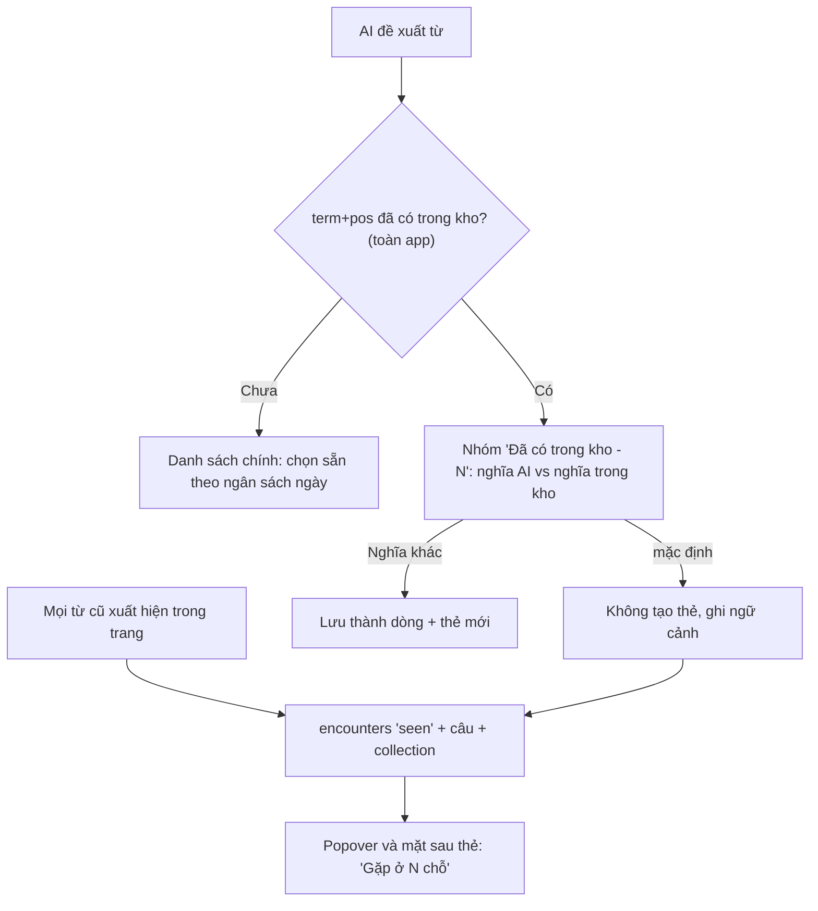

# Plan: vocab-identity-r1 — một từ, một thẻ, nhiều ngữ cảnh

> **Trạng thái:** open (2026-10-05) - T0 xong (ADR-066 + docs đồng bộ, baseline chờ fen export);
> T1-T4 còn lại.

> ADR: **ADR-066**. Migration: **v7** (`currentVersion` hiện = 6, không nhánh nào tranh số).
> Đảo **Q-09** (ADR-032) cho FR-10; mở rộng FR-09, FR-22. D1-D4 đã fen chốt 2026-10-05
> (D4 = để sau, **không làm spike PDF trong plan này**).

## Vấn đề & bằng chứng

Fen đọc 3-4 trang mỗi ngày (PDF là chính) và thu khoảng **~20 từ mỗi ngày — quá nhiều**.
Ba nguyên nhân cụ thể trong code:

- **Chọn sẵn 5 từ mỗi trang** (`ReviewDraftBuilder.preselectLimit = 5`,
  `Analysis/ReviewDraft.swift:113`). 4 trang thì được 20 từ.
- **Hạn mức thẻ mới mặc định là 10 mỗi ngày** (`daily_new_limit DEFAULT 10`,
  `Database/Migration.swift:221`). Lưu 20 mà học 10 thì tồn đọng tăng khoảng 10 từ/ngày,
  tức khoảng 300 từ/tháng.
- **Từ trùng vẫn sinh thẻ mới.** FR-10 chỉ gặp từ *đã thuộc* (`stability ≥ 21`) trong cùng
  collection (Q-09). Từ đang học, hoặc từ đã có ở collection khác, vẫn hiện bình thường,
  vẫn có thể được chọn sẵn, và lưu ra một `vocab_items` + `cards` mới
  (`VocabRepository.saveCapture`).
- **FR-22 biết từ được gặp lại nhưng không biết gặp ở đâu.** Bảng `encounters` chỉ có
  `(id, vocab_item_id, kind, created_at)`, không có câu và không có nguồn.

**Ý tưởng của fen (2026-10-05):** so khớp theo `term + pos` trên **toàn app**. Gặp lại ở
chỗ khác thì **ghi thêm ngữ cảnh**, không tạo thẻ mới.

**Vì sao đảo Q-09 lúc này:** lý do gốc của Q-09 (ADR-032) và của vocabulary.md §6.3 là
*"gặp lại từ chưa thuộc là tốt"*. Điều đó vẫn đúng. Nhưng lúc chốt Q-09 (2026-09-22) chưa
có FR-22, nên cách duy nhất để "gặp lại" được ghi nhận là tạo thêm một dòng. Giờ đã có
`encounters` (reencounter-r1, đã so khớp **toàn app** cho FR-22 từ đầu), nên giữ được phần
tốt (ghi lần gặp lại) mà không phải trả giá bằng thẻ trùng — thống nhất phạm vi so khớp
giữa FR-10 và FR-22.

**Giữ nguyên:**
- "Một dòng = một nghĩa" (vocabulary.md §6.3): không thêm `unique`, không thêm tầng `senses`.
- Nghĩa khác của cùng khoá vẫn lưu thành dòng mới, do người dùng quyết.

**Phương án khác đã cân nhắc:** không làm gì (tồn đọng tiếp tục tăng, đo được qua baseline
T0, bị loại) · chỉ tăng `daily_new_limit` mặc định (không giải quyết thẻ trùng, chỉ che
triệu chứng) · tầng `senses` riêng để phân biệt nghĩa khi so khớp (quá nặng cho R1, out-of-
scope).

**Tiêu chí thành công** (đo sau 2 tuần, so baseline T0):
- Từ mới mỗi ngày ≈ `daily_new_limit`;
- Thẻ `new` tồn **không tăng**;
- Không có thẻ trùng mới;
- Fen thấy mặt sau thẻ có ngữ cảnh gặp lại.

**Investigation / ADR liên quan đã đọc:** ADR-032 (Q-06/Q-08/Q-09 gốc, lý do Q-09 = "mỗi
collection ≈ một cuốn sách"), ADR-056 (Q-13 phương án B — gập thay vì xoá, nền tảng UI cho
nhóm "Đã có trong kho" ở plan này).

## Fen đã chốt (2026-10-05)

- **D1 — ngân sách chọn sẵn mỗi ngày:** (a) bằng `daily_new_limit`, không thêm setting riêng.
- **D2 — nhóm "Đã có trong kho":** gồm **mọi** từ đã có (đang học, đã thuộc, mọi collection).
- **D3 — ôn theo bộ:** từ gặp lại ở bộ khác **không** kéo vào khi ôn theo bộ đó; thẻ ở lại
  collection gốc. Để R2.
- **D4 — gạch chân trong màn đọc PDF:** **để sau**, không làm trong đợt này (không có T5).

## Điểm sáng (tái dùng được, ít code mới)

| Có sẵn | Ở đâu | Dùng cho |
|---|---|---|
| `EncounterMatcher` so khớp **xuyên collection**, biên từ, cụm dài thắng | `Encounter/EncounterMatcher.swift` | Tìm câu chứa từ cũ để ghi ngữ cảnh |
| Ghi `seen` **cùng transaction** lúc lưu trang | `VocabRepository.swift` (`saveCapture`) | Chỉ cần ghi thêm câu + nguồn, không đổi luồng |
| Nhóm gặp + "nghĩa trong kho" (Q-13, ADR-056) | `ReviewDraftResult.matureHidden`, `MatureHiddenDraft.knownMeanings` | Mở rộng thành nhóm "Đã có trong kho" |
| Thứ tự thẻ mới đã cộng số `seen` (ADR-047) | `ReviewQueue.swift` | Từ gặp nhiều nơi tự lên trước, không cần sửa |
| Không có `unique` trên `vocab_items` | vocabulary.md §6.3 | "Nghĩa khác - dòng mới" vẫn chạy như cũ |
| FSRS tách khỏi `encounters` (ADR-048) | — | Ghi ngữ cảnh không làm bẩn lịch ôn |
| `EncounterRepository.loadLexicon` đã quét **toàn app** (dùng cho FR-22) | `Encounter/EncounterRepository.swift` | Chung một nguồn dữ liệu cho FR-10 toàn app |

## Điểm nghẽn và rủi ro

| # | Điểm nghẽn | Vì sao nghẽn | Cách giảm |
|---|---|---|---|
| N1 | **Đồng âm cùng `term+pos`** (`bank` ngân hàng / bờ sông) | Khoá không phân biệt nghĩa; mặc định "không tạo thẻ" có thể làm mất nghĩa mới nếu fen lướt nhanh | Nhóm gặp hiện **nghĩa AI vừa đưa** cạnh **nghĩa trong kho**; một chạm "Nghĩa khác — lưu thẻ mới" |
| N2 | **Dạng từ AI trả khác dạng trên trang** (AI `take`, trang `took`) | Không lemmatize (Q-06) → `EncounterMatcher` quét segment không thấy → không ghi được ngữ cảnh | Item rơi vào nhóm "Đã có" thì **ghi `seen` tường minh** bằng câu `example` của AI (chỉ khi `verified`), độc lập với matcher quét segment; khử trùng mỗi vocab một dòng mỗi lần lưu |
| N4 | **Ôn theo bộ (FR-18)** không thấy từ gặp lại ở bộ khác | Thẻ chỉ thuộc collection gốc (D3) | Chấp nhận ở R1; ghi vào ADR-066 |
| N5 | **Thẻ trùng cũ vẫn còn** | Plan chỉ chặn từ nay về sau | Đem baseline (T0); công cụ gộp để Later, gộp lịch FSRS tự động dễ hỏng dữ liệu |
| N6 | `loadLexicon` mỗi lần lưu khi kho lớn dần | Đọc toàn bộ `vocab_items` | Đo thời gian lưu ở kho ~2-5k từ trong test T3; quá 200ms thì cache theo phiên (không làm trước, chỉ đo) |
| N7 | **Ngân sách chọn sẵn có thể "giấu" từ hay** ở trang 3, 4 | Từ vẫn hiện nhưng không tự tick | Dòng nhắc "Hôm nay đã chọn đủ N từ mới, phần còn lại tuỳ bạn"; thứ tự AI theo giá trị học (prompt v6) giữ từ đáng nhất lên đầu |
| N9 | **Docs phải sửa nhiều chỗ** | Q-09 nằm trong ADR-032, ADR-056, FR-10 GWT, vocabulary.md §6.3, CLAUDE.md §5 | T0 gom hết một lượt, `grep -n "Q-09"` |
| N10 | **Fen là nút thắt duy nhất xem tay** | Mọi task UI cần chạm thật | Mỗi task ghi rõ 1-2 thao tác xem tay, không dồn cuối |

## Spec

- **FR / journey:**
  - **FR-09:** chọn sẵn theo ngân sách ngày (`daily_new_limit` trừ số đã lưu hôm nay, D1),
    không còn cố định 5 mỗi trang.
  - **FR-10:** so khớp **toàn app** (đảo Q-09), nhóm "Đã có trong kho" (D2: mọi trạng thái,
    mọi collection) thay cho "Đã thuộc".
  - **FR-22:** `encounters` ghi kèm câu + nguồn; popover và mặt sau thẻ hiện nơi gặp.
  - J1 bước 4, J2 bước 4: mô tả nhóm gập đổi; bỏ đoạn "đổi đích tính lại nhóm gập theo bộ
    mới" (ADR-053/fr10-close-r1) — khoá giờ toàn app, không đổi theo đích lưu.
- **Nguyên lý (vision.md):**
  - #3 *Capture at the point of friction*: không bắt lưu lại từ đã có ("cả thái cực ngược
    lại: lưu tất cả mọi từ trong trang").
  - #4 *Context is the memory anchor*: nhiều ngữ cảnh cho một thẻ.
  - *Retention...*: "mỗi ngày giữ thêm vài từ là đủ" — D1 phục vụ trực tiếp.
  - Không đụng NG nào.
- **In-scope:** ngân sách chọn sẵn • so khớp toàn app • nhóm "Đã có trong kho" • ngữ cảnh
  trong `encounters` • hiện ngữ cảnh ở popover và mặt sau thẻ • export các cột mới.
- **Out-of-scope:** gộp thẻ trùng cũ (N5, Later) • lemmatize • tầng `senses` • ôn theo bộ
  kéo từ gặp ở bộ khác (D3, R2) • đổi prompt • **spike gạch chân PDF (D4, không làm)**.
- **Không đụng:**
  - FSRS, `cards`, `review_logs`.
  - `Prompt.version` (giữ **v6**).
  - `PDFPageText`, OCR.
  - Thứ tự hàng đợi ADR-047 (đã cộng `seen` sẵn).
- **Q mở / chỗ thiếu hợp đồng:** không còn — D1-D4 đã fen chốt.

## Tầng 1 — HLD

### Luồng lưu trang (sau plan)



### ReadoKit

- **Migration v7:**
  - `ALTER TABLE encounters ADD COLUMN sentence TEXT;`
  - `ALTER TABLE encounters ADD COLUMN collection_id TEXT REFERENCES collections(id) ON DELETE SET NULL;`
  - Cả hai cho phép NULL (dòng cũ giữ NULL), không rebuild bảng, `kind` CHECK không đổi.
  - **Cần kiểm:** SQLite cho `ADD COLUMN` có `REFERENCES` khi default NULL. Viết test migration.
- **`EncounterMatcher`:** thêm `contexts(in segments: [String]) -> [EncounterContext]`
  (`vocabItemID + câu chứa match`). Tách câu bằng `NLTokenizer(unit: .sentence)`
  (NaturalLanguage, framework hệ thống, không thêm dependency). Giữ nguyên `matches(in:)` /
  `vocabItemIDs(in:)`.
- **`EncounterRepository.insertSeen`:** nhận thêm `contexts` + `collectionID`. Vẫn **không
  tự mở transaction** (caller giữ nguyên kỷ luật). Mỗi vocab một dòng mỗi lần lưu.
- **`VocabRepository`:**
  - Thêm `knownSenses(on:) -> [String: [KnownSense]]`, **không tham số collection**.
  - `KnownSense` gồm `vocabItemID`, `meaningVI`, `collectionName`, `isMature`, `isLeech`.
  - `matureSenses(on:collectionID:)` giữ lại cho code cũ (không xoá, không ai gọi sau khi
    T3 xong thì cân nhắc dọn ở task khác); call site capture chuyển sang `knownSenses`.
  - `saveCapture` nhận thêm `contextOnlyItems`: các item để trong nhóm "Đã có", chỉ ghi
    `seen` với `example`, không tạo thẻ (giải N2).
- **`ReviewDraftBuilder.drafts`:**
  - `matureSenses` param → `knownSenses`.
  - `matureHidden` → `existingHidden` (đổi tên + giữ hành vi gập của ADR-056).
  - Thêm `preselectBudget: Int` thay cho hằng `preselectLimit` cố định (giữ hằng cũ làm
    default để test cũ không vỡ).
  - `regroup` khi đổi đích (ADR-053) **không còn cần tính lại** vì khoá giờ là toàn app.
    Giữ hàm (không xoá, test cũ còn dùng), nhưng `AnalysisView` không cần gọi khi đổi đích
    nữa — cân nhắc bỏ `.onChange(of: analysisTargetCollectionID)` gọi `regroupMatureIfNeeded()`.
- **Ngân sách (T1):** `newSavedToday` = số `vocab_items.created_at` trong
  `ReviewQueue.currentDayWindow`. `preselectBudget = max(0, daily_new_limit - newSavedToday)`.
- **Export (FR-16):** `ExportEncounter` thêm `sentence`, `collectionId` (cho phép rỗng);
  `version` giữ 1 (thêm field, không đổi nghĩa field cũ).

### Reado (app)

- `AppModel+Settings.matureSensesForCapture()` → `knownSensesForCapture()` (bỏ phụ thuộc
  `analysisTargetCollectionID`).
- `AnalysisView`: truyền `knownSenses` + `preselectBudget`. Nhóm gặp đổi nhãn "Đã có trong
  kho - N", mỗi dòng hiện nghĩa AI vs nghĩa trong kho + tên bộ, kèm nút "Nghĩa khác — lưu".
- Popover FR-22 (`Shared/EncounterText.swift`): thêm "Gặp ở N chỗ" + 1-2 câu gần nhất.
- Mặt sau thẻ (`Review/ReviewQueueView+Card.swift`): dưới câu gốc thêm mục "Gặp lại" (tối
  đa 3 câu gần nhất kèm tên bộ). Dữ liệu qua model thẻ ở `ReviewQueue.swift`.

### File cấm / luật

- Không edit tay `project.pbxproj`; thêm file Swift bằng cách tạo trong thư mục
  (synchronized folders).
- Migration theo mẫu các bản trước, test `MigrationAndSeedTests`.

## Tầng 2 — Tasks

Thứ tự: **T0 → T1 (đợt 1, ship riêng được) → T2 → T3 → T4**. T0 làm trước (baseline đo
trước/sau cần có sớm + gỡ nợ docs một lượt); T1 nên làm ngay sau — giảm tồn đọng sớm nhất
mà không đụng schema.

### T0 — docs + baseline (không code)

- **Baseline từ dữ liệu thật** (fen export JSON qua FR-16 — Settings → Dữ liệu → Xuất dữ
  liệu, hoặc chạy trên DB):

```sql
-- số khoá trùng và số dòng thừa
SELECT term_normalized, pos, COUNT(*) AS n FROM vocab_items
GROUP BY 1, 2 HAVING n > 1 ORDER BY n DESC;
-- thẻ mới đang tồn
SELECT COUNT(*) FROM cards WHERE state = 'new' AND suspended_at IS NULL;
-- từ mới lưu mỗi ngày, 14 ngày gần nhất
SELECT substr(created_at, 1, 10) AS d, COUNT(*) FROM vocab_items
GROUP BY d ORDER BY d DESC LIMIT 14;
```

Ghi kết quả vào `docs/journal/<ngày>.md`. Đây là thước đo trước/sau của cả plan.
- **ADR-066:**
  - Đảo Q-09 cho FR-10 (giữ nguyên "toàn app" cho FR-22 — vốn đã vậy từ reencounter-r1),
    kèm lý do ("FR-22 đã ghi được gặp lại, không cần thẻ trùng để giữ phần tốt của Q-09 cũ").
  - Ghi D1-D4 (D4 = để sau).
  - Hệ quả: N4 (ôn theo bộ không kéo từ bộ khác), N5 (thẻ trùng cũ còn đó, Later).
- **Sửa docs:**
  - `prd.md`: FR-09 GWT 1, FR-10 GWT 1 và 3, FR-22 thêm GWT ngữ cảnh. Thêm ghi chú phiên bản.
  - `db.md`: cột mới của `encounters`.
  - `vocabulary.md` §6.3: thêm một đoạn nối sang ADR-066.
  - `CLAUDE.md` §5: dòng Q-09.
  - `journeys.md`: J1/J2b bước duyệt.
- **DoD:** `grep -n "Q-09" docs CLAUDE.md` không còn câu nào mâu thuẫn • baseline đã ghi •
  fen OK ADR-066.

### T1 — ngân sách chọn sẵn mỗi ngày (đợt 1, độc lập, không đổi schema)

- **ReadoKit:**
  - `ReviewDraftBuilder.drafts(..., preselectBudget:)`: mặc định = `preselectLimit` để test
    cũ không đổi.
  - Hàm `VocabRepository.newSavedToday(on:now:)`.
- **App:** `AnalysisView` tính budget từ `daily_new_limit` (D1). Khi budget = 0 thì hiện
  dòng "Hôm nay đã đủ N từ mới — phần còn lại tuỳ bạn chọn".
- **Test:**
  - budget 0 → không chọn sẵn từ nào;
  - budget 3 → chọn sẵn 3 từ đủ điều kiện đầu;
  - unverified/suspect vẫn không chiếm suất;
  - qua giờ chuyển ngày (FR-11) thì budget hồi lại.
- **DoD:** test xanh • fen xem tay: phân tích trang 1 thấy chọn sẵn, trang thứ N sau khi
  đủ ngân sách thấy dòng nhắc • sau 1 tuần dùng, so số từ mới mỗi ngày với baseline T0.

### T2 — dữ liệu ngữ cảnh (migration v7 + matcher + repository + export)

- Migration v7 (N3 không còn — đã xác nhận `currentVersion=6`, không nhánh nào tranh số);
  `EncounterMatcher.contexts(in:)`; `insertSeen` nhận ngữ cảnh; `saveCapture` truyền câu +
  `targetID`; export thêm field.
- **Test:**
  - migration từ phiên bản trước lên: dòng cũ có `sentence` NULL;
  - xoá collection thì `collection_id` thành NULL, encounter vẫn còn;
  - matcher trả đúng câu chứa từ, kể cả cụm nhiều chữ và dấu `'s`;
  - lưu lỗi thì không có `seen` (FR-22 GWT 4 giữ nguyên);
  - export có field mới.
- **DoD:** kit test xanh • full `scripts/test.sh` xanh.

### T3 — so khớp toàn app + nhóm "Đã có trong kho"

- `knownSenses`, `drafts(knownSenses:)`, `existingHidden`, `saveCapture(contextOnlyItems:)`.
- UI nhóm gặp mới + "Nghĩa khác → lưu" (N1).
- Từ dạng leech: vẫn vào nhóm, có nhãn "đang ở Từ hay quên", không có nút lưu lại.
- **Test (thuần ReadoKit):**
  - từ có ở collection khác → vào nhóm, không chọn sẵn;
  - từ đang học cùng collection → vào nhóm;
  - "Nghĩa khác" → tạo dòng + thẻ mới;
  - để nguyên trong nhóm → 0 thẻ mới, 1 `seen` có câu (N2);
  - đổi đích lưu (ADR-053) không làm đổi nhóm.
- **DoD:** test xanh • fen xem tay một trang PDF có từ cũ: nhóm hiện đủ nghĩa + tên bộ,
  lưu xong không có thẻ trùng (đếm bằng query T0).

### T4 — hiện ngữ cảnh: popover + mặt sau thẻ

- Popover FR-22: "Gặp ở N chỗ" + 1-2 câu.
- Mặt sau thẻ: mục "Gặp lại", tối đa 3 câu, mới nhất trước, kèm tên bộ. Dòng cũ không có
  câu thì chỉ đếm, không hiện câu.
- **Test:** model thẻ nạp đúng ngữ cảnh, thứ tự đúng, giới hạn 3, không lấy dòng
  `recognized` không có câu.
- **DoD:** test xanh • fen xem tay một thẻ có ≥ 2 ngữ cảnh trên máy thật.

## Verification

| Task | Tự động | Tay (fen) | Số đo |
|---|---|---|---|
| T0 | — | Export/chạy query | Baseline: khoá trùng, thẻ new tồn, từ mới mỗi ngày |
| T1 | `ReviewDraftTests` | Phân tích 4 trang trong ngày | Từ mới mỗi ngày ≤ `daily_new_limit` |
| T2 | Migration + matcher + export tests | — | — |
| T3 | Draft builder + save tests | 1 trang PDF có từ cũ | Thẻ trùng mới = 0 sau 1 tuần |
| T4 | Card model tests | 1 thẻ có ≥ 2 ngữ cảnh | — |

Mỗi task đóng bằng `/rhandoff`, chạy full `scripts/test.sh` trước khi đóng.
