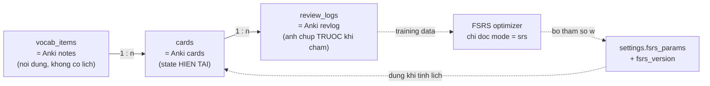

Gộp từ review-scheduling.md + multi-client-sync.md + rich-vocab-cram-ddl.md — nội dung không đổi, chỉ nhập làm một. 

## TL;DR — đã chốt (đọc trước; chi tiết ở các mục được trỏ tới)

> Tóm tắt 2026-09-28 (repo-hygiene-r1, ADR-044). **Nguồn sự thật vẫn là bảng "Đã chốt" ở Phần 1 mục 9, `CLAUDE.md` §4–5 và code.** Phần 2–3 viết thời PWA (đường dẫn `domain/verify.ts`, `listAllTags()` không còn) — mâu thuẫn với code → code thắng.
>
> **Cập nhật 2026-10-01 (ADR-050, extra-review-r1):** mọi câu dưới đây nói `cram`
> "không đụng state" đã **đảo** — R1 không còn ghi `mode='cram'`; "Ôn thêm" (tên mới
> của cram) giờ ghi `mode='srs'` và CẬP NHẬT state như ôn bình thường, đúng hướng
> "chấm thẻ sớm, không phải chấm-mà-không-ghi" (trả lời D-3, phần đã từng bỏ ngỏ ở
> mục 8.1). `mode` ở R1 vẫn chỉ mang giá trị `srs` — còn đúng hơn trước.

- **Thư viện tính, Reado lưu.** Dùng `swift-fsrs` (pin `4fbaf20`, `defaultWv6` 21 trọng số) — không tự viết; DB lưu lịch, không suy ra: `due_at` ghi nguyên giá trị thư viện trả (mục 1, 2.1).
- **"Đã thuộc" = `stability`** (Q-08, `>= 21`), không dùng `reps`/`lapses` (mục 2).
- **`state` 4 giá trị**, không gộp; **không** lưu `elapsed_days` trên `cards`, nhưng lưu trên `review_logs`; lệch thì `reviewed_at` thắng (mục 3.2–4.1).
- **`review_logs` = snapshot TRƯỚC khi chấm**; update `cards` + insert `review_logs` cùng 1 transaction (mục 4).
- **`mode` là trục chế độ, `state_before` là trục pha.** Chỉ `srs` cập nhật FSRS state; `cram` được kéo vào cuối R1 và không đụng state (mục 5; Phần 3 D-3). Phân biệt/gợi nhớ để R2.
- **Hàng đợi hai nhánh**; số thẻ mới trong ngày đếm từ `review_logs` (không counter); hạn mức thẻ mới áp trước khi lọc phạm vi; ranh giới ngày cấu hình được (mục 6.1–6.3).
- **Fuzz bật** ⇒ không được tính lại `due_at` on the fly. Tham số FSRS lưu kèm version (19 vs 21 tham số); R1 dùng tham số mặc định, optimizer để R2 (mục 9).
- **Leech:** phải đưa được thẻ ra khỏi hàng đợi, hành động mặc định là đề nghị sinh lại thẻ (mục 6.4). Ngưỡng = 6 lần Again (chốt 2026-09-24, không gộp Q-08).
- **Sync (Phần 2) = Later, chưa chốt:** server là source of truth nhưng client vẫn ghi offline; xung đột LWW theo `modified_at`; schema R1 đóng băng, sync là envelope cộng thêm; `settings` chứa secret ⇒ NFR-07 là ranh giới cứng (mục 4.5, 9.1–9.4). Không làm ở R1.
- **Rich vocab (Phần 3):** synonyms/antonyms/tags do AI sinh kèm lúc capture, giới hạn 3/3/4 (RV-1); cram chỉ chọn tag ở v1 (RV-3).
- **Mở:** Q-11 (jitter hai chế độ R2, chốt trước Phase 4) — phải hỏi owner.


## Phần 1 — Lịch ôn tập — FSRS cần giữ những gì, và Anki dạy được gì

| Field | Value |
|---|---|
| Status | Draft, mở cho nghiên cứu tiếp |
| Created | 2026-09-07 |
| Last updated | 2026-09-07 |
| Revision | v1 |
| Related | [prd.md](docs/specs/prd.md), [vision.md](docs/specs/vision.md), [vocabulary.md](docs/research/vocabulary.md), [vocabulary.md](docs/research/vocabulary.md) |
| Phạm vi | Trả lời câu hỏi: lịch ôn được tính thế nào, cần giữ lại những gì để tính được, và cơ chế của Anki phơi ra chỗ nào còn hở trong thiết kế Reado |

**Tài liệu này tự chứa.** Nó được viết để một session mới, không có bối cảnh gì về
cuộc thảo luận sinh ra nó, vẫn đọc và tiếp tục được.

> **Ranh giới của tài liệu này.** Nó dừng **trước** solution design. Mục 13 của
> [prd.md](docs/specs/prd.md) xếp data model, query và kiến trúc vào một solution design doc
> chưa viết, chờ Q-01 đến Q-03. Nên ở đây có *state nào cần giữ và vì sao*, nhưng
> không có DDL, không có câu query, không có ranh giới transaction. DDL nằm ở đúng
> một chỗ: [vocabulary.md mục 6](docs/research/vocabulary.md#6-schema).

## Điều hướng

- [1. Phạm vi — tầng thứ ba](#1-phạm-vi--tầng-thứ-ba)
- [2. Mô hình DSR — ba chữ cái và một hàm thuần](#2-mô-hình-dsr--ba-chữ-cái-và-một-hàm-thuần)
- [3. Ba tầng trùng khít Anki](#3-ba-tầng-trùng-khít-anki)
- [4. Log là ảnh chụp TRƯỚC khi chấm](#4-log-là-ảnh-chụp-trước-khi-chấm)
- [5. `mode` là `RevlogReviewKind` đã tách trục](#5-mode-là-revlogreviewkind-đã-tách-trục)
- [6. Bốn chỗ còn hở](#6-bốn-chỗ-còn-hở)
- [7. Hai đầu của cùng một câu hỏi](#7-hai-đầu-của-cùng-một-câu-hỏi)
- [8. Cái bẫy — `mode` bảo vệ số học, không bảo vệ phép đo](#8-cái-bẫy--mode-bảo-vệ-số-học-không-bảo-vệ-phép-đo)
- [9. Đã chốt và chưa chốt](#9-đã-chốt-và-chưa-chốt)
- [10. Nguồn](#10-nguồn)

---

## 1. Phạm vi — tầng thứ ba

Câu hỏi về từ vựng trong Reado có ba tầng. Hai tầng đầu đã có doc riêng.

| Tầng | Câu hỏi | Tài liệu |
|---|---|---|
| Card | **Một thẻ** chứa gì, kiểm tra gì | [vocabulary.md](docs/research/vocabulary.md) |
| Tổ chức | **Các từ** được gom nhóm và liên hệ thế nào | [vocabulary.md](docs/research/vocabulary.md) |
| Lịch | **Khi nào** một thẻ quay lại, và cần giữ gì để biết điều đó | Tài liệu này |

Tầng thứ ba này bị bỏ trống có chủ ý cho tới giờ, vì NG-09 đã chốt *không tự viết
SRS algorithm* và A-05 giả định dùng được thư viện có sẵn. Quyết định đó vẫn đúng.
Nhưng nó chỉ miễn cho Reado phần **tính toán**, không miễn phần **lưu trữ**: thư
viện là một hàm không có bộ nhớ, nên toàn bộ state phải nằm ở phía Reado.

Trước ngày 2026-09-07, mục 6.1 của doc structure để đúng hai chỗ trống, dưới dạng
comment:

```
-- <fsrs state: stability, difficulty, reps, lapses, state>
-- <fsrs state truoc khi cham, de sau nay chay lai optimizer>
```

Tài liệu này tồn tại để điền vào chúng. DDL kết quả nằm ở đúng chỗ đó — không lặp lại
ở đây, theo ranh giới đã nêu trong khung trên.

**Một lưu ý về tính bền của tài liệu này.** Phần dưới trích tên field cụ thể từ
`ts-fsrs`, implementation tham chiếu của FSRS-6 trong TypeScript. Đó là *ví dụ cụ
thể*, không phải *phụ thuộc*: những state này là yêu cầu của **thuật toán**, không
phải của thư viện. Nếu Q-01 chọn native và binding thành `rs-fsrs` hay `py-fsrs`,
danh sách state không đổi một dòng — chỉ tên field trong code đổi.

---

## 2. Mô hình DSR — ba chữ cái và một hàm thuần

FSRS đứng trên một mô hình trí nhớ ba biến. Hiểu ba biến này trước khi nhìn schema,
vì nếu không thì các cột chỉ là chữ.

| Biến | Nghĩa | Đơn vị |
|---|---|---|
| **R** — Retrievability | Xác suất nhớ lại được **ngay lúc này** | 0–1 |
| **S** — Stability | **Số ngày** để R tụt từ 100% xuống 90% | ngày |
| **D** — Difficulty | Từ này khó tới mức nào — khó thì mỗi lần ôn tăng S được ít hơn | 1–10 |

R không được lưu, vì nó là hàm của S và thời gian đã trôi: cùng một thẻ, R hôm nay
khác R tuần sau. Chỉ S và D được lưu. Lịch ôn sinh ra từ việc **đảo hàm quên**: cho
trước mức retention muốn giữ, tính ra sau bao nhiêu ngày R tụt xuống đúng mức đó.

Cần dừng lại ở định nghĩa của **S**, vì nó không phải một điểm số mờ mà là một con
số có đơn vị thật, và điều đó có hệ quả trực tiếp:

> `stability = 180` nghĩa là *"sáu tháng nữa vẫn còn 90% cơ hội nhớ được từ này"*.

Đó là lý do Q-08 — ngưỡng "đã thuộc" của bộ lọc trích xuất ở FR-10 — đo được bằng
đúng cột này. Câu hỏi *"từ nào coi là đã thuộc"* dịch thành *"cần bao nhiêu ngày
đảm bảo thì đủ để thôi làm phiền người học"*, và đó là một câu hỏi trả lời được.
Không có `stability`, ngưỡng đó phải đoán qua `reps` hay `lapses`, tức đo nỗ lực
thay vì đo kết quả.

### 2.1 FSRS là một pure function

Đây là tính chất quan trọng nhất của cả tầng này, và nó quyết định vài NFR:

```
(state hiện tại, số ngày đã trôi, rating) → (state mới, interval mới)
```

Không global state. Không phụ thuộc thẻ khác. Không phụ thuộc thứ tự trong buổi ôn.
Ba hệ quả:

- **NFR-03 (offline) gần như miễn phí.** Client tự tính lịch mới, không cần hỏi
  server. Đây cũng là lý do doc structure mục 6.4 chọn `uuid` thay vì số tự tăng:
  hai quyết định phục vụ cùng một mục tiêu.
- **DB chỉ *lưu* lịch, không *suy ra* lịch.** Không có view nào tính `due_at` từ
  `reps`; nó là giá trị do thư viện trả về và được ghi nguyên. Mục 6.3 cho thấy vì
  sao điều này không chỉ là sở thích kiến trúc mà là bắt buộc.
- **Không có "chạy lại lịch cho cả kho".** Muốn đổi retention thì phải đi qua từng
  thẻ mà tính lại — Anki gọi việc này là *reschedule* và coi nó là thao tác nặng,
  hiếm. Đừng thiết kế UI hứa hẹn nó rẻ.

---

## 3. Ba tầng trùng khít Anki

Điều đáng nói nhất khi đối chiếu: schema ở doc structure **đã có đúng hình dạng của
Anki**, dù được suy ra từ hướng khác hoàn toàn (Nation, Woźniak, và nhu cầu ôn theo
collection). Không phải trùng hợp — nó là hình dạng mà bài toán tự nhiên có.



Ranh giới giữa ba tầng có một quy tắc gọn: **nội dung ở tầng 1, lịch ở tầng 2, lịch
sử ở tầng 3.** `vocab_items` không biết gì về việc ôn tập — đó là lý do FR-17 chốt
được rằng đổi collection của một từ không đụng tới lịch FSRS. Chuyển collection là
sửa tầng 1; lịch sống ở tầng 2.

### 3.1 State mà một thẻ phải giữ

Interface `Card` của `ts-fsrs` có 10 property. Dưới đây là từng cái, kèm lý do —
đây là **danh sách state cần giữ**, không phải DDL:

| State | Nó là gì | Vì sao phải lưu |
|---|---|---|
| `state` | Pha hiện tại: `new` / `learning` / `review` / `relearning` | Xem 3.2 — đây là chỗ dễ làm sai nhất |
| `stability` | S của mục 2 | Đầu vào để tính interval, **và** là thước đo của Q-08 |
| `difficulty` | D của mục 2, 1–10 | Đầu vào để tính S mới sau mỗi lần chấm |
| `reps` | Tổng số lần đã ôn | Thống kê, và đầu vào cho vài nhánh của thuật toán |
| `lapses` | Số lần bấm *Again* sau khi đã thuộc | Cơ sở của luật leech ở mục 7 |
| `learning_steps` | Đang ở bước thứ mấy của learning steps | Chỉ có nghĩa khi bật short-term; xem Q-12 |
| `scheduled_days` | Interval mà hệ thống **đã hẹn** ở lần chấm trước | Để biết người dùng ôn sớm hay muộn so với hẹn |
| `due` | Thời điểm đến hạn | Cột dựng hàng đợi |
| `last_review` | Lần ôn gần nhất; `null` khi `state = new` | Để suy ra số ngày đã trôi lúc chấm |
| ~~`elapsed_days`~~ | Số ngày đã trôi từ lần ôn trước | **Không lưu** — xem 3.3 |

### 3.2 `state` là bốn giá trị, không phải hai

Trực giác nói chỉ cần `new` và `không-new`. Sai, và sai một cách tốn kém.

`learning` và `relearning` là **hai pha khác nhau về bản chất**:

| | `learning` | `relearning` |
|---|---|---|
| Thẻ đang ở đâu | Mới, chưa từng thuộc | Đã thuộc rồi, vừa bị bấm *Again* |
| Người học biết gì | Chưa có gì để mất | Đã có một dấu vết trí nhớ bị suy yếu |
| FSRS xử lý | Xây S từ đầu | Phục hồi S từ một mức đã có |

Gộp hai pha làm một thì thuật toán chấm `difficulty` sai, và cái sai đó **tích luỹ**
chứ không tự triệt tiêu: mỗi lần một thẻ đã thuộc bị lapse, nó bị đối xử như thẻ
mới, và S bị reset nặng hơn thực tế. Kết quả là những từ khó nhất bị ôn dày nhất một
cách vô ích.

Đây cũng là lý do mục 4 dưới đây khẳng định log phải lưu `state` — không phải để
thống kê, mà vì optimizer cần biết mỗi review xảy ra ở pha nào.

### 3.3 Vì sao **không** lưu `elapsed_days`

`ts-fsrs` đã mark `elapsed_days` là **deprecated, sẽ bỏ ở version 6.0.0** (cả trên
`Card` lẫn trên `ReviewLog`). Lý do rất đáng học thay vì chỉ tuân theo:

**Nó là giá trị dẫn xuất chỉ đúng vào đúng ngày review.** Ghi `elapsed_days = 7` hôm
nay thì mai nó thành sai, và không có gì báo. Đúng thứ cần làm là giữ `last_review`
rồi suy ra khi cần.

Nguyên tắc rút ra, áp cho cả tầng này: **trên bảng state hiện tại, không lưu giá trị
sẽ mục.** Mục 4 cho thấy vì sao cùng một field lại *nên* lưu trên bảng log — và
nghịch lý đó không phải mâu thuẫn.

---

## 4. Log là ảnh chụp TRƯỚC khi chấm

Đây là chỗ dễ hiểu sai nhất của cả tầng scheduling, và comment
`-- <fsrs state truoc khi cham>` trong doc structure đã đoán đúng hướng.

`ReviewLog` của `ts-fsrs` **không phải "kết quả của một lần ôn"**. Nó là:

> ảnh chụp thẻ ngay **trước** lúc bấm nút, cộng thêm cái nút đã bấm.

Nghĩa là log giữ `state`, `stability`, `difficulty`, `due`, `learning_steps` **của
quá khứ**, chứ không phải giá trị mới. Hai lý do, và cả hai đều thực tế:

**1. Undo.** `ts-fsrs` có `rollback()`, và nó chạy được chính vì log giữ state cũ.
Không có nó thì "bấm nhầm *Again* cho thẻ đã thuộc ba tháng" là mất vĩnh viễn — và
đó là loại lỗi mà người dùng gặp trong tuần đầu, lúc lòng tin vào sản phẩm còn mỏng.

**2. Training data cho optimizer.** FSRS huấn luyện lại tham số trên chuỗi
`(pha trước, khoảng đã trôi, rating)`. State *sau* thì suy ra được từ ba thứ đó — nó
là output của hàm. Lưu output là lưu thừa, và tệ hơn: nếu tham số được optimize lại
thì output cũ không còn khớp với hàm mới, nên nó thành dữ liệu gây nhiễu.

### 4.1 Nghịch lý `elapsed_days`, và ai là trọng tài

Mục 3.3 nói **không** lưu `elapsed_days` trên `cards`. Nhưng trên `review_logs` thì
**nên** lưu. Nghe như mâu thuẫn; không phải:

| | `cards.elapsed_days` | `review_logs.elapsed_days` |
|---|---|---|
| Nói về | Hiện tại — hôm nay đã trôi mấy ngày | Quá khứ — lần chấm đó đã trôi mấy ngày |
| Ngày mai | **Sai** | Vẫn đúng |
| Bản chất | Giá trị dẫn xuất đang mục | Sự thật về một sự kiện đã đóng băng |

Denormalize một sự thật đã đóng băng là an toàn, và nó tiết kiệm cho optimizer một
window function trên toàn bộ lịch sử khi export training data.

Nhưng nó vẫn *suy ra được* từ `reviewed_at` của dòng trước, nên phải có một quy tắc
trọng tài viết sẵn cho lần đầu hai thứ lệch nhau:

> **`reviewed_at` thắng.** `elapsed_days` là bản sao cho tiện; timestamp là bản gốc.

Cùng logic đó áp cho `scheduled_days`, vốn suy ra được từ `due_before` trừ lần
`reviewed_at` trước.

> **Cập nhật 2026-10-02 (fsrs-queue-fix-r1 T3):** giá trị ghi vào `review_logs.elapsed_days`
> là giá trị **swift-fsrs tự tính** (`AbstractScheduler.init` @`4fbaf20`, `Date.dateDiffInDays`)
> — hiệu ngày lịch **UTC** (floor theo `startOfDay` UTC), **không** theo `day_cutoff_hour` của
> Reado. Input `CardSnapshot` truyền cho lib luôn là `0` vì lib ghi đè ngay khi khởi tạo scheduler;
> Reado không tự định nghĩa lại công thức này (NG-09). Optimizer R2 nếu cần `elapsed_days` theo
> "ngày học" thật sẽ tính lại từ `reviewed_at` qua `DayBoundary`, không đọc cột này.

---

## 5. `mode` là `RevlogReviewKind` đã tách trục

Anki phân loại mỗi dòng review log bằng một enum:

| Giá trị | Nghĩa |
|---|---|
| `Learning = 0` | Ôn khi thẻ đang ở pha learning |
| `Review = 1` | Ôn khi thẻ đã ở pha review |
| `Relearning = 2` | Ôn khi thẻ đang học lại sau lapse |
| `Filtered = 3` | Ôn trong filtered deck **không** bật reschedule, hoặc ôn trước hạn |
| `Manual = 4` | Không phải review thật — *Forget*, *Set Due Date* |
| `Rescheduled = 5` | Lịch bị đổi bằng tay |

Và optimizer lọc bằng một hàm có tên nói thẳng ý định — `has_rating_and_affects_scheduling()`,
tức *có rating* **và** *không phải cramming*.

Cột `review_logs.mode` mà doc structure mục 6.1 đã chốt (`srs` / `cram` /
`distinguish` / `recall`) chính là cột đó. Nhưng có một điểm Reado làm **sạch hơn
Anki**, và đáng ghi lại để không ai "sửa" nó về sau:

> `RevlogReviewKind` trộn **hai trục độc lập** vào một cột — *pha của thẻ*
> (Learning / Review / Relearning) và *chế độ học* (Filtered / Manual / Rescheduled).
> Reado tách đôi: `mode` giữ trục chế độ, `state_before` giữ trục pha.

Đó là di sản lịch sử của Anki, không phải thiết kế đáng học theo. Hệ quả thực tế của
việc trộn: trong Anki, một lần ôn ở filtered deck **mất thông tin thẻ đang ở pha
nào**, vì ô đó đã bị `Filtered` chiếm. Reado giữ được cả hai.

**Ở R1 cột này chỉ bao giờ mang giá trị `srs`.** Mục 10 của PRD hoãn cram sang R2, và
`distinguish` / `recall` cũng thuộc R2. Nên `mode` ở R1 là chi phí gần bằng không mà
giữ đường mở — đúng nguyên tắc *"không tự chặn đường"* mà mục 10 đặt cho phần *Later*.

---

## 6. Bốn chỗ còn hở

Bốn điểm dưới đây là những chỗ mô hình Anki phơi ra khi va vào quyết định riêng của
Reado. Không phải lỗi thiết kế — là những thứ chưa được nghĩ tới vì tầng lịch chưa
được viết ra.

### 6.1 Một mệnh đề `where` không dựng nổi hàng đợi

Doc structure mục 4.1 chốt rằng ba chế độ ôn theo phạm vi là **một mệnh đề `where`**.
Với **trục phạm vi** thì đúng. Với cả hàng đợi thì không đủ, vì hai FR va nhau:

- **FR-09** — thẻ mới vào queue với `state = new` và **đến hạn ngay trong ngày**. Nên
  nó cũng thoả `due_at <= now()`.
- **FR-11** — thẻ mới bị chặn ở `daily_new_limit`; thẻ đến hạn ôn lại **không** bị
  chặn.

Hai hạn mức khác nhau trên cùng một điều kiện đến hạn thì không nằm được trong một
mệnh đề. Hàng đợi phải có **hai nhánh**: nhánh ôn lại không giới hạn, nhánh thẻ mới
giới hạn — và theo đúng criterion của FR-11, hạn mức áp **trước** khi lọc phạm vi,
không phải sau.

Hình dạng query cụ thể thuộc solution design doc. Điều cần chốt ở tầng research chỉ
là: **kết luận "thêm trục lọc không cần migration" của mục 4.1 vẫn đúng**; chỉ con
số "một mệnh đề" là sai.

Kèm theo là một câu hỏi nhỏ nhưng có câu trả lời rõ: *hôm nay đã giới thiệu bao nhiêu
thẻ mới rồi?* Không cần cột counter — đếm được từ `review_logs` những dòng có
`state_before = 'new'` trong ngày. Đúng cách Anki làm, và tránh được một lớp bug
không quan sát được: counter lệch với log thì không ai biết bên nào đúng.

### 6.2 Chưa có định nghĩa "một ngày"

`now()` không phải ranh giới ngày. Anki có tuỳ chọn *next day starts at*, mặc định 4
giờ sáng, và nó tồn tại vì người học đêm bấm thẻ lúc 1h sáng vẫn đang trong "ngày hôm
qua" theo cảm nhận của chính họ.

Thiếu núm này thì hai thứ vỡ, và cả hai đều vỡ với **đúng nhóm người dùng chăm nhất**:

- `daily_new_limit` reset giữa buổi ôn
- **streak ở FR-14 đứt oan** — người ôn đều mỗi đêm bị tính thành ôn cách ngày

M-02 (streak ≥ 5/7 ngày) là leading metric, nên một streak sai không chỉ làm người
dùng khó chịu mà còn làm chính phép đo thành vô nghĩa.

### 6.3 `daily_new_limit` dàn phần giới thiệu, nhưng không phá cohort

Đây là chỗ dễ tưởng đã xử lý xong mà chưa.

`daily_new_limit` giải bài "capture 25 trang sinh 200 thẻ đến hạn cùng ngày" — nó dàn
phần **giới thiệu** ra nhiều ngày. Nhưng 10 thẻ vào cùng một ngày, cùng được bấm
*Good*, sẽ nhận **interval y hệt nhau**. Rồi đến hạn cùng ngày. Rồi lại y hệt nhau.

Sau tám tuần, thứ người dùng thấy không phải một đường phẳng mà một chuỗi đỉnh nhọn:
vài ngày trống rỗng rồi một ngày 60 thẻ. Và ngày 60 thẻ đó là ngày người ta bỏ app.

Cái vá đã có sẵn trong thư viện: **fuzz** — thêm nhiễu nhỏ vào interval dài để phá
cohort. Một tham số. Hệ quả duy nhất cần biết: interval trở thành **không tất định**,
nên bắt buộc lưu `due_at` do thư viện trả về chứ không tính lại. Schema ở doc
structure vốn đã lưu, nên không phải sửa gì — nhưng nếu ai đó sau này "tối ưu" bằng
cách tính `due_at` on the fly thì fuzz là lý do không được làm vậy.

### 6.4 Không có cách nào lấy một thẻ ra khỏi hàng đợi

FR-10 có bộ lọc *đã thuộc*. Không có gì xử lý trường hợp ngược lại: một từ **không
bao giờ thuộc**, cứ vài ngày lại quay lại, mãi mãi.

Anki gọi hiện tượng này là **leech** và giải bằng ngưỡng số lần lapse, rồi tag và
suspend thẻ. Reado có `lapses` nên luật thì rẻ. Chỗ thiếu là **một cách đánh dấu thẻ
đã ra khỏi hàng đợi** — schema hiện tại không có.

Mục 7 giải thích vì sao chỗ này đáng nghĩ kỹ hơn là chỉ copy Anki.

---

## 7. Hai đầu của cùng một câu hỏi

Mục 6.4 và Q-08 nhìn như hai việc rời nhau. Chúng không phải. PRD cuối mục 12 đã nói
đúng ý này về Q-06 và Q-08; đây là lần thứ hai nó xuất hiện:

| Cơ chế | Đưa thẻ ra khỏi queue vì | Đo bằng |
|---|---|---|
| Bộ lọc "đã thuộc" (FR-10, Q-08) | **Đã thuộc** — thẻ hoàn thành nhiệm vụ | `stability` vượt ngưỡng |
| Leech (mục 6.4) | **Không bao giờ thuộc** — thẻ đang phá buổi ôn | `lapses` vượt ngưỡng |

Cùng một câu hỏi, hỏi từ hai đầu: **cái gì xứng đáng còn ở trong bộ ôn tập?**

Và ở đầu thứ hai, Reado có một lựa chọn tốt hơn Anki. Anki chỉ biết *"người dùng học
kém từ này"* nên hành động duy nhất hợp lý là suspend. Reado thì **tự sinh cái thẻ
đó**, nên một leech ở đây mang thêm một cách đọc:

> Thẻ này có thể **sai**, không phải người học kém. `meaning_vi` dịch lệch, hoặc
> `example` không đủ để phân biệt nghĩa nào đang được hỏi — đúng vấn đề mà doc
> structure mục 6.4 nêu về từ đa nghĩa.

Nên hành động đúng ở Reado là **đề nghị sinh lại thẻ**, không phải chôn nó. Và điều
này nối thẳng vào M-03 (tỷ lệ item bị sửa tay ≤ 10%): leech là một tín hiệu chất
lượng extraction đến **muộn nhưng chính xác hơn** M-03, vì nó dựa trên việc dùng thật
qua nhiều tuần chứ không phải phản ứng lúc mới duyệt.

Ngưỡng cụ thể của cả hai đầu đều chưa chốt — xem mục 9.

---

## 8. Cái bẫy — `mode` bảo vệ số học, không bảo vệ phép đo

Đây là phát hiện quan trọng nhất của tài liệu này, và nó là chỗ **duy nhất** mà kiến
trúc Anki không cover được thiết kế của Reado.

Doc structure mục 5.2 chốt: hai chế độ R2 (`distinguish`, `recall`) ghi vào
`review_logs` nhưng **không cập nhật FSRS state**. Quyết định đó đúng, và nó khớp với
cách Anki xử lý filtered deck. Nhưng nó chỉ bảo vệ được một nửa.

Cả issue #63 của `fsrs-rs` lẫn thread trên Anki forum đều mô tả cùng một vấn đề. Câu
diễn đạt gọn nhất nằm trên forum:

> *"Now you have extra reviews happening outside of FSRS' purview that is affecting
> your memory state but FSRS would have no way to include that."*

Dịch ý: bỏ log non-`srs` khỏi training data giữ đúng **số học** của scheduler — không
có review giả nào làm bẩn phép hồi quy. Nhưng nó **không xoá được sự thật** rằng người
dùng đã thật sự truy xuất từ đó. Trí nhớ tăng lên; FSRS không biết.

**Với Anki thì chấp nhận được. Với Reado thì không**, và đây là điểm khác biệt cốt tử:

| | Anki | Reado |
|---|---|---|
| Chế độ không-đụng-state | Cram / filtered deck | `distinguish` + `recall` |
| Tần suất dùng | Cửa thoát hiểm, hiếm | **Feature trung tâm của R2** |
| Thiết kế để dùng thường xuyên | Không | **Có** |

Hệ quả đo được, và nó lan xa hơn tưởng:

1. Với những từ được luyện nhiều ở R2, FSRS **ước lượng thấp `stability` một cách hệ
   thống** — vì nó chỉ thấy phần review qua `mode = srs`.
2. Interval ngắn hơn cần thiết → khối lượng ôn phình ra, đúng thứ `daily_new_limit`
   đang cố ngăn.
3. Và vì `stability` cũng là thước đo của FR-10, **bộ lọc "đã thuộc" bỏ sót** những
   từ thực ra đã thuộc rất chắc. Chúng bị trích lại từ trang mới, tạo thẻ trùng —
   đúng thứ mục 6.3 của doc structure tin là đã xử lý xong.

Điểm 3 là chỗ đáng ngại nhất, vì nó biến một sai lệch ở tầng lịch thành một lỗi nhìn
thấy được ở tầng nội dung, và người dùng sẽ quy kết cho AI extraction chứ không cho
scheduler.

### 8.1 Ba đường đi, chưa chọn

Tài liệu này **không** chốt. Cả ba đều có lý và chọn đúng thì cần dữ liệu thật:

| Đường | Nội dung | Cái giá |
|---|---|---|
| **Chấp nhận** | Ghi nhận sai lệch, không làm gì. Ngưỡng Q-08 hạ xuống để bù | Đơn giản nhất, nhưng ngưỡng thành con số phải hiệu chỉnh bằng tay |
| **Cho `recall` chấm thật** | Chế độ Gợi nhớ theo nhóm **đúng là** bài kiểm tra productive, nên để nó cập nhật FSRS state của thẻ `productive` (GP2) thay vì không đụng gì | Đúng về mặt sư phạm, nhưng phá quy tắc "hai chế độ R2 không đụng state" đang nằm trong bảng Đã chốt |
| **Đếm rồi hiệu chỉnh** | Giữ nguyên quy tắc, nhưng đếm số lần luyện R2 và dùng nó để điều chỉnh ngưỡng FR-10 riêng cho từng thẻ | Không đụng scheduler, nhưng thêm một cơ chế phải tự bảo trì |

Đường thứ hai đáng chú ý riêng, vì nó biến một vấn đề thành một lợi thế: doc
card-design GP2 đã để sẵn cột `direction` và chốt R1 chỉ sinh thẻ `receptive`. Chế độ
`recall` chạy đúng chiều `productive`. Nếu nó chấm thật, Reado có chiều productive
**mà không phải nhân đôi số thẻ ôn mỗi ngày** — đúng cái giá mà GP2 lo, và doc
structure mục 5.2 đã nhận ra một nửa điều này.

Việc này thành **Q-11** trong PRD, mốc *cần chốt trước khi bật R2*.

> **Cập nhật 2026-09-08 — owner chốt sớm một phần của Q-11.** Chế độ **cram theo chủ
> đề** (Targeted review, làm ngay sau task 2.8) đi **đường 1 "chấp nhận"** cộng thêm
> cam kết **không đụng state**: chấm + log `mode='cram'`, hàng `cards` giữ nguyên.
> Độ lớn sai lệch sẽ đo bằng dữ liệu thật ở task 3.11, cùng lượt Q-08/Q-09. Phần
> `distinguish`/`recall` của R2 **vẫn mở** tới task 4.0 — xem
> [rich-vocab-cram-ddl.md](docs/research/review.md) mục 5.

---

## 9. Đã chốt và chưa chốt

### Đã chốt — session sau không cần tranh luận lại

| Quyết định | Cơ sở |
|---|---|
| Thư viện tính, Reado lưu — toàn bộ state nằm phía Reado | Mục 1 |
| `stability` là thước đo của ngưỡng "đã thuộc" (Q-08), không dùng `reps` hay `lapses` | Mục 2 |
| DB **lưu** lịch, không **suy ra** lịch; `due_at` ghi nguyên giá trị thư viện trả về | Mục 2.1, 6.3 |
| `state` có **bốn** giá trị; `learning` và `relearning` không được gộp | Mục 3.2 |
| **Không** lưu `elapsed_days` trên bảng state hiện tại | Mục 3.3 |
| `review_logs` là ảnh chụp **trước** khi chấm, không phải kết quả sau | Mục 4 |
| Log **được** lưu `elapsed_days` và `scheduled_days`; khi lệch thì `reviewed_at` thắng | Mục 4.1 |
| `mode` giữ trục chế độ, `state_before` giữ trục pha — không trộn như `RevlogReviewKind` | Mục 5 |
| Ở R1 `mode` chỉ mang giá trị `srs`; cột vẫn tồn tại để giữ đường mở | Mục 5, **sửa đổi 2026-09-08:** owner kéo sớm `mode='cram'` (không đụng state) vào cuối R1 — cột vẫn để mở cho distinguish/recall ở R2 |
| Hàng đợi cần **hai nhánh**; hạn mức thẻ mới áp trước khi lọc phạm vi | Mục 6.1 |
| Số thẻ mới trong ngày **đếm từ `review_logs`**, không dùng cột counter | Mục 6.1 |
| Phải có ranh giới ngày cấu hình được, không dùng nửa đêm hệ thống | Mục 6.2 |
| Fuzz **bật**; hệ quả là không được tính lại `due_at` on the fly | Mục 6.3 |
| Leech phải đưa được thẻ ra khỏi hàng đợi, và hành động mặc định là **đề nghị sinh lại thẻ** | Mục 6.4, 7 |
| Tham số FSRS lưu kèm **số version** — FSRS-5 dùng 19 tham số, FSRS-6 dùng 21 | Mục 9, ghi chú dưới |
| R1 dùng tham số mặc định; optimizer là việc của R2 | Mục 9, ghi chú dưới |

Hai dòng cuối cần nói rõ. **Version tag** không phải bookkeeping: lưu bộ tham số dưới
dạng một mảng trần rồi nâng thư viện là silent breakage — mảng sai độ dài, và không có
gì báo cho tới khi lịch bắt đầu lệch. **R1 dùng default** là an toàn vì từ Anki 24.06
không còn ngưỡng review tối thiểu để optimize, nhưng ngay cả khi chưa optimize thì
FSRS với tham số mặc định vẫn hơn SM-2 — tài liệu fsrs4anki nói thẳng điều đó.

### Chưa chốt

| Câu hỏi | Ghi chú | Trong PRD |
|---|---|---|
| Hai chế độ R2 làm ước lượng thấp `stability` — chọn đường nào trong ba? | Ảnh hưởng cả FR-10, không chỉ tầng lịch. Cần dữ liệu thật, không quyết trên giấy. **2026-09-08: phần cram đã chốt** (đường "chấp nhận" + không đụng state); phần distinguish/recall vẫn mở tới 4.0 | **Q-11**, mốc: trước khi bật R2 |
| Có bật learning steps trong ngày (`short-term`) không? | Bật thì một thẻ quay lại trong cùng buổi, nên con số "còn bao nhiêu thẻ hôm nay" ở FR-11 và FR-14 mất tính tất định | **Q-12** |
| Ngưỡng `stability` để coi là "đã thuộc" | Đơn vị là ngày nên câu hỏi trả lời được, nhưng con số phải đo | Q-08, đã có |
| Ngưỡng `lapses` để coi là leech | Anki dùng một con số mặc định; chưa rõ nó có phù hợp với thẻ do AI sinh hay không | FR-19 |
| `request_retention` để mặc định 0.9 hay cho người dùng chỉnh? | Đây là núm quan trọng nhất của FSRS. Cho chỉnh sớm thì dễ tự bắn chân; ẩn đi thì mất công cụ điều tiết khối lượng duy nhất | Chưa vào PRD |

### Đã áp dụng vào đâu

Toàn bộ bảng dưới **đã được áp dụng** vào `prd.md` v0.4 và
[vocabulary.md](docs/research/vocabulary.md) v2.2 ngày 2026-09-07. Giữ lại làm
bảng đối chiếu: nếu một chỗ trong PRD đọc thấy lạ, cột phải nói vì sao.

| Đích | Thay đổi |
|---|---|
| `vocabulary.md` mục 6.1 | Hai comment placeholder thành DDL thật cho `cards`, `review_logs`, `settings` |
| `vocabulary.md` mục 6.1 | Tiểu mục mới **"những field cố ý KHÔNG lưu"** — chặn việc session sau "phát hiện thiếu" rồi thêm lại |
| `vocabulary.md` mục 4.1 | Ghi chú rằng một mệnh đề `where` đủ cho *trục phạm vi* nhưng không dựng nổi cả hàng đợi; tuyên bố cũ **giữ nguyên**, theo quy ước gạch-ngang-không-xoá của doc đó |
| `vocabulary.md` mục 7 | **Bẫy 5** — tưởng `review_logs.mode` đã xử lý xong vấn đề R2 |
| PRD FR-11 | Hai criterion: đếm thẻ mới **từ review log** thay vì cột counter; giờ chuyển ngày cấu hình được (mặc định 4h). Cộng ghi chú hàng đợi hai nhánh |
| PRD FR-12 | Criterion log là ảnh chụp trước-khi-chấm, và criterion **undo** |
| PRD FR-15 | `request_retention` (mặc định 0.9) và số version của tham số |
| **PRD FR-19 (mới)** | Leech Handling, đặt trong Epic E4 Review — không phải criterion của FR-11 |
| **PRD Q-11 (mới)** | Ước lượng thấp `stability` ở R2; mốc *trước khi bật R2* |
| **PRD Q-12 (mới)** | Có bật learning steps trong ngày không |
| PRD mục 10 | R1 dùng tham số mặc định, không mở núm retention; nhưng `review_logs` phải đầy đủ **ngay từ R1**; FR-19 vào R1 vì `lapses` tích luỹ |

Hai chỗ **cố ý không** viết vào đâu cả: hình dạng query dựng hàng đợi, và ranh giới
transaction của một lần chấm. Cả hai thuộc solution design doc (PRD mục 13), chờ Q-01
đến Q-03.

### Câu hỏi để nghiên cứu tiếp

1. **Optimizer cần bao nhiêu review thì thật sự có ích với một kho một người dùng?**
   Ngưỡng cứng đã bỏ, nhưng "chạy được" khác "đáng chạy". Đây là câu hỏi 6 ở mục 6 của
   doc card-design, giờ có thêm bối cảnh.
2. **Công thức chính xác của FSRS-6 và ý nghĩa 21 tham số.** Mục 2 chỉ mô tả *hình
   dạng* của hàm quên. Cần tra "The Algorithm" wiki nếu sau này phải debug lịch.
3. **Ngưỡng leech phù hợp với thẻ do AI sinh.** Giả thuyết ở mục 7 là leech ở Reado
   thường là *thẻ sai* chứ không phải *từ khó*. Nếu đúng, ngưỡng nên **thấp hơn** Anki,
   vì phát hiện thẻ sai sớm thì rẻ hơn.
4. **`request_retention` bao nhiêu là đúng cho người học đọc sách?** Anki nói 0.9 phù
   hợp phần lớn người dùng, nhưng vốn từ receptive có đặc thù: đọc sai một từ thì ngữ
   cảnh thường vẫn cứu được nghĩa, nên có thể chấp nhận retention thấp hơn để đổi lấy
   khối lượng ôn nhẹ hơn. Chưa có bằng chứng.

---

## 10. Nguồn

### Đã đọc trực tiếp

| Nguồn | Đường dẫn |
|---|---|
| `ts-fsrs` — interface `Card` | https://open-spaced-repetition.github.io/ts-fsrs/interfaces/Card.html |
| `ts-fsrs` — interface `ReviewLog` | https://open-spaced-repetition.github.io/ts-fsrs/interfaces/ReviewLog.html |
| `ts-fsrs` — README, bộ tham số và API `next` / `repeat` / `rollback` | https://github.com/open-spaced-repetition/ts-fsrs |
| Anki `rslib/src/revlog/mod.rs` — enum `RevlogReviewKind`, hàm `has_rating_and_affects_scheduling()` | https://github.com/ankitects/anki/blob/main/rslib/src/revlog/mod.rs |
| fsrs4anki — tutorial: `request_retention` là *"the most important setting"*; không còn ngưỡng review tối thiểu từ Anki 24.06 | https://github.com/open-spaced-repetition/fsrs4anki/blob/main/docs/tutorial.md |
| Anki FAQ về FSRS — tần suất optimize, và việc optimizer chỉ lấy **một review mỗi ngày** cho mỗi thẻ | https://faqs.ankiweb.net/frequently-asked-questions-about-fsrs.html |
| `fsrs-rs` issue #63 — các loại review log cần xử lý đặc biệt | https://github.com/open-spaced-repetition/fsrs-rs/issues/63 |
| Anki forum — filtered deck có ảnh hưởng FSRS không (nguồn của câu trích ở mục 8) | https://forums.ankiweb.net/t/do-filtered-decks-have-an-effect-on-fsrs/60365 |
| Tài liệu nội bộ Reado | [prd.md](docs/specs/prd.md), [vision.md](docs/specs/vision.md), [vocabulary.md](docs/research/vocabulary.md), [vocabulary.md](docs/research/vocabulary.md) |

### Nhắc lại từ trí nhớ — CHƯA kiểm chứng

Đừng coi các phát biểu gắn với những mục dưới đây là đã xác minh. Session sau nếu cần
dựa vào chúng để chốt thiết kế thì phải tra trước.

| Nội dung | Được dẫn ở mục | Vì sao chưa chắc |
|---|---|---|
| Công thức chính xác của hàm quên FSRS-6 và bộ 21 tham số | 2 | Chỉ biết *hình dạng* (power function), chưa tra "The Algorithm" wiki. Không ảnh hưởng danh sách state, nhưng đừng dựa vào để debug |
| Ranh giới ngày mặc định của Anki là 4 giờ sáng | 6.2 | Con số nhắc từ trí nhớ. Việc *cần* một ranh giới cấu hình được thì không phụ thuộc con số này |
| Ngưỡng leech mặc định của Anki | 6.4, 7 | Nhớ là 8 lapse nhưng chưa tra manual. Mục 7 lập luận rằng Reado nên dùng số khác, nên con số của Anki chỉ là mốc tham chiếu |
| DSR có gốc từ lý thuyết two-component của Woźniak | 2 | Quan hệ lịch sử giữa SuperMemo và FSRS được nhắc nhiều nhưng chưa tra nguồn gốc |

**Một lưu ý epistemic về mục 8.** Cơ chế nhân quả — R2 làm ước lượng thấp `stability`
— là **suy luận từ nguyên lý**, không phải quan sát đã đo. Nó đứng trên hai tiền đề
đã kiểm chứng (optimizer bỏ log non-`srs`; và việc truy xuất thật có củng cố trí nhớ),
nhưng **độ lớn** của sai lệch thì hoàn toàn chưa biết. Có thể nó nhỏ tới mức không
đáng làm gì. Đó chính là lý do mục 8.1 không chốt đường nào.

## Phần 2 — Multi-client sync — hướng kiến trúc tương lai (note, chưa chốt)

> **Trạng thái: NOTE — Later. Không load-bearing.**
> Doc này ghi lại và phân tích hướng kiến trúc owner vẽ ngày 2026-09-08 cho tương
> lai xa: đa thiết bị + sync server kiểu AnkiWeb. Nó **không** thay đổi bất kỳ
> quyết định đã chốt nào — Q-01 (PWA mobile-first), Q-02 (local-first SQLite),
> Q-03 (BYOK) vẫn nguyên hiệu lực cho tới khi PRD mục 10 (Later) được mở lại.
> Khi mở lại: đọc mục 7 trước, đó là các câu hỏi thuộc quyền quyết định của owner,
> không được tự lấp.
>
> **Cập nhật 2026-09-08:** owner chốt hướng *"server là source of truth"* (mục 9.1)
> và mang bản draft schema sync (USN + multi-tenant guest-first + graves) của một
> agent ngoài về review — đánh giá + đề xuất ở mục 9.2–9.4; câu hỏi mới MS-08→MS-13
> ở cuối mục 7. Vẫn chưa đổi gì ở R1/R2.
>
> **Bản vẽ DDL server nháp:** [sync-server-ddl.md](docs/specs/sync-server-ddl.md) — Postgres/Supabase
> + USN + LWW + RLS + tombstone triggers; chờ owner review từng bảng.
>
> **Cập nhật 2026-09-18:** Q-01 (PWA → iOS native) và Q-03 (BYOK → hybrid) đã đảo
> 2026-09-17 — bản note này vẫn là nền cho scope Later, không load-bearing với R1 v2.

| Field | Value |
|---|---|
| Created | 2026-09-08 |
| Nguồn | Owner mô tả sơ đồ kiến trúc trong phiên làm việc 2026-09-08 |
| Trạng thái | NOTE — Later, chưa chốt bất cứ gì; không ảnh hưởng R1/R2 |
| Liên quan | [prd.md](docs/specs/prd.md) mục 10 (Later) + mục 12; NG-05, NFR-03, NFR-07; [solution-design.md](docs/specs/solution-design.md) mục 2 (câu "server chỉ là relay"); [ROADMAP.md](ROADMAP.md) (Later) + tracker cũ mvp-plan-pwa-gen.md (đã xoá, ADR-044) mục 3 + 6 |

---

## 1. Sơ đồ gốc của owner

```
PWA/Desktop (SQLite Local) ───[Push/Pull Delta (USN)]───┐
                                                         ├──► AnkiWeb Server (Postgres/Supabase)
Mobile App (SQLite Local)  ───[Push/Pull Delta (USN)]───┘         │
                                                                  │ (Direct API)
Browser (Không DB Local)   ─────────────────[CRUD Trực tiếp]──────┘
```

## 2. Đọc sơ đồ theo một câu

- **PWA/Desktop và Mobile App** là *rich client*: mỗi cái giữ **toàn bộ** DB SQLite
  local, chạy được offline, đồng bộ với server theo **delta hai chiều dùng USN**
  (Update Sequence Number — chuỗi số tăng dần cho phép *"đưa tôi mọi thay đổi từ
  cursor X trở đi"*).
- **Browser** là *thin client*: không giữ DB, mọi thao tác là CRUD trực tiếp vào
  server — tức với browser, **server là nguồn sự thật**.
- **Server** là Postgres/Supabase, đóng vai trò kiểu **AnkiWeb**: chỗ hội tụ của mọi
  thiết bị. Khác AnkiWeb thật ở chỗ nó *không chỉ* là relay — nó còn phục vụ trực tiếp
  một client.

Hệ quả: product có **hai hạng công dân** — rich client (offline + đồng bộ) và thin
client (online + direct). Mọi khó khăn thật của kiến trúc này nằm ở *đường biên giữa
hai hạng đó*, xem mục 4.

## 3. Vì sao hướng này hợp với những gì đã chốt (không phải ngẫu nhiên)

Một số quyết định ở R1 vô tình dọn sẵn đường cho sync sau này:

| Đã chốt | Vì sao giúp sync sau này |
|---|---|
| NFR-03 — ôn tập offline | local-first không phải tùy chọn; sync là cách duy nhất giữ cả **offline** lẫn **đa thiết bị** |
| `uuid` client tự sinh (hex text) | id không phụ thuộc server → dữ liệu sinh ra trước khi có server vẫn gán id được, không cần id-map khi sync |
| Timestamp ISO-8601 UTC `Z` | đồng bộ không dịch múi giờ; "ngày học" (day cutoff) tính ở tầng đọc theo device, không lệch dữ liệu |
| Ảnh gốc không lưu (NFR-04) | **bài toán media sync của Anki không tồn tại** — payload sync của Reado là text nhỏ, đây là lợi thế lớn nhất |
| `review_logs` append-only | change stream của log gần như thuần insert — nhánh dễ nhất của sync (nửa còn lại ở mục 4.3) |
| Research schema gốc viết bằng Postgres; ba quyết định dialect (uuid hex text · ISO-8601 UTC · JSON text) | cả ba đều Postgres-compatible → dựng schema server không phải redesign |

## 4. Các bài toán phải giải trước khi chốt

Mỗi mục là một cái bẫy đã thấy rõ *trước* khi viết dòng code nào. Số hiệu MS dùng
trong mục 7.

### 4.1 Hai đường ghi, một nguồn sự thật — nguy cơ số một

Browser ghi *trực tiếp* vào DB server; còn PWA/Mobile ghi *local rồi đồng bộ*. Nếu
đường ghi của browser không đi qua đúng lớp duy trì USN/version, ba lỗi kinh điển
xuất hiện, lặng lẽ:

1. Browser sửa/xoá một row → USN không nhảy → thiết bị không bao giờ kéo thay đổi đó về.
2. Thiết bị chưa kịp pull, vẫn đẩy lên phiên bản cũ → **đè mất** edit mới của browser.
3. Browser xoá một row (xoá vật lý, không tombstone) → thiết bị offline không hề biết
   row biến mất → lần sync sau **hồi sinh** cái đã xoá.

> **Quy tắc bắt buộc nếu đi hướng này:** *mọi* đường ghi tới server — kể cả cái gọi là
> "CRUD trực tiếp" — phải đi qua **một lớp duy nhất** bump version + ghi change/tombstone.
> Hiện thực khả dĩ: Postgres trigger, hoặc một write service mà cả REST lẫn sync đều gọi.
> Nếu không, hai đường ghi là nguồn bug khó chẩn đoán số một.

### 4.2 USN trả lời "cái gì mới", không trả lời "ai thắng"

USN chỉ giải bài toán **truyền tải** (delta từ cursor), không giải bài toán **xung
đột**. Anki classic là bài học công khai: khi cả hai phía cùng đổi, nó hỏi *"chọn
một phía"* — phía còn lại **mất thay đổi**, không merge.

- Với Reado (một người, vài thiết bị, hiếm khi cùng sửa một field vào cùng thời điểm),
  **last-write-wins theo từng dòng** dự kiến là đủ — nhưng cần chốt rõ là row-level
  hay field-level (field-level tránh chuyện "sửa nghĩa trên phone, chấm thẻ trên
  desktop" đè nhau, đổi lại phức tạp hơn nhiều).
- Đồng hồ device lệch nhau: nếu dùng `updated_at` của device làm trọng tài, thiết bị
  nào đồng hồ nhanh luôn thắng. ⇒ USN/version **phải do server cấp**, đừng để device
  làm trọng tài. (Đây cũng là lý do "USN" trong sơ đồ nên hiểu là server-sequence,
  không phải timestamp device.)

### 4.3 `review_logs` append-only thuận, nhưng state cuối của card có thể mâu thuẫn

Half dễ: log chỉ thêm dòng, không sửa dòng cũ → delta sync gần như thuần insert.

Half khó: mỗi dòng log là **ảnh chụp trước khi chấm** của `cards` (quy ước bắt buộc
của repo). Nếu phone và desktop cùng offline rồi **cả hai đều chấm thẻ 42**, khi sync
về: hai dòng log cho cùng một card, hai phiên bản state. LWW chọn một state thì dòng
log của phía thua **không còn khớp** với state cuối — đúng thứ hư training data của
FSRS, và không có gì báo.

Xác suất thấp với một người dùng, nhưng là loại lỗi âm thầm — cần chốt chính sách
trước khi sync chạm `review_logs` (xem MS-03).

### 4.4 Xoá cần tombstone

Sync kiểu "thay đổi từ cursor X trở đi" không nhìn thấy thứ bị xoá **vật lý** — nó
chỉ thấy thứ còn tồn tại. Nên mọi delete phải thành *tombstone* (bia mộ: đánh dấu đã
xoá và giữ lại/liệt kê một thời gian để thiết bị offline biết mà xoá theo). Schema R1
hiện xoá vật lý + cascade — đủ cho một thiết bị, chưa đủ cho sync. Lựa chọn khi tới
lúc: cột `deleted_at` (soft delete) hoặc bảng tombstone riêng.

### 4.5 `settings` đang chứa secret — NFR-07 trở thành ranh giới cứng cho sync

Bảng `settings` một dòng chứa `ai_api_key` (BYOK — Q-03). **Không bao giờ** sync dòng
này nguyên dạng lên server: key của user ở trên server là vấn đề mới, vi phạm đúng
tinh thần NFR-07. Khi có sync, bắt buộc tách:

- Settings **đồng bộ** (cefr_level, daily_new_limit, request_retention, fsrs_params…)
- Secrets **per-device** (ai_api_key; ai_base_url tùy chọn) — chỉ nằm ở device.

Đồng thời đây là lúc câu hỏi *proxy hoãn sang Later* ở Q-03 quay lại — có server rồi
thì "giấu key sau proxy" trở thành lựa chọn thật; đó là quyết định mới của owner,
không tự chọn.

### 4.6 Auth — động vào NG-05

Sync nhiều thiết bị của cùng một người vẫn cần một **danh tính**: dù chỉ là device
pairing. NG-05 (multi-user, authentication) đang là Later, nên câu quyết định sớm nhất
và đắt nhất là: server là **sản phẩm SaaS đa user** (Supabase auth + RLS cho từng
user) hay **server cá nhân của riêng owner** (đơn giản hơn rất nhiều, chưa cần auth
thật)? Chênh lệch chi phí giữa hai hướng là lớn nhất trong toàn bộ note này — hỏi
owner trước bất cứ thiết kế nào (MS-01). Anki cũng vậy: AnkiWeb là dịch vụ, nhưng
người dùng nào cần tự host có sync server mã nguồn mở.

### 4.7 Hai dialect SQL (SQLite client vs Postgres server)

Client giữ SQLite, server Postgres: hai nơi có thể "biết" schema theo hai cách và
dần lệch nhau, đúng kiểu drift từng giết nhiều dự án sync. Hai nốt tin tốt: ba quyết
định dialect đã nêu ở mục 3 là Postgres-compatible; và phần SQL đặc thù (partial
index, check, cascade) đang co cụm trong tầng `storage/`. Nguyên tắc khi tới lúc:
**định nghĩa canonical một chỗ** (migration + query qua một lớp chung, hoặc server
chỉ là store thô + sync service riêng), không duy trì hai bộ SQL song song.

### 4.8 Dữ liệu sinh ra trước khi server tồn tại

R1 có thể chạy nhiều tháng trước khi sync xuất hiện. Ngày đầu bật sync có thể là:
server trống + thiết bị đầy dữ liệu — hoặc hai thiết bị *cùng* chứa dữ liệu riêng
của cùng một người mà chưa bao giờ gặp nhau (initial merge hai chiều). Cần chính sách
khởi đầu tường minh: seed từ phía nào, dữ liệu chồng nhau gộp hay chọn phía chủ
(mô hình "upload/download" của Anki là dạng thô của chính sách này). UUID client-sinh
là thứ khiến bài toán này *giải được* — đã có sẵn.

### 4.9 Push notification — đây là lúc đánh đổi Q-01 quay lại

Sơ đồ có Mobile App native. Q-01 chốt PWA với cái giá đã chấp nhận: *"iOS không có
push thật, nhắc ôn hàng ngày kém tin cậy"*. Khi Later tới, câu hỏi tự khắc quay lại:
nếu **push thật** là lý do chính để làm native, đó là lý do mạnh; nếu không, Capacitor
(lối đã hứa ở PRD mục 11) là đường rẻ hơn một app native thứ hai. Đây chính là đánh
đổi Q-01 hồi tháng — ghi để owner thấy lại toàn bộ bối cảnh (MS-02).

## 5. Lựa chọn implementation khi tới lúc (chưa chọn, chỉ đánh dấu hướng)

| Hướng | Hình dạng | Ghi chú cho later |
|---|---|---|
| Tự dựng USN delta trên Postgres | trigger/write service bump version + bảng change log + tombstone | Kiểm soát hoàn toàn, hợp với quy mô Reado (5 bảng, không media). Giá: tự bảo trì giao thức |
| Dùng engine có sẵn cho đúng mô hình "SQLite local + Postgres server" | PowerSync (sync engine purpose-built cho Postgres→SQLite), Electric**SQL** (đồng bộ qua Postgres logical replication) | Trạng thái/license của từng sản phẩm phải **kiểm lại khi mở Later** — note này chỉ ghi tên hướng để spike, không phải nghiên cứu đã xong |
| CRDT (Automerge/Yjs) | merge không cần server trọng tài | Thừa cân cho schema quan hệ + lượng data nhỏ; không phải lựa chọn đầu tiên |
| Đổi cả stack server (CouchDB/PouchDB) | sync engine đi kèm DB khác | Phá cam kết "Postgres/Supabase" trong sơ đồ — chỉ xét nếu mọi hướng trên thất bại |

**Nói rõ về "AnkiWeb-style":** AnkiWeb là chuẩn về *vai trò* (chỗ hội tụ đồng bộ),
không phải về *giao thức nên copy*. Sync classic của Anki xử lý conflict bằng "chọn
một phía, phía kia mất thay đổi" (mục 4.2); giao thức mới hơn hoạt động ở mức note.
Reado đơn giản hơn Anki rất nhiều (không deck share, không media) — không cần copy
giao thức đó, chỉ cần học bài học conflict của nó.

## 6. Những gì sẽ mở lại khi Later được kích hoạt

| Mở lại | Vì sao | Hiện tại |
|---|---|---|
| Q-02 (local-only → cloud) | PRD mục 12 đã ghi *"đa thiết bị để Later"* | Vẫn chốt local-first cho R1/R2 |
| Q-01 (thêm Mobile App) | Sơ đồ thêm một client native bên cạnh PWA | Vẫn chốt PWA mobile-first |
| NG-05 (auth) | Sync đòi danh tính, xem mục 4.6 | Vẫn là non-goal |
| Q-03 phần "proxy hoãn sang Later" | Có server rồi, câu proxy-secrets quay lại (mục 4.5) | Vẫn BYOK |
| Câu *"server (nếu có sau này) chỉ là relay"* ở solution-design mục 2 | Với browser CRUD trực tiếp, server là **nguồn sự thật** nữa, không chỉ relay | Không sửa bây giờ — câu đó vẫn đúng cho R1 |

## 7. Câu hỏi mở cho owner (hỏi khi mở Later — không tự chốt)

| ID | Câu hỏi | Ảnh hưởng |
|---|---|---|
| MS-01 | Server là SaaS đa user (Supabase auth + RLS) hay server cá nhân chỉ cho owner? | Quyết định chi phí lớn nhất + NG-05 (mục 4.6) |
| MS-02 | Mobile App native vì **push thật**, hay Capacitor là đủ? | Mở lại đánh đổi Q-01 (mục 4.9) |
| MS-03 | Conflict model: LWW row-level, field-level, hay log event đóng vai trò event-log và replay? | review_logs có giữ nguyên là training data FSRS không (mục 4.3) |
| MS-04 | Browser client (không DB local) chấp nhận **luôn online**? | Nếu đi công tác không mạng, browser client không dùng được — xác nhận đó đúng ý |
| MS-05 | Trigger sync: nút bấm tay, tự động sau mỗi thay đổi, hay realtime? | Chọn hạ tầng (realtime/polling), độ phức tạp client |
| MS-06 | Secrets đặt đâu khi có server — giữ BYOK per-device hay chuyển proxy? | NFR-07 ở cấp độ mới; gắn với phần "Proxy → Later" của Q-03 (mục 4.5) |
| MS-07 | Initial merge khi ≥ 2 thiết bị đều đã có dữ liệu riêng? | Chính sách seed/merge ngày đầu bật sync (mục 4.8) |

### Cập nhật 2026-09-08 (sau khi owner mang draft schema của agent ngoài về)

| ID | Trạng thái |
|---|---|
| MS-01 | ✅ **Chốt 2026-09-08 (owner): SaaS đa user** — *"nhiều người dùng, 1 người dùng nhiều thiết bị"*. Hướng guest-first + `user_id` + RLS của draft hợp lệ (hệ quả ở mục 9.4) |
| MS-08 | ✅ **Chốt 2026-09-08 (owner): ảnh KHÔNG lưu** — gạt `image_path` khỏi draft; NFR-04 + nguyên lý 5 giữ nguyên |
| MS-09 | ✅ **Chốt 2026-09-08 (owner): LWW theo `modified_at`** — server từ chối bản cũ hơn bản đang có; đủ cho 1 người/2-3 thiết bị. Tie-break ghi ở mục 9.4 |
| MS-10 | ✅ **Chốt 2026-09-08 (owner): kho tạm là con trỏ per-device** — hai kho tạm là hai collection khác nhau, không tự gộp; trỏ "kho tạm của thiết bị" nằm device-local, KHÔNG sync; từ trong kho vẫn sync bình thường |
| MS-11 | **Mới:** đường ghi browser CRUD bump USN bằng trigger hay write service? (điều kiện sống còn của toàn bộ cơ chế USN — mục 4.1) |
| MS-12 | **Mới:** settings nào được sync (cefr_level…) và secrets giữ device? (NFR-07) |
| MS-13 | **Mới:** change log trên server giữ vô hạn hay có snapshot/cut-off? |

## 8. Điều kiện mở + cách dùng note này

- **Mở khi:** R1 + R2 dùng thật ổn định **và** owner xác nhận bắt đầu scope Later của
  PRD mục 10 (hoặc nhu cầu thiết bị thứ hai trở thành thật).
- **Lúc đó, thứ tự đúng:** (1) hỏi MS-01 → MS-13; (2) spike hướng ở mục 5 (tự dựng vs
  PowerSync/Electric — đo, không đoán); (3) viết research doc chính thức + mở lại các
  mục ở bảng 6; (4) mới đụng code. Note này giờ đây là ghi nhớ, không phải spec —
  không có gì trong nó được phép dùng làm lý do đổi code ở R1/R2.

---

## 9. Cập nhật 2026-09-08 — chốt hướng của owner + review draft của agent ngoài

### 9.1 Quyết định mới của owner: server là source of truth

Owner (2026-09-08): *"db ở server sẽ là nguồn chính. source of truth. db ở
mobile/app sẽ có cơ chế sync cùng với db server."* Ghi chính xác ý nghĩa để sau khỏi
thiết kế lệch:

- Server là **nơi gán USN duy nhất** và là **nơi phân xử khi xung đột** — bản server
  là bản đầy đủ nhất *giữa hai lần sync*.
- Client local vẫn **ghi được offline** (NFR-03) — "source of truth" KHÔNG có nghĩa
  "client read-only" hay "online mới dùng được". Local là bản cache đầy đủ có quyền
  ghi; câu hỏi khi xung đột thì ai thắng là MS-09 — **đã chốt 2026-09-08: LWW theo `modified_at`** (mục 7 + 9.4).
- Nhất quán với: browser CRUD trực tiếp (mục 1) và hướng server làm trọng tài ở mục
  4.2. Dòng *"server (nếu có sau này) chỉ là relay"* ở solution-design mục 2 sẽ được
  sửa khi Later mở thật.

### 9.2 Review draft "sync-ready schema + USN" của agent ngoài

Draft được viết trong chân không — không có bộ docs Reado — nên **ý tưởng sync có hạt
đúng, còn phần schema phá chốt repo**. Ba bảng:

**a) Điểm đúng (giữ):** usn trên từng dòng + dirty = -1; server cấp USN (không phải
client đánh số); bảng graves làm tombstone; guest-first (đúng nếu Later là SaaS); giữ
ảnh chụp trước-khi-chấm; `ON DELETE RESTRICT` collections→vocab (trùng tinh thần
FR-17: xoá collection không tự xoá từ).

**b) Phá chốt repo (những thứ phải gạt ra khi Later viết DDL thật):**

| Draft làm | Chốt repo (docs/journeys.md) | Hậu quả nếu lấy theo |
|---|---|---|
| `cards.state` INTEGER 0–3 | TEXT đủ BỐN giá trị (điều cấm #2) | Đảo chốt vô cớ; ts-fsrs native là số nhưng tầng lưu của repo đã chốt TEXT |
| `vocab_items` bỏ `pos`, bỏ `cefr`; đổi tên `meaning_vi`→`definition`, `example`→`example_original` | Hợp đồng 6 field của FR-02; FR-12 cần `pos`, FR-08 cần `cefr` | Mặt trước thẻ không còn `pos`; mất lọc CEFR |
| Thêm `image_path` (ảnh trang sách) | NFR-04: ảnh gốc KHÔNG lưu (nguyên lý 5) | Lưu ảnh lên server storage = nới bề mặt bản quyền — phải qua owner (MS-08) |
| `direction` = 'forward'/'backward' | 'receptive'/'productive' | Đổi thuật ngữ đã chốt, không lợi gì |
| `collections` bỏ `is_default` | Kho tạm FR-17 — bất biến đúng 1 dòng | Gãy kho tạm |
| `settings` bỏ 4 cột BYOK, `cefr_level`, `request_retention`, `maximum_interval`, `enable_fuzz`, `day_cutoff_hour`, `fsrs_version`; `daily_new_limit` 20 | settings R1 đủ các cột đó; limit = 10 (FR-15) | FR-02/11/15 + NFR-07 gãy; mất `fsrs_version` = silent breakage FSRS-5→6 |
| `review_logs` bỏ `mode`, bỏ `learning_steps_before`, đổi `rating`→`grade` | `mode` 4 giá trị có sẵn cho R2; log là ảnh chụp đủ cột | Chặn cram/distinguish/recall; lệch cột undo |
| Nhét `last_sync_usn`/`cloud_user_id` vào đúng bảng `settings` đang chứa secret | settings device-local; secret cấm sync (mục 4.5) | Trộn secret + cursor — NFR-07 ở cấp độ mới |

**c) Chín lỗ hổng protocol (thật, không phải chuyện gu):**

1. **Không có conflict detection.** Không có cột `modified_at`/version nào → server
   nhận gì ghi nấy, ai push **sau** thắng kể cả khi đó là bản cũ cả tháng offline.
   Thiết bị quên sync lâu có thể cán đổ lịch FSRS mới hơn của thiết bị kia. (MS-09)
2. **USN đòi MỘT đếm chung.** Pull dùng một cursor `last_sync_usn` cho mọi bảng ⇒ USN
   phải do **một sequence toàn cục per account** cấp, không phải autoincrement mỗi
   bảng. Draft không nói thẳng — ai implement sau dễ chia đếm rồi pull lệch.
3. **Push không có thứ tự dependency.** `vocab_items.collection_id` có FK `RESTRICT`;
   push vocab trước collection còn dirty → server reject. Cần topo sort
   (collections → vocab → cards → logs) trong mỗi batch push.
4. **Cascade delete phải materialize thành graves.** Server xoá vocab → cards/logs
   chết theo vật lý. Không có trigger ghi graves cho các dòng con thì thiết bị kia
   không bao giờ biết → hồi sinh. Draft bỏ trống hoàn toàn.
5. **Update đến record đã xoá / FK mồ côi.** Hai thiết bị: A xoá từ, B đồng thời chấm
   thẻ của từ đó → B push log trỏ card đã chết. Cần chính sách trước (drop + báo),
   không phát hiện ra lúc runtime.
6. **Cursor per-user, không per-device.** USN đếm theo account; đổi user trên một
   thiết bị thì `last_sync_usn` của người cũ không dùng được — cần map user→cursor.
7. **Guest→user không xử lý multi-device merge.** Hai thiết bị đều có "Kho tạm"
   `is_default=1` → login cùng account → **hai kho tạm**, vỡ bất biến "đúng một dòng"
   vốn là per-DB (repo) chứ chưa là per-user (server). Chưa có chính sách hợp nhất
   (MS-10).
8. **Browser CRUD trực tiếp vắng mặt trong draft.** Sơ đồ gốc có đường này; nếu
   browser ghi không qua đúng lớp gán USN thì toàn bộ cơ chế hỏng (mục 4.1). (MS-11)
9. **Lịch sử USN phải giữ vô hạn** với mô hình "pull = mọi dòng có USN > cursor".
   Chấp nhận được ở quy mô cá nhân, nhưng phải ghi rõ — không được phép cắt log đã
   hứa cho một thiết bị còn offline dài ngày. (MS-13)

### 9.3 Đề xuất của agent: đóng băng schema R1, sync là envelope cộng thêm

Không viết lại schema. "Cùng thiết kế DB" của Later nên là:

1. **Nền = schema R1 đã implement** ([journeys.md](docs/specs/journeys.md)) nguyên vẹn.
2. **Sync-ready = migration additive**: mỗi bảng sync thêm đúng 3 cột:
   `user_id TEXT NOT NULL DEFAULT 'local'` · `modified_at TEXT NOT NULL` (UTC, client
   clock) · `usn INTEGER NOT NULL DEFAULT -1`.
3. Bảng `graves` (id, original_table, deleted_at, user_id, usn — `deleted_at` đóng vai
   `modified_at` của sự kiện xoá).
4. **Tách `settings`**: để nguyên `settings` device-local (BYOK secrets…); bảng mới
   `user_settings` cho thứ muốn sync (cefr_level, daily_new_limit…); bảng mới
   `sync_state` (device-local: user_id, last_sync_usn, last_synced_at).
5. **Server (khi có):** một write path duy nhất (trigger hoặc write service) gán USN
   từ một đếm chung per account cho MỌI đường ghi — sync lẫn browser CRUD; conflict
   theo MS-09; cascade delete sinh graves — đúng cam kết "server là source of truth"
   ở mục 9.1.

Điều này giữ toàn bộ FR/NFR đã chốt. Làm khi nào: khi Later mở thật (mục 8) — không
thêm cột vô tác dụng vào schema trước khi có server thật.

### 9.4 Hệ quả thiết kế sau bốn chốt của owner (2026-09-08)

MS-01/08/09/10 đã chốt kéo theo bốn hệ quả cụ thể cho DDL sau này:

1. **Multi-user → `user_id` + RLS.** Mọi bảng sync có `user_id`; dữ liệu trước login
   mang nhãn `'guest'`, login lần đầu claim toàn bộ `'guest'` sang UID thật (flow của
   draft, mục 9.2) rồi push. Server Postgres/Supabase: RLS `auth.uid() = user_id` trên
   mọi bảng — lý do cột `user_id` phải nằm ngay trong bảng dữ liệu chứ không phải bảng
   phụ.
2. **Không ảnh → NFR-04 giữ nguyên.** Không có bảng/media storage nào cho ảnh trang,
   payload sync thuần text; `image_path` của draft bị gạt bỏ cho tới khi (nếu có)
   owner ra quyết định mới.
3. **Kho tạm per-device → đổi ngữ nghĩa `is_default`.** Khi Later mở: cờ `is_default`
   trên dòng `collections` nên được thay bằng con trỏ `default_collection_id` nằm ở
   phần **device-local** của settings (KHÔNG sync). Bản thân collection "kho tạm" vẫn
   là một dòng bình thường, sync lên server như mọi dòng; hai thiết bị cùng account có
   hai kho tạm riêng — đúng chốt, không tự gộp. FR-17 (chuyển nguyên lô) là công cụ
   user tự gộp khi muốn.
4. **LWW → bắt buộc có `modified_at`.** Cột `modified_at` (client clock, ISO-8601 UTC)
   trở thành phần bắt buộc của sync envelope (mục 9.3) trên mọi bảng sync;
   `graves.deleted_at` đóng vai trò tương đương cho tombstone. Server rule: chỉ chấp
   nhận push khi `payload.modified_at ≥ modified_at` đang có của dòng; xoá thắng update
   khi `deleted_at ≥ modified_at`; bằng nhau thì USN lớn hơn thắng (USN vẫn do server
   cấp — hai con số không thay thế nhau, mục 4.2). Clock lệch giữa device là rủi ro đã
   chấp nhận khi chọn LWW (đủ cho 1 người/2-3 thiết bị).

Bản vẽ DDL đầy đủ (Postgres/Supabase + triggers + RLS + contract push/pull):
[sync-server-ddl.md](docs/specs/sync-server-ddl.md) — nháp, chờ owner review.
## Phần 3 — Rich Vocabulary + Targeted Review — thiết kế & DDL

> **Trạng thái: ĐÃ CODE 2026-09-09** (task 3.12 + 3.13, commit `3e6b951`). Bản design
> dưới đây giữ nguyên để truy vết vì sao; các chỗ sai khác so với code được ghi ngay
> tại mục tương ứng. Bốn câu mở RV-1..RV-4 đã được owner chốt khi code — xem mục 8.
> Nhánh file này **không** nằm trong git (quy ước mục 1 của mvp-plan-pwa-gen (ADR-044): docs ở root
> ngoài git).
>
> *Đánh số lại mới 2026-09-08:* tên "v2" trước đây giờ là **v3** — migration v2 đã được
> dùng cho bảng `analyses` ở task 3.5 (FR-14/NFR-02; bảng này thuộc bản PWA, không còn trong
> schema Swift thật — xem `docs/specs/db.md`, bia mộ 2026-10-02 ux-redesign-r1 T11).
> Chỉ đổi số thứ tự, không đổi nội dung DDL.

| Field | Value |
|---|---|
| Created | 2026-09-08 |
| Trạng thái | Design v0.1 — chờ đóng 2.8 để code (task 3.12 + 3.13 trong mvp-plan-pwa-gen (ADR-044)) |
| Nền | Brief owner 2026-09-08 (Rich Vocabulary & Dynamic Tagging + Targeted Review) + đề xuất agent ngoài (3 cột TEXT JSON) + review agent Reado |
| Đụng chốt đã xử lý | Mở lại 2 dòng "KHÔNG hỏi AI" ở prompt-spec mục 7 + chốt một phần Q-11 — chi tiết mục 1 |

---

## 1. Ba quyết định của owner (2026-09-08) — đã ghi đồng bộ vào các doc

| # | Quyết định | Nội dung owner duyệt | Đụng chốt gì | Xử lý |
|---|---|---|---|---|
| D-1 | Synonyms + antonyms | **AI sinh kèm lúc capture** — *"sửa cái prompt của Gemini 1 tí, để kết quả trả về có kèm 1 số từ đồng nghĩa trái nghĩa luôn… người dùng lười lắm"* — lưu 2 cột TEXT JSON trên `vocab_items`, người dùng sửa được ở màn duyệt | prompt-spec mục 7: "Từ đồng nghĩa / trái nghĩa — không hỏi AI… thuộc `word_relations` R2" | **Bia mộ cập nhật tại chỗ** (giữ dòng cũ gạch ngang + ghi owner mở lại, lý do mới). `word_relations` R2 không bị xoá khỏi design — nó vẫn là cơ chế *luyện* cặp quan hệ; 2 cột này chỉ là *hiển thị bổ trợ* |
| D-2 | Tags | **Cột `tags` TEXT JSON** trên `vocab_items`; **AI sinh kèm lúc capture** (bổ sung output của Gemini), người dùng gắn/sửa thêm được | Đã-loại "Topic tag do AI sinh" (structure mục 11, prompt-spec mục 7) | **Owner mở lại với điều kiện mới:** (1) 1 từ nhiều chủ đề — collection không phục vụ được; (2) AI sinh sẵn để user không phải gõ; (3) drift kiềm bằng sửa tay + collection vẫn là trục tổ chức chính |
| D-3 | Targeted review (cram) | **Chấm + log `mode='cram'`, KHÔNG đụng FSRS state** — buổi ôn tức thì không dịch chuyển lịch dài hạn | Q-11 (ước lượng thấp `stability`) — chốt một phần | Đi **đường 1 "chấp nhận"** của review-scheduling mục 8.1 cho riêng cram; phần `distinguish`/`recall` của R2 **vẫn mở** tới 4.0 |

## 2. DDL — migration v3 (SQLite, additive-only, KHÔNG chạy trước 2.8 đóng)

```sql
-- migration v3 — Rich Vocabulary (áp khi code task 3.12)
alter table vocab_items add column tags     text not null default '[]';
alter table vocab_items add column synonyms text not null default '[]';
alter table vocab_items add column antonyms text not null default '[]';
```

Quy ước giá trị: JSON array of string — `'["IELTS","B2"]'`; rỗng = `'[]'`; serialize lúc
lưu, parse lúc hiển thị. Không bao giờ lưu JSON hỏng (guard `json_valid` + fallback
`'[]'` lúc đọc).

**Vì sao 3 cột JSON thay vì bảng junction** (đã cân nhắc `vocab_tags`/`word_relations`):

| | 3 cột TEXT JSON (chọn) | Bảng junction |
|---|---|---|
| Sync tương lai | 1 gói payload text nhẹ — đúng cam kết "siêu nhẹ, không rác" của brief | Nhiều dòng + nhiều tombstone |
| Query | `json_each` (có sẵn trong SQLite-WASM) — quy mô cá nhân (hàng nghìn từ) thừa nhanh | Index btree, SQL thuần |
| Hiển thị | Parse + render, không JOIN | JOIN rồi gom |
| Đổi ý sau này | Migrate sang bảng thì chỉ thêm bảng, cột cũ giữ làm cache | Đổi ngược lại khó hơn |

Lọc tag đa chọn được thử ngay bằng `json_each`; nếu sau này kho lên hàng chục nghìn từ
mà cảm giác chậm, mới tính bảng junction/triggers — ghi trước để khỏi tối ưu hoá sớm.

## 3. Prompt FR-02 — thay đổi output schema

Thêm **3 thuộc tính optional** vào mỗi phần tử `vocabulary[]` (không đưa vào `required`):

```json
"tags":     { "type": "array", "items": { "type": "string" }, "maxItems": 6 },
"synonyms": { "type": "array", "items": { "type": "string" }, "maxItems": 5 },
"antonyms": { "type": "array", "items": { "type": "string" }, "maxItems": 5 }
```

- **Optional có chủ ý:** output cũ (provider chặt schema, bản cache trình duyệt) vẫn hợp
  lệ — không phá vỡ `additionalProperties: false`; thiếu field thì lưu `'[]'`.
- **Giới hạn maxItems** (5/5/6) là đề xuất của agent, mục đích chặn AI chảy văn — con
  số chưa chốt, điều chỉnh lúc verify A-02 bằng dữ liệu thật.
- Luật cũ **giữ nguyên**: `example` vẫn qua xác minh 3 nhánh; item unverified vẫn lên
  đầu + đỏ + không chọn sẵn; 3 field mới **không tham gia xác minh** (thuần bổ trợ).
- **Cái giá:** output tokens tăng nhẹ mỗi lần chụp → đo lại A-02 khi code (latency p50 +
  tokens đã hiển thị sẵn ở màn duyệt NFR-02). Nếu chất lượng 3 field kém (M-03), đường
  lui là tắt từng field ở prompt mà không đổi schema.

## 4. Hiển thị & sửa

- **Mặt sau thẻ (ôn tập):** 4 field bắt buộc của FR-12 giữ nguyên vị trí; `synonyms` /
  `antonyms` hiện bên dưới như khối "Mở rộng" (chữ nhỏ hơn, không lấn); `tags` dạng chips
  — đây là **mở rộng FR-12** đã được owner duyệt trong D-1/D-2.
- **Màn duyệt từ (FR-03) & Kho từ vựng (FR-08):** card mở inline có thêm chips tags +
  khối synonym/antonym; sửa được (thêm/bớt tag, sửa danh sách từ) — không phải AI-only.
- **Cảnh báo đã ghi trong repo, giữ nguyên:** synonym/antonym là *semantic set* thuần
  (structure mục 4.3, card-design mục 6.5) — bày cạnh nhau dễ gây lẫn (`borrow`/`lend`).
  Mitigation: chỉ là khối "xem thêm" trên mặt sau, **không** sinh thẻ, **không** bắt
  học; nếu người dùng báo lẫn từ thì bỏ khối này ở UI trước khi đổ lỗi AI.

## 5. Targeted review — cram theo chủ đề (D-3)

- **Vào chế độ:** màn Ôn tập có nút "Ôn theo chủ đề" → chọn 1..n tag → buổi ôn chỉ gồm
  thẻ thuộc các tag đó. v1 **chỉ chọn theo tag** (đúng brief); ôn theo collection là
  chế độ phạm vi FR-18 đã có trong plan — không trộn.

```sql
-- dựng phiên cram (thẻ vẫn sống, không lệ thuộc due_at)
select distinct c.* from cards c
join vocab_items v on v.id = c.vocab_item_id,
     json_each(v.tags) t
where json_valid(v.tags) and t.value in (/* tag đã chọn */)
order by v.term_normalized, v.id;
```

- **Không giới hạn** bởi `daily_new_limit`, không lọc `due_at` (cram = ôn tức thì, ngoài
  hàng đợi thường; FR-18 số nợ không áp ở đây).
- **Chấm:** 4 nút như thường. Điểm khác biệt duy nhất: **KHÔNG gọi `next`/`repeat` của
  FSRS** — hàng `cards` **không đổi một cột nào** (state/stability/due giữ nguyên vẹn).
- **Log:** insert `review_logs` với `mode='cram'` (giá trị đã có sẵn trong check R1),
  ảnh chụp **trước khi chấm** như mọi log; `rating` = nút bấm; `elapsed_days` tính như
  công thức srs hiện có, `scheduled_days = 0` (không có khoảng hẹn mới). Log cram không
  tham gia optimizer (theo chuẩn fsrs) — để lại lịch sử người dùng.
- **Undo:** vì card không đổi, undo cram = xoá log vừa chèn — cùng transaction pattern
  hiện có.
- **Q-11 (phần đã chốt):** chấp nhận sai lệch — FSRS không "thấy" các lần truy xuất
  cram nên `stability` bị ước lượng thấp; **không sửa bây giờ**. Đo độ lớn sai lệch bằng
  dữ liệu thật ở task 3.11, cùng lượt Q-08/Q-09. Đây là phạm vi D-3; `distinguish`/
  `recall` R2 vẫn chờ chốt ở 4.0.

## 6. Khớp với sync Later (đã cập nhật bản nháp server)

`docs/specs/sync-server-ddl.md` mục 4.2: `vocab_items` phía server có thêm đúng 3 cột TEXT
JSON này — payload sync vẫn thuần text, không rác, đúng cam kết kinh doanh trong brief.
Appendix A migration additive phía client cũng đã nối 3 cột. Không có gì khác đổi ở
thiết kế sync.

## 7. Checklist code — task 3.12 + 3.13

> ✅ **CODE XONG 2026-09-09** — commit `3e6b951` (104/104 test, lint 0/0,
> typecheck sạch, build PASS precache 10). Sai khác so với nháp bên dưới trong
> ngoặc đơn: giới hạn 3/3/4 theo RV-1; `countIntroducedNew` chỉ đếm `mode='srs'`
> (nếu không, chấm cram thẻ new sẽ ăn hạn mức FR-11 — phát hiện khi viết test);
> e2e smoke `app/e2e/cram-flow.mjs` đã viết nhưng CHƯA chạy được trên máy này
> (Chrome headless bị sandbox chặn — cùng lý do e2e:swipe, nhật ký mvp-plan-pwa-gen (ADR-044)).

1. **3.12 Rich vocab:** migration **v3** (`app/src/storage/migrate.ts` — gắn sau v1)
   → parser AI nhận 3 field (guard `json_valid`, default `'[]'`) +
   prompt builder thêm instruction gọn (≤5 synonym/antonym, ≤6 tag, có thể bỏ trống,
   chỉ từ thật) → validation JSON Schema cập nhật (3 props optional) → UI: mặt sau thẻ
   khối "Mở rộng" + chips; màn duyệt từ + kho từ sửa được 3 field → tests: unit parser +
   integration save/load SQLite thật → commit `app/`.
2. **3.13 Cram:** màn chọn tag (multi-select từ tag hiện có trong kho, đếm số thẻ mỗi
   tag) → phiên cram query mục 5 → grading + log `mode='cram'` + undo → integration
   test: **card không đổi trước/sau cram**, log snapshot đúng, undo xoá log, không vi
   phạm `daily_new_limit` → e2e smoke → commit `app/`.
3. **Verify A-02** lại với output mới (latency p50 + tokens + tỷ lệ 3 field hợp lệ),
   ghi kết quả vào mvp-plan-pwa-gen (ADR-044) mục 7.

## 8. Đã chốt với owner lúc code (2026-09-09)

| ID | Câu hỏi | Quyết định của owner |
|---|---|---|
| RV-1 | Giới hạn số synonym/antonym/tag mỗi từ | **3 synonyms / 3 antonyms / 4 tags** (không theo đề xuất 5/5/6) — `RICH_LIMITS` trong `domain/verify.ts` + `maxItems` trong request schema |
| RV-2 | Tags có autocomplete từ nhãn đã có trong kho không | **Có** — `<datalist>` từ `listAllTags()` ở cả màn duyệt từ và kho từ; nhập tự do vẫn được |
| RV-3 | Cram có cần chọn thêm collection giao với tag không | **Không — v1 chỉ chọn tag**; collection giao scope thuộc FR-18 |
| RV-4 | Khối synonym/antonym có bật mặc định trên mặt sau không | **Bật mặc định** — khối "Mở rộng" luôn hiện khi item có dữ liệu, ẩn hẳn khi rỗng |
