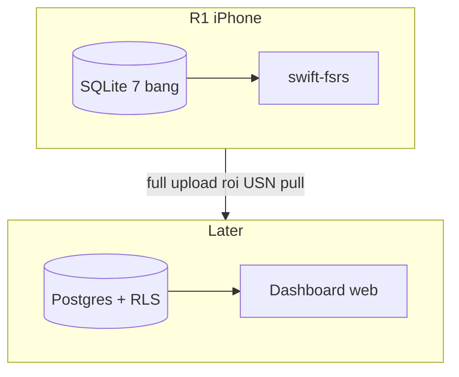

# DB — dialect SQLite R1, và cửa sync Later

| Field | Value |
|---|---|
| Status | Draft — tầng A là DDL máy; tầng B chưa implement |
| Created | 2026-09-17 |
| Last updated | 2026-09-18 |
| Related | [research/vocabulary.md](docs/research/vocabulary.md) mục 6, [research/tech-stack.md](docs/research/tech-stack.md) mục 7 và 10.2, [research/review.md](docs/research/review.md), [prd.md](docs/specs/prd.md) |

**Tài liệu này không thay** [vocabulary.md mục 6](docs/research/vocabulary.md#6-schema). Doc kia là *hình dạng logic* (tên cột, nullability, vì sao). File này là *dialect sẽ `CREATE`*: R1 trên iPhone, và ghi chú Later để khỏi nhồi envelope sync vào máy.

Bản nháp trước (Postgres `auth.uid()`, `usn`, `graves`, id 32 hex, bỏ `is_default`, `tags`/`synonyms`/`antonyms`, cột BYOK plaintext) là thiết kế **server đa tenant**. Các mã `D-*`, `app/src/storage/schema.sql` **không có trong repo**. Thiết kế Rich Vocabulary + cram giờ nằm ở `docs/research/review.md` Phần 3 — vẫn là bản nháp PWA, đừng coi là đã chốt.

## Điều hướng

- [A. R1 — SQLite trên máy](#a-r1--sqlite-trên-máy)
  - [A.2.1 Seed lúc cài đặt](#a21-seed-lúc-cài-đặt)
  - [A.2.2 App-rule — không CHECK SQL](#a22-app-rule--không-check-sql)
- [B. Later — server sync / dashboard](#b-later--server-sync--dashboard)
- [C. Cố ý không đưa vào máy](#c-cố-ý-không-đưa-vào-máy)



---

## A. R1 — SQLite trên máy

Source of truth cho app iOS. Một user, một file, NG-05. FSRS chỉ chạy ở đây (`swift-fsrs` + `defaultWv6`).

### A.1 Quy tắc dialect

Đã chốt [tech-stack mục 7.2](docs/research/tech-stack.md#72-mapping-đã-chốt-2026-09-17):

| Logic (structure 6.1) | SQLite R1 |
|---|---|
| `uuid` | `TEXT`, chữ thường, **có gạch nối** (`8-4-4-4-12`). Không `BLOB`, không 32 hex. FR-16 đọc được bằng mắt |
| `timestamptz` | `TEXT` ISO-8601 **UTC, luôn hậu tố `Z`**. App ghi, không `datetime('now')` trần |
| `jsonb` / `fsrs_params` | `TEXT` JSON; `fsrs_version` đi kèm |
| `boolean` | `INTEGER` 0/1 |

App **bật** `PRAGMA foreign_keys = ON` mỗi connection. SQLite mặc định tắt.

Id do **client sinh** lúc insert (kể cả khi đang online) — cửa sync Later không phải đánh số lại.

### A.2 Bảy bảng trên máy

Không có `user_id`, `usn`, `graves`. Không có `tags` / `synonyms` / `antonyms` trên item. **Không** cột API key.

```sql
-- PRAGMA foreign_keys = ON;  -- moi connection

CREATE TABLE collections (
  id          TEXT NOT NULL PRIMARY KEY,
  name        TEXT NOT NULL,
  is_default  INTEGER NOT NULL DEFAULT 0 CHECK (is_default IN (0, 1)),
  created_at  TEXT NOT NULL
);

CREATE UNIQUE INDEX idx_collections_inbox
  ON collections (is_default) WHERE is_default = 1;
CREATE UNIQUE INDEX idx_collections_name
  ON collections (name COLLATE NOCASE);
-- Ten: FR-20 khop khong hoa thuong. Trim o app truoc insert/rename.

CREATE TABLE vocab_items (
  id               TEXT NOT NULL PRIMARY KEY,
  collection_id    TEXT NOT NULL REFERENCES collections(id) ON DELETE RESTRICT,
  term             TEXT NOT NULL,
  term_normalized  TEXT NOT NULL,
  pos              TEXT NOT NULL,  -- noun | verb | adj | adv | phrase | other | ...
  ipa              TEXT,
  meaning_vi       TEXT NOT NULL,
  example          TEXT NOT NULL,  -- cau that tren trang, khong phai AI tu nghi
  cefr             TEXT,
  created_at       TEXT NOT NULL
  -- KHONG unique (collection_id, term_normalized): structure 6.3 / Q-07
);

CREATE INDEX idx_vocab_collection ON vocab_items (collection_id);
CREATE INDEX idx_vocab_term      ON vocab_items (term_normalized);
CREATE INDEX idx_vocab_inbox_time ON vocab_items (collection_id, created_at);

CREATE TABLE cards (
  id              TEXT NOT NULL PRIMARY KEY,
  vocab_item_id   TEXT NOT NULL REFERENCES vocab_items(id) ON DELETE CASCADE,
  direction       TEXT NOT NULL DEFAULT 'receptive'
                    CHECK (direction IN ('receptive', 'productive')),
  state           TEXT NOT NULL DEFAULT 'new'
                    CHECK (state IN ('new', 'learning', 'review', 'relearning')),
  stability       REAL NOT NULL DEFAULT 0,
  difficulty      REAL NOT NULL DEFAULT 0,
  reps            INTEGER NOT NULL DEFAULT 0,
  lapses          INTEGER NOT NULL DEFAULT 0,
  learning_steps  INTEGER NOT NULL DEFAULT 0,
  scheduled_days  INTEGER NOT NULL DEFAULT 0,
  last_review_at  TEXT,
  due_at          TEXT NOT NULL,
  suspended_at    TEXT,
  UNIQUE (vocab_item_id, direction)
);

CREATE INDEX idx_cards_due ON cards (due_at) WHERE suspended_at IS NULL;

CREATE TABLE review_logs (
  id                     TEXT NOT NULL PRIMARY KEY,
  card_id                TEXT NOT NULL REFERENCES cards(id) ON DELETE CASCADE,
  mode                   TEXT NOT NULL
                           CHECK (mode IN ('srs', 'cram', 'distinguish', 'recall')),
  rating                 INTEGER NOT NULL CHECK (rating BETWEEN 1 AND 4),
  -- anh chup TRUOC khi cham
  state_before           TEXT NOT NULL,
  stability_before       REAL NOT NULL,
  difficulty_before      REAL NOT NULL,
  learning_steps_before  INTEGER NOT NULL,
  due_before             TEXT NOT NULL,
  elapsed_days           INTEGER NOT NULL,
  scheduled_days         INTEGER NOT NULL,
  reviewed_at            TEXT NOT NULL
);

CREATE INDEX idx_logs_card ON review_logs (card_id, reviewed_at);

-- FR-21. Khong cot key — Keychain theo id.
CREATE TABLE analysis_agents (
  id          TEXT NOT NULL PRIMARY KEY,
  kind        TEXT NOT NULL CHECK (kind IN ('reado_proxy', 'openai_compat')),
  name        TEXT NOT NULL,
  base_url    TEXT,  -- bat buoc khi openai_compat; NULL khi reado_proxy
  model       TEXT,  -- bat buoc khi openai_compat; NULL khi reado_proxy
  created_at  TEXT NOT NULL
);

-- Q-10 chot 2026-09-18 (ADR-029): giu 10 phien doc gan nhat moi NAMED collection
-- de doc lai trang cuoi. KHONG anh (NFR-04). Kho tam (is_default=1) KHONG ghi phien
-- (app-rule, khong CHECK SQL vi can join collections).
CREATE TABLE reading_sessions (
  id            TEXT NOT NULL PRIMARY KEY,
  collection_id TEXT NOT NULL REFERENCES collections(id) ON DELETE CASCADE,
  created_at    TEXT NOT NULL,
  segments      TEXT NOT NULL,  -- JSON: cap {source_en, translation_vi} theo thu tu
  summary       TEXT            -- summary_vi; NULL neu response khong tra
);

CREATE INDEX idx_sessions_collection
  ON reading_sessions (collection_id, created_at DESC);
-- Trim con 10 moi nhat/collection TRONG CUNG transaction voi insert.

CREATE TABLE settings (
  id                 INTEGER PRIMARY KEY DEFAULT 1 CHECK (id = 1),
  cefr_level         TEXT NOT NULL DEFAULT 'B2',
  daily_new_limit    INTEGER NOT NULL DEFAULT 10,
  request_retention  REAL NOT NULL DEFAULT 0.9
                       CHECK (request_retention BETWEEN 0.7 AND 0.99),
  maximum_interval   INTEGER NOT NULL DEFAULT 36500,
  enable_fuzz        INTEGER NOT NULL DEFAULT 1 CHECK (enable_fuzz IN (0, 1)),
  day_cutoff_hour    INTEGER NOT NULL DEFAULT 4
                       CHECK (day_cutoff_hour BETWEEN 0 AND 23),
  timezone           TEXT NOT NULL,  -- IANA; seed luc cai dat tu device. FR-11 / FR-14
  enable_short_term  INTEGER NOT NULL DEFAULT 0 CHECK (enable_short_term IN (0, 1)),
  -- Q-12 tat. swift-fsrs: enableShortTerm / learning steps rong
  known_stability    REAL,           -- FR-10; NULL = chua bat loc. So = PRD Q-08
  leech_lapses       INTEGER,        -- FR-19 hanh dong; NULL = chua bat. lapses van dem
  fsrs_params        TEXT,           -- JSON array; null = default thu vien
  fsrs_version       TEXT,           -- 'fsrs-6' ke ca khi fsrs_params null
  home_shortcut_1_id TEXT REFERENCES collections(id) ON DELETE SET NULL, -- deprecate: v3 copy sang home_pin_ids rồi NULL
  home_shortcut_2_id TEXT REFERENCES collections(id) ON DELETE SET NULL, -- deprecate, cùng lý do
  active_agent_id    TEXT NOT NULL REFERENCES analysis_agents(id),
  -- Các cột dưới KHÔNG có trong DDL v1. Migration v2/v3 ALTER thêm.
  -- Shape này là bảng sau currentVersion = 3.
  reminder_enabled    INTEGER NOT NULL DEFAULT 0,          -- v2. 0 = tắt
  reminder_minutes    INTEGER NOT NULL DEFAULT 1200,       -- v2. phút từ nửa đêm; 1200 = 20:00
  cefr_levels         TEXT NOT NULL DEFAULT '["B2"]',     -- v3. JSON array A2–C1. cefr_level đơn deprecate
  home_pin_ids        TEXT NOT NULL DEFAULT '[]',         -- v3. JSON, tối đa 5, thứ tự user ghim
  review_priority_ids TEXT NOT NULL DEFAULT '[]',         -- v3. JSON, tối đa 3 collection ôn nhanh
  review_all          INTEGER NOT NULL DEFAULT 0          -- v3. 1 = ôn mọi collection
);
```

Xoá collection: `ON DELETE RESTRICT` — phải chuyển hoặc xoá `vocab_items` trước (FR-17). Xoá item thì cards + logs cascade. Shortcut Home trỏ vào collection bị xoá thành `NULL` (`ON DELETE SET NULL`). Phiên đọc `reading_sessions` chết theo collection (`ON DELETE CASCADE`) — collection rỗng vocab xoá được thì phiên của nó cũng đi.

`review_logs`: R1 chỉ ghi `mode = 'srs'`. Ba giá trị kia giữ đường R2, không đụng FSRS state.

Một lần chấm: `UPDATE cards` và `INSERT review_logs` **cùng transaction**. Log không ghi thì mất training data. Undo FR-12 được **xoá đúng dòng log vừa ghi** trong cùng transaction đó; không `UPDATE` log cũ. Xoá item vẫn cascade (mất log thẻ đó) — như research.

### A.2.1 Seed lúc cài đặt

`timezone` không có SQL default. **Một** transaction lúc cài:

1. `INSERT` collection kho tạm, `is_default = 1`.
2. `INSERT` `analysis_agents`: `id = '00000000-0000-4000-a000-000000000001'`, `kind = 'reado_proxy'`, `name = 'Reado'`, `base_url` / `model` null, `created_at` now UTC `Z`. Hàng này **không xoá được**.
3. `INSERT` `settings` (`id = 1`): `timezone` = IANA của device, `fsrs_version = 'fsrs-6'`, `fsrs_params` null (default thư viện + `defaultWv6` lúc gọi FSRS), `home_shortcut_*` null, `known_stability` null, `leech_lapses` = 6 (**owner chốt 2026-09-24** — không phải Q-08), `active_agent_id` = id proxy ở bước 2. Cột v2/v3 lấy DEFAULT của ALTER (`reminder` tắt, `cefr_levels` `["B2"]`, pin và priority rỗng).

### A.2.2 App-rule — không CHECK SQL

| Rule | Vì sao |
|---|---|
| R1 chỉ `INSERT` card `direction = 'receptive'` | GP2: cột `productive` sẵn, feature R2 |
| Không gán `home_pin_ids` gồm kho tạm (`is_default = 1`) | FR-17: kho tạm không phải bài đọc chủ động. Tối đa 5 id, không trùng. `home_shortcut_1/2` deprecate |
| `known_stability` NULL | Coi như 21 (Q-08). NULL không tắt bộ lọc. Task 3.8 lọc lúc dựng danh sách duyệt |
| `leech_lapses` = 6 lúc seed | Owner chốt 2026-09-24. Không gộp với Q-08 |
| Trim `collections.name` trước ghi | Unique `COLLATE NOCASE` không thay trim |
| Key user (FR-21) chỉ Keychain theo `analysis_agents.id`; không cột SQLite | NFR-07 hybrid |
| Không `DELETE` hàng `kind = reado_proxy` | FR-21; seed bắt buộc |
| Xoá agent đang `active_agent_id` → gán lại proxy builtin | FR-21 |
| `openai_compat`: `base_url` + `model` không null; HTTPS trừ loopback / RFC1918 | Self-host LAN |
| Client POST `{base_url}/chat/completions` (prefix kiểu `https://openrouter.ai/api/v1`) | Wire OpenAI-compat |

### A.3 Không nằm file SQLite kho từ

| Chỗ | Ở đâu |
|---|---|
| `analysis_events` | **Proxy** — [tech-stack 10.1](docs/research/tech-stack.md#101-telemetry--analysis_events-trên-proxy) |
| API key Gemini **sản phẩm** | **Proxy `.env`** — Q-03 / NFR-07. Không cột trên máy |
| API key **user** (FR-21) | **Keychain** theo `analysis_agents.id`. Metadata agent ở SQLite; key không |
| `word_relations` | **R2** — structure mục 5.1 |
| Buffer bản song ngữ (FR-05) | Bảng `reading_sessions`: tối đa 10 phiên / collection có tên, JSON segments + summary. Kho tạm không ghi. Không ảnh |

### A.4 Field cố ý không lưu

Giữ nguyên bảng structure 6.1: không `cards.elapsed_days`, không `cards.retrievability`, không `review_logs.last_elapsed_days`.

---

## B. Later — server sync / dashboard

Chưa làm ở R1. Lần sync đầu = **full upload** từ máy. `usn` / `graves` / RLS chỉ cần khi đã có **client thứ hai** hoặc dashboard đọc cùng kho.

### B.1 Envelope (thêm lúc mở sync, không có trên máy R1)

Trên Postgres, mỗi bảng nội dung thêm:

- `user_id uuid not null default auth.uid()`
- `modified_at text not null` — ISO-8601 UTC `Z`, đồng hồ LWW
- `usn bigint not null default -1` — cursor pull: `where user_id = me and usn > cursor order by usn`

`settings` máy (`id = 1`) thành `user_settings` PK `user_id`.

`unique (vocab_item_id, direction)` trên server thành `unique (user_id, vocab_item_id, direction)`. **Không** unique trên `term_normalized`.

### B.2 `is_default` ở đâu

**Giữ trên máy.** `collection_id` không bao giờ null; kho tạm là một hàng `is_default = 1`.

Trên server, boolean `is_default` không unique theo user trừ khi partial unique. Later được map sang `default_collection_id` trên `user_settings` — đó là D-7 của bản nháp cũ. **Không** xoá cột trên SQLite R1.

### B.3 `graves`

Tombstone xoá đa client. PK `(user_id, id, original_table)`. Chỉ có nghĩa khi có máy thứ hai cần biết “hàng này đã xoá”. R1 một máy: xoá là xoá.

### B.4 FSRS không chạy trên server

[tech-stack 4.2](docs/research/tech-stack.md#42-dual-fsrs-là-cảnh-báo-later-không-chặn-r1): server lưu **snapshot** máy đã tính. Hai implementation lệch `due_at` im lặng.

Id **vẫn** uuid có gạch nối, cùng máy — không đổi sang 32 hex lúc lên server (FR-16 + một định dạng).

### B.5 Bản nháp Postgres (tham khảo, chưa chốt)

Giữ hình dạng cũ để khỏi mất ý sync, đã vá cho khớp tầng A: uuid có gạch nối, không `tags`/`synonyms`, không cột key, `cefr_level` mặc định `B2`. **Không** `CREATE` tuần này. RLS / trigger `utc_iso()` / mục 5 chưa viết. Metadata `analysis_agents` **có thể** lên server Later; **key không sync**.

```sql
-- Later only. Khong phai schema iPhone.

create table collections (
  id          text not null primary key,  -- uuid co gach noi, giong may
  name        text not null,
  created_at  text not null,
  user_id     uuid not null default auth.uid(),
  modified_at text not null,
  usn         bigint not null default -1
);

create table vocab_items (
  id               text not null primary key,
  collection_id    text not null references collections(id) on delete restrict,
  term             text not null,
  term_normalized  text not null,
  pos              text not null,
  ipa              text,
  meaning_vi       text not null,
  example          text not null,
  cefr             text,
  created_at       text not null,
  user_id          uuid not null default auth.uid(),
  modified_at      text not null,
  usn              bigint not null default -1
);

create table cards (
  id              text not null primary key,
  vocab_item_id   text not null references vocab_items(id) on delete cascade,
  direction       text not null default 'receptive'
                    check (direction in ('receptive', 'productive')),
  state           text not null default 'new'
                    check (state in ('new', 'learning', 'review', 'relearning')),
  stability       double precision not null default 0,
  difficulty      double precision not null default 0,
  reps            integer not null default 0,
  lapses          integer not null default 0,
  learning_steps  integer not null default 0,
  scheduled_days  integer not null default 0,
  last_review_at  text,
  due_at          text not null,
  suspended_at    text,
  user_id         uuid not null default auth.uid(),
  modified_at     text not null,
  usn             bigint not null default -1,
  unique (user_id, vocab_item_id, direction)
);

create table review_logs (
  id                     text not null primary key,
  card_id                text not null references cards(id) on delete cascade,
  mode                   text not null
                           check (mode in ('srs', 'cram', 'distinguish', 'recall')),
  rating                 integer not null check (rating between 1 and 4),
  state_before           text not null,
  stability_before       double precision not null,
  difficulty_before      double precision not null,
  learning_steps_before  integer not null,
  due_before             text not null,
  elapsed_days           integer not null,
  scheduled_days         integer not null,
  reviewed_at            text not null,
  user_id                uuid not null default auth.uid(),
  modified_at            text not null,
  usn                    bigint not null default -1
);

create table analysis_agents (
  id          text not null primary key,
  kind        text not null check (kind in ('reado_proxy', 'openai_compat')),
  name        text not null,
  base_url    text,
  model       text,
  created_at  text not null,
  user_id     uuid not null default auth.uid(),
  modified_at text not null,
  usn         bigint not null default -1
  -- khong cot key. Key khong sync.
);

create table graves (
  id             text not null,
  original_table text not null
                   check (original_table in ('collections', 'vocab_items', 'cards', 'review_logs')),
  deleted_at     text not null,
  user_id        uuid not null default auth.uid(),
  usn            bigint not null default -1,
  primary key (user_id, id, original_table)
);

create table user_settings (
  user_id              uuid not null default auth.uid() primary key,
  default_collection_id text references collections(id),
  cefr_level           text not null default 'B2',
  daily_new_limit      integer not null default 10,
  request_retention    double precision not null default 0.9,
  maximum_interval     integer not null default 36500,
  enable_fuzz          integer not null default 1 check (enable_fuzz in (0, 1)),
  day_cutoff_hour      integer not null default 4 check (day_cutoff_hour between 0 and 23),
  timezone             text not null,
  enable_short_term    integer not null default 0,
  known_stability      double precision,
  leech_lapses         integer,
  fsrs_params          text,
  fsrs_version         text,
  active_agent_id      text references analysis_agents(id),
  modified_at          text not null,
  usn                  bigint not null default -1
);

create index idx_collections_owner_usn on collections (user_id, usn);
create index idx_vocab_owner_usn      on vocab_items (user_id, usn);
create index idx_vocab_owner_term     on vocab_items (user_id, term_normalized);
create index idx_cards_owner_usn      on cards (user_id, usn);
create index idx_cards_owner_due      on cards (user_id, due_at) where suspended_at is null;
create index idx_logs_owner_usn       on review_logs (user_id, usn);
create index idx_logs_owner_card      on review_logs (user_id, card_id, reviewed_at);
create index idx_graves_owner_usn     on graves (user_id, usn);
```

Pull: `where user_id = me and usn > cursor order by usn` — chỉ khi đã có sync.

---

## C. Cố ý không đưa vào máy

| Ý bản nháp cũ | Vì sao không vào R1 |
|---|---|
| Id 32 hex + `check (id ~ '...')` | Dialect đã chốt gạch nối; SQLite không có `~` |
| Bỏ `is_default` | FR-17 / `collection_id` never null |
| `tags` / `synonyms` / `antonyms` JSON trên item | Không có trong schema đã chốt. R2 = `word_relations` |
| ~~BYOK `ai_api_key` plaintext trên device / SQLite~~ | Cột key **cấm**. User key = Keychain (FR-21). Key sản phẩm = proxy `.env` |
| `user_id` / `usn` / `graves` / RLS | Một máy; lần sync đầu = full upload |
| Default `cefr_level` `B1` | Docs: **B2** |
| `session_id` trên `vocab_items` | Không cần — phiên đọc có bảng riêng `reading_sessions` (Q-10, ADR-029). Chữ cũ ở FR-20 là mồ của bảng `pages` |
