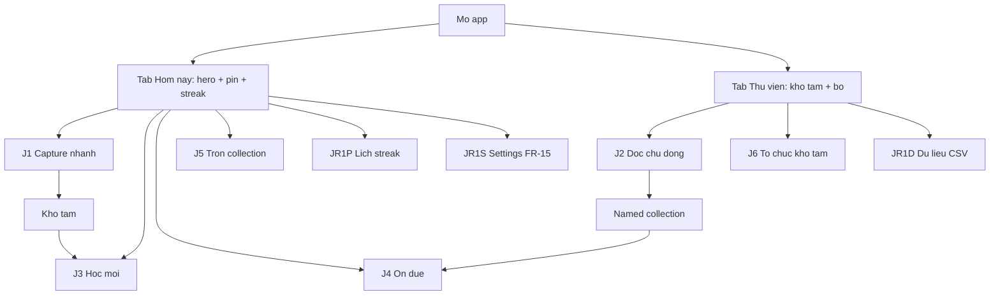
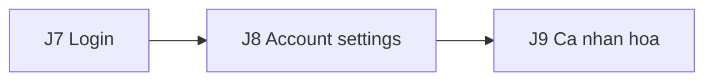
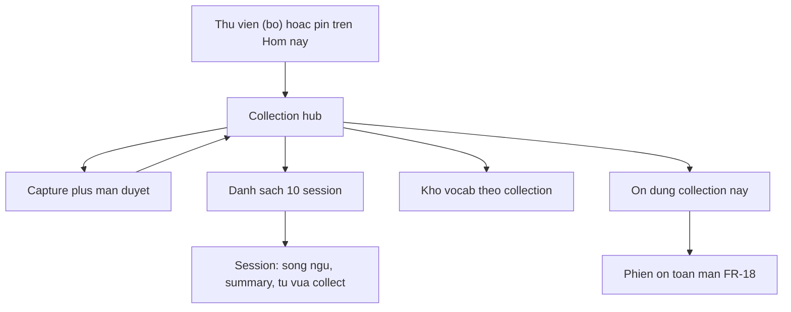

## Phần 1 — Reado — Customer Journeys

| Field | Value |
|---|---|
| Product | Reado |
| Status | Draft |
| Created | 2026-09-14 |
| Last updated | 2026-10-02 (ux-redesign-r1 T11 — IA 2 tab, ADR-052/053/054) |
| Related | [prd.md](docs/specs/prd.md), [vision.md](docs/specs/vision.md), [db.md](docs/specs/db.md), [research/vocabulary.md](docs/research/vocabulary.md), [research/review.md](docs/research/review.md), [prompt-spec.md](docs/agent/prompt-spec.md), [design-system/reado/MASTER.md](design-system/reado/MASTER.md) |
| Phạm vi | Flow spec trước UI: ai làm gì, màn nào, state nào. **Không** chốt màu, font, hay Design system |

**Tài liệu này tự chứa.** Session mới đọc được mà không cần chat history. Nó **không** thay PRD: FR, non-goals, và bảng "Đã chốt" ở research doc vẫn là source of truth. Journey chỉ **tách** [Core User Journey ở PRD mục 6](docs/specs/prd.md#6-core-user-journey) thành các lối đi dùng để prompt UI từng màn. **Code là nguồn sự thật cho hiện trạng UI** — file này tả ý định (JTBD/FR/empty-error); mâu thuẫn với code thì báo lại, không tự sửa prd.md/decisions-log.md.

Hai việc journey R1 thêm so với mermaid PRD (không đổi FR):

1. **Hai lối capture** — nhanh (không chọn collection → kho tạm) và đọc chủ động (**collection hub**: capture, 10 session chọn được, kho vocab theo collection).
2. **Tối đa năm collection ghim lên Hôm nay** — user tự ghim/bỏ ghim ở Hub, không phải recent tự động và không pin session.
3. **Ba lối ôn** ánh xạ câu "học / ôn / trộn" của owner — xem mục 2; sai thì sửa **ở đây** trước khi prompt UI, đừng bịa chế độ thứ tư.

**Khung app (ADR-052, 2026-10-02):** shell 2 tab — **Hôm nay** (hero theo trạng thái + pin + streak) và **Thư viện**
(kho tạm + danh sách bộ) — cộng một nút chụp tròn đứng cùng hàng với capsule tab (không phải FAB nổi đè nội dung).
Ôn **không** còn là tab: bấm "Ôn ngay"/"Ôn bộ này"/"Ôn thêm" ở hero, Hub, hoặc Lịch streak mở một **phiên ôn toàn
màn** (che cả thanh tab) — thoát bằng ✕ hoặc "Xong", quay lại đúng chỗ đang đứng. Toolbar Hôm nay: pill
🔥N (Lịch streak) · ⚙ (home-eevas-r1 T1, ADR-057 — hai nút tròn tách, không gộp capsule);
Dữ liệu (CSV/JSON) nằm trong menu ⋯ của Thư viện, không phải trên Hôm nay/Settings.

**Later** (sau R1+R2 chứng minh giá trị — [PRD mục 10](docs/specs/prd.md#10-release-scope)): J7 login, J8 settings theo tài khoản, J9 cá nhân hoá. **Không** prompt UI R1 cho J7–J9. R1 vẫn một người dùng (NG-05); màn Settings học tập (FR-15) **không** cần login — xem J-R1-S. FR-21 (agent phân tích) cũng nằm trên J-R1-S, không phải J8.

Phiên ôn (J3/J4/J5) là một `fullScreenCover` mở từ hero Hôm nay, Hub bộ, hoặc Lịch streak — không vẽ riêng trong
mermaid trên để khỏi rối, nhưng không phải một tab thứ ba.

Later — không nối vào tab nào của R1:

---

## 1. Persona và job

Primary persona = owner: developer, B1–B2, đọc sách giấy / báo / tài liệu chuyên ngành, điện thoại luôn bên cạnh. [PRD mục 4](docs/specs/prd.md#4-target-user).

| ID | Job |
|---|---|
| JTBD-01 | Hiểu trang ngay lúc đọc — segment song ngữ, không đứt mạch |
| JTBD-02 | Từ vừa khựng lại vào bộ ôn, kèm câu gốc, không gõ tay |

Mọi journey **R1** dưới đây phải truy được về một trong hai. J1 chỉ JTBD-02. J2 là JTBD-01 rồi JTBD-02. J3–J5 chỉ JTBD-02. J6 phục vụ G-03 (tổ chức collection), không phải job thứ ba. J-R1-S phục vụ FR-15 (núm học tập) và FR-21 (chọn agent phân tích trang). J-R1-D phục vụ NFR-05 / FR-16 + FR-20 (mang kho từ đi và gộp lại) — không phải path capture. J-R1-P là *lens* của FR-14 (xem lịch streak), không phải job thứ ba. J7–J9 phục vụ **tài khoản**, không phải job đọc/ôn — chúng chỉ tồn tại khi có người dùng thứ hai.

---

## 2. Ánh xạ "học / ôn / trộn"

Đây là hợp đồng ngôn ngữ với UI. "Ôn" **không** tự biến thành "Ôn thêm" — Ôn thêm
chỉ vào bằng nút riêng ở màn hết thẻ, CTA ở header collection hub, hoặc Home khi đã
xong phần hôm nay (extra-review-r1 ADR-050).

| Câu owner | Nghĩa trong Reado | Không phải |
|---|---|---|
| **Học** | Thẻ `new` trong hạn `daily_new_limit` (FR-11, FR-14) | Ôn thêm thẻ chưa đến hạn (đường riêng, không đi qua `daily_new_limit`) |
| **Ôn** | Thẻ đến hạn FSRS; một collection hoặc tất cả | Tự đẩy thẻ chưa due để "lấp chỗ" |
| **Trộn** | FR-18: chọn **vài** collection; queue = due ∩ phạm vi; **vẫn** ghi FSRS | Trộn semantic set (R2); Ôn thêm |

"Ôn thêm" có trong FR-18 và [structure §4.2](docs/research/vocabulary.md#42-lọc-hàng-đợi-có-thể-phá-vỡ-hợp-đồng-của-scheduler).
**Owner chốt 2026-09-28 (ADR-043):** kéo về R1, chỉ vào từ màn hết thẻ (J4/J5).
**Owner chốt tiếp 2026-10-01 (ADR-050, đảo ADR-011/039/043):** một lượt tối đa 20
thẻ, **trộn** tối đa 10 từ mới (LIFO, bỏ qua `daily_new_limit`) + tối đa 10 thẻ đã
học chưa due ("ôn sớm", sắp due trước) — bên nào thiếu thì bên kia bù đủ 20, xen kẽ
nhau trong lượt. MỌI mức chấm **ghi lịch FSRS thật** (`mode='srs'`) — không còn
đường chấm-không-đổi-lịch của R1; thay cho "Học thêm 10 từ" cũ (ADR-039, đã xoá).

---

## 3. Điểm đã chốt mà mọi journey kế thừa

Không tranh luận lại ở file này. Lý do nằm ở doc gốc.

| Điểm | Nguồn |
|---|---|
| Collection = bối cảnh đọc do user đặt tên; thay `book` | vision nguyên lý 4, structure §3 |
| **Kho tạm** = collection `is_default`; `collection_id` không bao giờ null; từ trong kho tạm **ôn được ngay** | structure §3.2, FR-17 |
| Input đúng **một** path: ảnh (camera hoặc thư viện) | NG-07 |
| Song ngữ + summary **persist** cho **10 phiên đọc gần nhất mỗi collection có tên** (text + dịch, **không ảnh**) — đọc lại được để dễ đọc sách; **kho tạm không lưu session**; session thứ 11 trôi; vocab đã confirm không bao giờ trôi | Q-10 chốt 2026-09-18 (ADR-029); NFR-04; FR-05/FR-06 qua hình dạng J2 (một capture = một session) |
| `example` phải trích nguyên văn; unverified **không** chọn sẵn; không loại trong im lặng | FR-02, prompt-spec |
| Item verified: AI xếp theo giá trị học giảm dần, màn duyệt **chọn sẵn tối đa 5 đầu** (`preselectLimit`), còn lại user tự chọn thêm | FR-09, prompt-v6 T2b |
| Lọc từ **đã thuộc** lúc trích xuất (FR-10); không `unique` trên `term` | structure §6.3 |
| Hai nhánh queue: new bị `daily_new_limit`, due thì không | FR-11 |
| Home hiện số **sẽ ôn hôm nay** (sau hạn mức), backlog là số **riêng** | FR-14 |
| Phạm vi hẹp vẫn cập nhật FSRS; hiện số due **ngoài** phạm vi | FR-18, structure §4.2 |
| `daily_new_limit` áp **toàn cục, trước** khi lọc phạm vi | FR-11 |
| Card: mặt trước `term` + `pos`; lật = nghĩa + IPA + câu gốc + tên collection | FR-12 |
| Kho tạm đổi tên được, **không xoá được**; move collection **không** reset FSRS | FR-17 |
| Hôm nay hiện tối đa **năm named collection do user ghim** (`HomePinService.maxPins`); ghim/bỏ ghim ở menu ⋯ của Hub, không phải ở Settings; tap mở Collection Hub; ghim collection thứ sáu phải chọn một trong năm để thay | FR-17, ADR-052 |
| Settings R1 = một hàng `settings`: `cefr_levels` (JSON array, **nhiều mức** A2–C1, không phải một mức đơn — `db.md` migration v3), `daily_new_limit`, `day_cutoff_hour` (mặc định 04:00); `request_retention` mặc định, **không** mở user; mọi mục **tự lưu**, không có nút "Lưu" | FR-15, FR-11, ADR-031 |
| Agent phân tích: ~~builtin proxy mặc định~~ (bỏ, ADR-049) — user **phải** thêm OpenAI-compat trước khi dùng; **một** active cho cả FR-02; key không SQLite / không export | FR-21, NFR-07 |
| Multi-user / authentication = **Later**, không R1, không R2 | NG-05, PRD mục 10 |
| R1 **không tự chặn đường** Later: đừng hardcode "chỉ một người trên máy này" vào copy hay schema khiến tách user phải viết lại | PRD mục 10 Later |

---

## J1 — Capture nhanh

**Trigger:** Gặp chữ trên bàn, screenshot, menu quán — không muốn "mở phiên đọc sách".  
**Job:** JTBD-02 only.  
**Collection đích:** kho tạm (user **không** chọn collection).

### Happy path

1. Nút chụp trên thanh (cùng hàng với 2 tab, ADR-052) → Camera / chọn ảnh từ thư viện. Chưa thêm agent BYOK →
   mở thẳng form thêm agent (`AgentFormSheet`) thay vì chụp rồi báo lỗi sau (ADR-053, phòng lỗi trước).
2. Không bước collection picker. Đích ngầm = kho tạm.
3. Processing (FR-02): OCR + dịch + vocab **một lần gọi**, dùng `settings.active_agent_id` (FR-21). ~~Mặc định = proxy Reado~~ — bỏ, ADR-049: chưa thêm agent BYOK thì lỗi, không chạy được bước này. Segments có thể có trong payload nhưng J1 **không** bắt user ở lại đọc song ngữ, và **kho tạm không lưu session đọc** (Q-10).
4. Màn **Duyệt & lưu**: FR-10 gập từ đã thuộc xuống nhóm riêng "Đã thuộc · N" cuối danh sách (gập sẵn, không
   xoá — Q-13 phương án B, ADR-056), mở ra thấy nghĩa AI gán cho trang này cạnh mọi nghĩa đã có trong kho cùng
   khoá `term+pos`; chọn một dòng trong đó vẫn tăng số ở nút Lưu như item thường. Verified (danh sách chính)
   chọn sẵn **tối đa 5 đầu** theo thứ tự AI xếp hạng giá trị học (FR-09, prompt-v6 T2b). Unverified badge,
   không preselect (FR-02). User sửa field / bỏ chọn / chọn thêm (FR-03). Dòng "Lưu vào: X ⏷" ở đầu màn —
   **đổi được đích ngay đây** (`CollectionDestinationPicker`, Menu: Kho tạm · các bộ · "Tạo bộ mới…"), không
   còn phải quay lại màn chụp để sửa (ADR-053, giải ngõ cụt cũ). Đổi đích → nhóm gập "Đã thuộc"
   tính lại theo bộ mới (Q-09 so khớp theo collection), giữ nguyên sửa tay + lựa chọn người dùng
   (fr10-close-r1, `ReviewDraftBuilder.regroup`).
5. Nút đáy "Lưu N từ vào X" (prominent, ghim đáy) → lưu card `new`, `due_at` hôm nay (FR-09). Từ **ôn được ngay** (structure §3.2). Thao tác **không chặn** — không alert xác nhận.
6. Sau Lưu: ở lại đúng chỗ đang đứng (không tự đổi tab, không bị đẩy sang Hub) + `ShellBanner` không chặn "Đã lưu N từ vào X · Xem" (ADR-053). Bấm "Xem" mới mở Hub của X; để banner tự tắt (4s, hoặc giữ khi VoiceOver đang chạy) thì ở nguyên màn cũ. Số new trên Hôm nay đã áp `daily_new_limit` (FR-14).

### Màn UI (thứ tự prompt)

Capture · Processing · Duyệt & lưu (đổi đích + chọn từ) · banner "Xem" (không màn riêng).

### Empty / error (J1)

| State | Hành vi | FR |
|---|---|---|
| Ảnh mờ / không đọc được | Báo cụ thể, gợi ý chụp lại, **không** bịa | FR-04 |
| Không phải tiếng Anh | Báo không hỗ trợ, không tính lần gọi vào lịch sử | FR-04 |
| Schema / parse fail | Lỗi + retry, không lưu bản ghi hỏng | FR-02 |
| BYOK 401 / timeout / JSON lệch schema | Lỗi rõ + CTA Settings; không lưu vocab dở | FR-21 |
| Submit trùng do mạng | Không lưu hai bộ vocab trùng | FR-02 |
| Chưa thêm agent, bấm nút chụp | Mở form thêm agent trước, không mở camera (ADR-053) | FR-21 |
| Vocab rỗng sau FR-10 | "Không còn từ đáng học trên trang này" + [Chụp lại] [Đóng] — vẫn cho đọc tab Trang (T9). Còn item trong nhóm gập "Đã thuộc" (Q-13) thì KHÔNG rơi vào state này — vẫn hiện danh sách với nhóm gập đó, còn chọn/lưu được | FR-10 |
| Thoát picker chưa confirm | Cảnh báo mất kết quả analysis | FR-03 |
| Lưu thất bại (không phải thành công) | Vẫn alert chặn — chỉ đường **thành công** đổi sang banner (ADR-053) | FR-02 |
| Analysis cần mạng | Fail rõ, không giả offline. Ôn (J3–J5) **chạy được offline** (NFR-03, Q-02 local-first) — không cần journey ôn-khi-mất-mạng riêng nếu hàng đợi đã trên máy | NFR-03 |

---

## J2 — Đọc chủ động (collection hub)

**Trigger:** "Hôm nay đọc tiếp *Atomic Habits*" — hoặc tạo collection mới mang tên sách / mảng việc.  
**Job:** JTBD-01 rồi JTBD-02.  
**Collection đích:** collection **đã chọn** (hoặc vừa tạo). Chọn kho tạm = ứng xử J1 (không tạo session) — kho tạm **không bao giờ** lưu session (Q-10 chốt 2026-09-18).

J2 không phải một pipeline thẳng Capture → Read → Home. Nó là **hub của một collection**, bốn bề mặt sống cùng lúc:

| Bề mặt | Sống bao lâu | Job |
|---|---|---|
| Capture | Một lần gọi, rồi thành session mới | Cả hai JTBD |
| **10 session gần nhất** — chọn được | Bền (text + dịch + summary, **không ảnh** — NFR-04). Session thứ 11 **trôi** (song ngữ + summary mất). Vocab đã confirm thì **không** mất | JTBD-01 |
| **Kho vocab theo collection** | Durable, FR-08 lọc `collection_id` | JTBD-02 |
| **Ôn collection này** | Queue = due ∩ collection đang đứng; FSRS bình thường. Nợ ngoài phạm vi phải nhìn thấy | JTBD-02, FR-18 |

Một **session** = một lần capture thành công đã confirm picker (một ảnh → một session), **chỉ cho named collection**. Đây là hình dạng UX của FR-05 do owner chốt 2026-09-18 (Q-10, ADR-029): giữ **10 session gần nhất mỗi collection** để đọc lại trang cuối — mục đích dễ đọc sách — thay vì chỉ cuộn ngược một trang dài trong phiên.

### Happy path — vào hub

1. Mở **Collection hub** từ danh sách "Bộ" ở tab Thư viện, hoặc từ một pin trên Hôm nay (**không** còn màn
   "Collection picker" riêng — ADR-052; tạo bộ mới thì bấm `+` trên toolbar Thư viện trước, FR-17).
2. Trên hub, cùng lúc:
   - Menu ⋯ của hub có mục **"Ghim lên Hôm nay" / "Bỏ ghim"** cho collection này (`HomePinMenu`). Đã ghim đủ 5 (`HomePinService.maxPins`) → mở chooser chọn một pin bị thay; không tự thay ngầm.
   - Nút chụp trên thanh tab, khi đang mở hub này, ngầm chọn đích = bộ đang mở (chip ở màn chụp ghi tên bộ) — không có nút "Chụp vào bộ này" riêng trên hub (chỉ 1 CTA chính, ADR-052). Đổi đích khác thì đổi chip hoặc đổi "Lưu vào" ở màn duyệt (giống J1 bước 4).
   - **Header thống kê** (T6): thẻ tiến độ "Đã thuộc X/Y" + thanh 4 màu theo từ (Đã thuộc · Đang nhớ · Đang học · Chưa học; bộ rỗng ẩn thanh) + **một dòng meta** "Đến hạn N · +M từ/7 ngày · Lần ôn tiếp …" (không còn 3 ô số riêng).
   - CTA chính **đổi theo ngữ cảnh**: còn due → **"Ôn bộ này · N đến hạn"** → mở phiên ôn toàn màn với hàng đợi due đã lọc `collection_id` (FR-18); hết due mà còn từ mới/thẻ ôn sớm → **"Ôn thêm N thẻ"** (extra-review-r1 ADR-050, CÓ ghi lịch FSRS thật, cùng phiên ôn toàn màn theo phạm vi bộ này); không còn gì → không nút. 0 due trong bộ nhưng còn due ngoài → hiện số nợ + CTA ôn tất cả (trong phiên ôn).
   - Danh sách **tối đa 10 session** gần nhất, **chọn được** từng cái.
   - Cửa **kho từ vựng theo collection** (mọi từ đã lưu vào collection này, kể cả từ session đã trôi).

### Happy path — capture thêm một session

3. Nút chụp trên thanh (đích ngầm = bộ đang mở) → Processing (FR-02).
4. Màn **Duyệt & lưu** — cùng rule J1 (FR-09 / FR-02 / FR-10 / FR-03); đích đã là collection này nhưng vẫn đổi được qua "Lưu vào ⏷" nếu bấm nhầm bộ.
5. Session mới **đứng đầu** danh sách 10. Nếu đã đủ 10: session cũ nhất trôi. Sắp trôi mà chưa confirm picker → cảnh báo (FR-05).
6. Lưu xong: ở lại/về hub (banner "Xem" nếu đang ở màn khác, ADR-053) — không bắt về Hôm nay.

### Happy path — mở một session (chọn từ list)

7. Trong session:
   - **Song ngữ xen kẽ theo đoạn**, đúng thứ tự (FR-05, ADR-007) — bản dịch hiện sẵn ngay dưới bản gốc, 0 thao tác. **Nút nhỏ ở phía dưới màn:** 1 tap = ẩn/hiện toàn bộ bản dịch (ADR-030) — từ ADR-053, màn Duyệt & lưu tab "Trang" cũng dùng chung cơ chế này. **Cụm chạm-sáng** (FR-05, prompt-v6 T3): một số cụm EN được gạch chân mảnh — chạm một cụm thì cụm đó và cụm VI tương ứng cùng tô nền, tự hiện bản dịch đoạn nếu đang ẩn; tối đa một cụm sáng cùng lúc. Chữ đã có trong kho (FR-22) ưu tiên hơn — chạm đúng chữ chồng vẫn mở popover từ cũ.
   - **Summary** nằm **dưới** phần đọc (FR-06: mặc định thu gọn trên list hoặc trên detail — không thay trang sách, vision nguyên lý 6).
   - **Từ session này collect thêm:** danh sách vocab đã confirm từ đúng lần capture đó (subset của kho collection). Unverified từng hiện lúc picker không nằm đây trừ khi user giữ. **Mở — chưa làm** (brief §2.3, thiếu `session_id` trên `vocab_items`, ngoài phạm vi ux-redesign-r1).
8. List 10 session: mỗi hàng có thể hiện summary (snippet) để chọn đúng phiên, không bắt mở hết mới biết.

### Happy path — kho vocab theo collection

9. Từ hub, mở kho: `term`, `pos`, `ipa`, `meaning_vi`, `cefr`, câu gốc, collection (FR-08). Lọc trạng thái ôn **có thể** để R2 (PRD mục 10); R1 chỉ cần list theo collection. Cửa **Xuất bộ này** → J-R1-D với collection đang đứng đã chọn sẵn (FR-16).
10. Kho này **không** trôi khi session thứ 11 rơi. Đó là chỗ neo JTBD-02 trong J2.

### Màn UI (thứ tự prompt)

Thư viện (danh sách Bộ) · **Collection hub** (menu ghim + ôn bộ này + list 10 session + cửa kho vocab) · Capture / Processing / Duyệt & lưu (reuse J1) · **Session detail** (song ngữ + summary dưới + từ collect session này — mở) · **Collection vocab** (FR-08).

### Empty / error (J2)

Mọi state capture của J1 cộng:

| State | Hành vi | FR |
|---|---|---|
| Collection mới, 0 session | Hub empty: nút chụp vẫn mở (đích = bộ này), kho vocab rỗng, không giả 10 hàng | — |
| User mở session đã trôi | Không còn song ngữ/summary — hành vi đúng. Vocab của lần đó vẫn trong kho collection | FR-06 |
| 0 due trong collection, ngoài còn due | Hiện số nợ + CTA ôn tất cả — không giấu FR-18 | FR-18 |
| Session 0 từ (user bỏ hết lúc picker) | Session vẫn có thể tồn tại để đọc song ngữ + summary; hàng "từ collect" empty | FR-03 |
| Đã ghim đủ 5, bật ghim collection thứ sáu | Cho chọn một trong 5 pin hiện tại để thay; cancel giữ nguyên | FR-17 |
| Collection đang ghim bị xoá | Bỏ pin lỗi; không mở route chết | FR-17 |
| Kho tạm | Không hiện mục "Ghim lên Hôm nay" trong menu ⋯ | FR-17 |
| Tạo collection trùng tên / xoá collection còn từ | FR-17: không xoá theo; cho chuyển sang collection khác | FR-17 |
| Chỉ có kho tạm, chưa có bộ nào | Thư viện gợi ý "Tạo bộ theo tên sách" + nút, dưới card Kho tạm | — |

---

## J3 — Học từ mới

**Trigger:** Home hiện số **new hôm nay** — con số **sau** `daily_new_limit`, không phải tổng card `due_at` vừa capture (FR-14).  
**Job:** JTBD-02.  
**Queue:** nhánh `new` của FR-11, thứ tự ưu tiên collection vừa thêm từ gần nhất → từ gặp lại → thứ tự trang (new-order-r1, ADR-047) — không phải thứ tự tạo thẻ.

### Happy path

1. Hôm nay → hero "N thẻ đến hạn" → "Ôn ngay" (`HomeHero.State.review(n)`, ADR-052/054) mở **phiên ôn toàn màn**
   (`fullScreenCover`, nhánh new nạp trước theo FR-11). Cùng lối vào với J4 — một hàng đợi, khác nhánh bên trong.
2. Mặt trước: `term` + `pos` only (FR-12).
3. Lật: `meaning_vi`, IPA, câu gốc, **tên collection** (kho tạm cũng hiện tên, không để trống).
4. Grade → FSRS + review log ảnh chụp **trước** khi chấm (FR-12). Undo về đúng state cũ.
5. Hết hạn mức new hôm nay → tiếp tục hàng đợi due nếu còn, hoặc **"Xong"** đóng phiên (`SessionDoneView`). Backlog new **không** nhồi vào queue hôm nay; hero **không hiện con số tồn** (new-order-r1) — chỉ chuyển sang trạng thái `.extra`/`.done`.

Leech (FR-19) không đếm vào số hero và không vào queue — badge, không journey riêng.

### Empty / error (J3)

| State | Hành vi |
|---|---|
| Hết new trong hạn mức, backlog > 0 | Hero: "Xong phần hôm nay ✓" + link "Chụp trang mới", không hiện số backlog, không CTA giả "học tiếp" cùng nhánh |
| Hết hàng đợi, vừa chấm ≥1 thẻ trong phiên, còn từ mới/thẻ ôn sớm trong phạm vi | `SessionDoneView` thêm nút "Ôn thêm N thẻ" (extra-review-r1 ADR-050, đảo ADR-039 "Học thêm 10 từ" — đã xoá) — bấm → nạp lượt Ôn thêm 20 thẻ trộn mới + ôn sớm, cùng scope, **cùng phiên đang mở** (không đóng rồi mở lại). Không còn gì Ôn thêm được → nút "Xong". Hệ thống không bao giờ tự mở. |
| Hết new và backlog = 0 | CTA sang J1/J2 |
| 0 new vì chưa capture | Hero ở trạng thái onboarding (`.firstCapture`), không empty-state chết (ADR-054) |

---

## J4 — Ôn đến hạn

**Trigger:** Hero Hôm nay hiện số **due**, hoặc Hub bộ / Lịch streak còn due.  
**Job:** JTBD-02.  
**Queue:** nhánh review; **không** bị `daily_new_limit`.

### Happy path

1. Hero Hôm nay "Ôn ngay" **hoặc** Hub "Ôn bộ này · N" **hoặc** Lịch streak ngày còn due → cùng mở **một phiên ôn
   toàn màn** qua `EnvironmentValues.startReview` (ADR-052) — chrome thống nhất (✕ trái, tiêu đề + phạm vi ⏷ phải),
   không còn 3 kiểu chrome khác nhau theo nơi mở.
2. Cùng card UI với J3 (một component; khác nhánh queue).
3. Grade + undo như J3. Nút chấm hiện nhịp ôn kế tiếp (ước lượng, preview `swift-fsrs`).
4. Hết due → summary buổi: đã xong, streak theo **giờ chuyển ngày** FR-11 (mặc định 04:00), không nửa đêm hệ thống (FR-14). Vừa chấm hết ≥1 thẻ → `SessionDoneView` (ADR-038): số thẻ đã ôn, % không-Again, từ vừa "đã thuộc" Q-08 (≤5, "+N khác"), streak, nút **"Xong"** đóng cover — về đúng chỗ đang đứng (không còn "Về Home" gọi `dismiss()` chết, giải #2 bằng kiến trúc cover); vào due đã hết sẵn từ đầu thì giữ màn trung tính cũ, không ăn mừng.
5. **Không** tự đẩy card chưa due để lấp chỗ (FR-11). Đổi tab giữa phiên **không còn xảy ra được** — cover che cả thanh tab (giải #3).

Phạm vi mặc định của J4 = **tất cả** (`collection_ids` null). Muốn hẹp → J5.

### Empty / error (J4)

| State | Hành vi |
|---|---|
| 0 due, còn từ mới/thẻ ôn sớm toàn kho | Hero chuyển "Xong phần hôm nay" thành **"Ôn thêm N thẻ"** (`.extra(n)`, extra-review-r1 ADR-050). Mở phiên ôn vẫn hiện "Không có gì cần ôn" + cùng nút nếu vào thẳng |
| 0 due, không còn gì Ôn thêm được | Hero `.done`: đã xong ôn hôm nay, không CTA ôn. CTA khác vẫn là J1/J2 |
| Due > 0 nhưng user đang ở J5 hẹp | Không phải empty J4 — xem J5 "nợ ngoài phạm vi" |
| Kho rỗng hoàn toàn khi mở phiên | "Không có gì cần ôn" + CTA "Chụp trang" — đóng cover rồi mới mở camera, không present 2 cover cùng lúc (T7) |

---

## J5 — Trộn / ôn theo phạm vi

**Trigger:** "Chỉ ôn cuốn đang đọc" hoặc "trộn collection công việc + sách".  
**Job:** JTBD-02.  
**FR:** FR-18. Vẫn filtered study; Ôn thêm chỉ là nhánh riêng ở màn hết thẻ (ADR-043/050).

### Happy path

1. Trong phiên ôn toàn màn (J3/J4): bấm tiêu đề "Tất cả ⏷" → mở `ScopePickerSheet` (không còn mở từ Home hay
   một màn Ôn riêng — ADR-052, picker chỉ sống **trong** phiên).
2. Ba chế độ: một collection · vài collection (trộn) · tất cả. Section **"Mặc định khi bấm Ôn"** trong cùng sheet
   chỉnh phạm vi mặc định lâu dài (thay "Ôn nhanh" cũ ở tab Kho; footer "Vuốt một bộ trong Thư viện để ưu tiên").
3. Queue = card due ∩ phạm vi. New trong phạm vi vẫn chịu `daily_new_limit` **toàn cục đã áp trước** (FR-11).
4. Chấm điểm → FSRS **bình thường**.
5. Hiện số card due **nằm ngoài** phạm vi. Nợ phải nhìn thấy.

### Empty / error (J5)

| State | Hành vi |
|---|---|
| Phạm vi không có due, ngoài phạm vi vẫn còn due | "Không còn trong phạm vi này" + số nợ ngoài + CTA nới phạm vi hoặc ôn tất cả |
| Chỉ còn kho tạm / một collection | Trộn vài collection disable hoặc ẩn — đừng hiện picker 2-slot rỗng |
| User muốn ôn chưa due / học thêm từ mới | Nút "Ôn thêm N thẻ" ở màn hết thẻ (cả nhánh "Không còn trong phạm vi này") → lượt Ôn thêm theo phạm vi đang chọn: trộn mới + ôn sớm, chấm `mode='srs'` **ghi lịch thật**, ăn mừng/leech bình thường (extra-review-r1 ADR-050); đổi phạm vi thì về hàng đợi đến hạn |

---

## J6 — Tổ chức kho tạm

**Trigger:** Rảnh, muốn gắn lô từ "chiều hôm qua" vào tên sách.  
**Job:** không JTBD mới; điều kiện để FR-18 còn giá trị (FR-17).  
**Bắt buộc?** Không. Không làm J6 thì J3/J4 vẫn chạy — kho tạm thoái hoá thành một collection mặc định to (structure §3.2).

### Happy path

1. Mở kho tạm: từ sắp theo thời điểm thêm, chọn theo lô (FR-17).
2. Chuyển sang collection có tên (có thể tạo mới ngay đó).
3. FSRS state **giữ nguyên** — collection là nhãn, không phải danh tính thẻ.

### Empty / error (J6)

| State | Hành vi |
|---|---|
| Kho tạm trống | CTA J1, không màn dọn rỗng |
| Xoá collection đích còn từ | Cho chuyển, không xoá theo |
| Đòi xoá kho tạm | Không cho |

---

## J-R1-S — Settings học tập (R1, không login)

**Trigger:** Khối lượng ôn không hợp, capture đang trả từ quá dễ / quá khó, hoặc cần thêm/sửa agent phân tích.  
**Job:** không JTBD mới; núm của JTBD-02 (FR-15), và chọn agent phân tích trang (FR-21). Quản lý pin collection (FR-17)
đã dời sang menu ⋯ của Hub — xem J2 (ADR-052), **không** còn ở màn này.  
**Bắt buộc trên R1:** có. Không có màn này thì `cefr_levels` và `daily_new_limit` hardcode — phá FR-10 / FR-11. Không có chỗ chọn agent thì FR-21 không thi hành được. ~~walking skeleton vẫn chạy vì seed = proxy~~ — bỏ, ADR-049: walking skeleton giờ cũng cần thêm agent BYOK trước, seed chỉ là placeholder báo lỗi.

Đây **không** phải account settings. Không email, không mật khẩu, không avatar.

### Happy path

1. Tab Hôm nay → ⚙ góc phải toolbar (ADR-052 — Dữ liệu **không** còn cạnh ⚙, xem J-R1-D).
2. Đặt CEFR — **chip chọn nhiều mức** A2–C1 (`cefrLevels`, ≥1 mức bắt buộc; không phải một mức đơn, khớp `db.md`
   migration v3 `cefr_levels` JSON array — **lệch câu chữ FR-15/prd.md "CEFR level (A2–C1)" số ít, đã báo owner,
   không tự sửa prd.md**, xem mục "Drift đã xử lý" cuối Phần 1). Capture **tiếp theo** dùng mức mới; trang đã phân
   tích **không** chạy lại (FR-15). Mỗi thay đổi **tự lưu ngay** (T8, ADR-053 áp cùng nguyên tắc "không chặn"),
   không có nút "Lưu" riêng; đổi giá trị không rời màn.
3. Đặt `daily_new_limit` (mặc định 10, tự lưu khi rời ô nhập/submit). Hero Hôm nay / J3 đổi ở **ngày học hiện tại**
   theo giờ cắt ngày FR-11.
4. Đặt **giờ chuyển ngày** `day_cutoff_hour` (mặc định 04:00, 0–23, tự lưu) — streak và số đếm "hôm nay" tính theo giờ này (FR-11, FR-14).
5. `request_retention` và tham số FSRS: **không** hiện cho user ở R1 (PRD mục 10).
6. Mục **Agent phân tích trang** (FR-21, lên đầu khi chưa có agent nào): list radio active, subtitle = `model`.
   ~~"Proxy Reado"~~ — bỏ, ADR-049: placeholder không hiện trong list. Thêm agent: tên, base URL, model, key (ô bảo
   mật) — tự lưu khi submit form, không có nút "Lưu" chung. Sửa / xoá được agent user. Hint một dòng: OCR trên máy,
   agent dịch+từ (một lần gọi phân tích; không phải agent OCR riêng). Capture **tiếp theo** dùng agent mới; trang đã
   phân tích không chạy lại.
7. **Không** đặt export/import trên màn này. Cửa dữ liệu là J-R1-D (menu ⋯ Thư viện). Export **không** kèm key.
8. Lỗi lưu một mục (vd agent thiếu field): dòng đỏ inline ngay dưới section đó, giá trị UI giữ nguyên để sửa lại —
   không mất những gì đã đổi ở section khác (T8).

### Empty / error (J-R1-S)

| State | Hành vi |
|---|---|
| CEFR bỏ hết chip (0 mức) | Không lưu; hiện "Chọn ít nhất 1 mức" |
| `daily_new_limit` = 0 | Cấm hoặc cảnh báo: J3 chết |
| Giờ chuyển ngày ngoài 0–23 | Không lưu — schema `CHECK (day_cutoff_hour BETWEEN 0 AND 23)` |
| Thiếu tên / URL / model / key khi thêm agent | Không lưu; báo field thiếu |
| `base_url` không HTTPS (trừ loopback / RFC1918) | Không lưu |
| Đòi xoá agent `reado_proxy` (placeholder, ADR-049) | Không cho — nhưng không hiện trong UI nên không có ca này thực tế |
| Xoá agent đang active | Fallback về placeholder "chưa chọn agent" |
| Agent BYOK thiếu key | Không cho chọn active; bắt sửa |

CEFR trống lần đầu / checklist mở app lần đầu **không còn là ca riêng của màn Settings** — ADR-054 (sửa ADR-041,
2026-10-02): 3 bước CEFR/agent/chụp trang gộp vào hero Hôm nay làm CTA duy nhất (`HomeHero.State`), không phải
checklist 3 hàng; bước CEFR hiện mức đang lọc, không trang mẫu (NG-03). Chi tiết hero ở J3/J4 phía trên.

---

## J-R1-D — Dữ liệu từ vựng (CSV)

**Trigger:** Mang kho sang Anki / máy khác / file backup; hoặc gộp CSV Reado (cột giống file xuất) vào kho đang có.  
**Job:** không JTBD mới; điều kiện NFR-05 (FR-16 xuất, FR-20 nhập). Giống J6: không phải job đọc.  
**Bắt buộc trên R1:** có — FR-16 là bảo hiểm nếu R1 sai hướng; FR-20 là chiều ngược để round-trip được.  
**Không phải:** path capture thứ hai. NG-07 vẫn cấm PDF/ebook. Ảnh vẫn là **đúng một** lối đưa trang vào.

Cửa vào: menu **⋯ của tab Thư viện** → "Xuất dữ liệu" / "Nhập CSV" (ADR-052 — dời khỏi Home/Settings; không tab thứ 4
— NFR-08: từ mở app tới chụp được trang ≤ 3 thao tác vẫn giữ nguyên, Dữ liệu thêm 1 chạm so với bản Home cũ). Từ kho
từ collection: **Xuất bộ này**.

### Happy path — xuất

1. Thư viện → ⋯ → Xuất dữ liệu, hoặc kho từ collection → Xuất bộ này (collection đó đã chọn).
2. Chọn phạm vi: tất cả / một / vài collection.
3. Tải CSV: `term`, `pos`, `ipa`, `meaning_vi`, `cefr`, `example`, `collection`. Định dạng nhập được vào Anki (FR-16).
4. JSON FSRS là nút phụ cùng màn: toàn bộ backup máy, **không** lọc collection. R1 **không** nhập JSON.

### Happy path — nhập

5. Thư viện → ⋯ → Nhập CSV → chọn file → parse → **preview** (checkbox, mặc định chọn hết; sửa 6 field + tên collection được).
6. `term` đã có trong kho: badge cảnh báo, **không** khoá — user tự bỏ chọn. Không `unique` (structure §6.3).
7. Xác nhận → **gộp**. Khớp collection theo tên, không phân biệt hoa thường, trim; tên trống → kho tạm; chưa có → tạo mới (FR-17). Không tạo session / song ngữ. `sessionId = null`, `verified = true`. Card `state = new`, `due_at` hôm nay — vào nhánh Học (J3). Không đụng FSRS thẻ cũ.
8. Toast số dòng đã nhập; ở lại màn Dữ liệu (không bị đẩy đi đâu — cùng nguyên tắc "không chặn" của ADR-053).

### Màn UI (thứ tự prompt)

Thư viện (menu ⋯ Dữ liệu) · **Dữ liệu** (xuất theo collection + nhập file) · Preview nhập (reuse pattern picker FR-03) · kho từ collection (cửa xuất bộ này).

### Empty / error (J-R1-D)

| State | Hành vi | FR |
|---|---|---|
| Xuất khi 0 từ (hoặc 0 collection được chọn) | File header-only hợp lệ, không lỗi | FR-16 |
| Header sai / không parse được | Lỗi trên màn + chọn lại file. Không merge một phần | FR-20 |
| File chỉ có header, 0 dòng | Preview trống; xác nhận không ghi | FR-20 |
| Thoát preview chưa confirm | Cảnh báo: bỏ bản parse, không ghi | FR-20 |
| 0 dòng còn chọn lúc xác nhận | Không ghi; nói rõ | FR-20 |

---

## J-R1-P — Xem lịch streak

**Trigger:** User muốn biết chuỗi ngày ôn có thật sự liền, hay chỉ nhìn con số trên Home.  
**Job:** không JTBD mới — *lens* của FR-14, phục vụ M-02 (≥ 5 ngày ôn trong 7 ngày).  
**Bắt buộc trên R1?** Không. Con số streak trên Home đã thoả FR-14. Màn này làm streak *kiểm được*, không thêm metric mới.

Đây **không** phải social graph. Không share, không so sánh, không leaderboard (NG-04).

### Happy path

1. Tab Hôm nay → tap pill 🔥N trên toolbar (home-eevas-r1 T1).
2. Màn lịch: streak hiện tại (ngày liên tục), streak dài nhất, heatmap **18 tuần** (7 hàng × 18 cột, vừa khít bề ngang phone, không scroll ngang).
3. Một ô = một ngày học theo **giờ chuyển ngày** FR-11 (mặc định 04:00), không nửa đêm hệ thống. Màu = số thẻ ôn hôm đó, đếm từ `review_logs` — không dùng cột counter ([review.md mục 6.1](docs/research/review.md#61-một-mệnh-đề-where-không-dựng-nổi-hàng-đợi)).
4. Tap một ô → dòng chi tiết **ngay dưới lưới** (không popover): ngày, số thẻ ôn, số trang chụp nếu có. Popover trên phone che mất lưới.
5. CTA: còn due → mở **phiên ôn toàn màn** (J4, qua `startReview` — ADR-052). 0 due → Chụp trang (J1). **Không** CTA Cram.

### Màn UI (thứ tự prompt)

Hôm nay (pill streak trên toolbar bấm được) · Lịch streak (heatmap + chi tiết ngày + CTA).

### Empty / error (J-R1-P)

| State | Hành vi |
|---|---|
| Chưa ôn ngày nào | Lưới toàn xám, CTA J1/J3 — không empty-state chết |
| Ngày trống giữa chuỗi | Ô xám **vẫn hiện**, không che, không gộp |
| Muốn "mua lại" ngày trượt | Không. Không streak freeze ở R1 |
| Share / so sánh với người khác | Không. NG-04 |
| Ngày chỉ capture, chưa ôn | **Chưa chốt** — xem dưới. Đề xuất R1: ô xám (chỉ ngày có ôn mới tô) |

### Chưa chốt

| Câu hỏi | Đề xuất R1 | Vì sao không tự chốt thành FR |
|---|---|---|
| Ngày chỉ-capture-không-ôn có tô màu không? | Không. FR-14 nói streak ngày **ôn** liên tục | Capture không chứng minh retention; tô màu sẽ làm M-02 đọc sai |
| Nâng J-R1-P thành FR riêng, hay đủ là lens của FR-14? | Giữ lens — PRD chưa đụng | Owner quyết. Journey không được tự viết FR |

---

## Later — J7 đến J9

Chỉ khi R1 (và R2) đã chứng minh giá trị. [PRD mục 10 Later](docs/specs/prd.md#10-release-scope): authentication (NG-05), không thiết kế provider ở R1. Journey dưới đây là **hợp đồng UX**, không phải solution design: không chốt OAuth / magic link / Cognito.

**Không tự chặn đường ở R1:** uuid do client sinh, `settings` một hàng có thể thành một hàng *mỗi user* sau này, FR-16 luôn export được. Đừng viết copy "dữ liệu chỉ sống trên máy này mãi".

### J7 — Login / tài khoản

**Trigger:** Người dùng thứ hai, hoặc cùng một người hai thiết bị (đồng bộ = cùng gói Later, chưa tách journey).  
**Job:** định danh — để collection, card, FSRS **không lẫn** giữa người.

#### Happy path

1. First launch Later: tạo tài khoản hoặc đăng nhập. Identity = một email (hoặc tương đương); **cách** xác thực không chốt ở đây.
2. Session còn hạn → Home như R1 (J1–J6, J-R1-S, J-R1-D, J-R1-P).
3. Logout → màn guest: không đọc/ghi kho của user khác; CTA login.
4. User A không thấy collection / card / review log của user B.

#### Empty / error (J7)

| State | Hành vi |
|---|---|
| Session hết hạn giữa Vocab picker | Cảnh báo FR-03 vẫn giữ: không mất analysis chưa confirm nếu còn local; cấm lưu vào account sai |
| Sai credential / từ chối identity | Retry, không tạo kho trống giả |
| Chưa login, mở J1 | Chặn hoặc kho local tạm — **chưa chốt**. Ghi nhận: đừng im lặng ghi vào user gần nhất |
| Xoá tài khoản | Cần confirm; dữ liệu học theo NFR-05 phải export được **trước** khi xoá |

Onboarding CEFR lần đầu (A-04) xảy ra **sau** identity, một lần, rồi vào J-R1-S. Không hỏi lại mỗi lần mở app.

### J8 — Settings theo tài khoản

**Trigger:** Đổi trình độ, hạn mức ôn, hoặc thông tin tài khoản.  
Kế thừa toàn bộ J-R1-S, cộng lớp account.

| Nhóm | Có trên R1? | Later |
|---|---|---|
| `cefr_level`, `daily_new_limit` | Có (FR-15) | Theo user, đồng bộ theo tài khoản |
| `day_cutoff_hour` | Có (FR-11) — núm ngay trong J-R1-S từ R1 (ADR-031) | Hiện rõ — streak/FR-14 phụ thuộc |
| `request_retention` | Không mở user | Vẫn **cân nhắc** ẩn; dễ tự bắn chân (FR-15) |
| Email / đổi identity / logout | Không | Có |
| Export / xoá dữ liệu trên account | Export có (FR-16, cửa J-R1-D) | Xoá account + export bắt buộc trước |
| Import CSV từ vựng | Có (FR-20, cửa J-R1-D) | Theo user; không phải path capture |
| API key sản phẩm | NFR-07: không trên client | Vẫn không nhúng key Reado vào user app |
| BYOK (FR-21) | Keychain trên máy | Metadata agent có thể sync; **key không upload** |

Một hàng `settings` thời R1 trở thành **một hàng per user**. Không đổi ý nghĩa núm.

### J9 — Cá nhân hoá

**Trigger:** App nhớ *lựa chọn của người này*, không phải AI đề xuất nội dung (NG-03 vẫn cấm kho bài soạn sẵn).

| Nhớ gì | Không nhớ / không làm |
|---|---|
| Collection J2 dùng gần nhất | Không đổi J1: capture nhanh vẫn **kho tạm**, trừ khi user **cố ý** đổi default — và đó là setting hiện rõ, không ngầm |
| Scope J5 gần nhất | Không biến thành Cram |
| CEFR và `daily_new_limit` (đã là J8) | Không personalize nghĩa từ / không graded reader |
| Giờ nhắc ôn (local notification / APNs) | Không social, leaderboard (NG-04) |

**Empty:** user mới — default như R1 (B2, limit 10, kho tạm, scope = tất cả). Cá nhân hoá là *ghi nhớ*, không phải màn wizard thứ hai.

---

## 4. Error / empty dùng chung

Nhét vào từng J ở trên. **Không** tạo journey riêng cho lỗi. Tóm tắt để prompt Home không sót:

- Ảnh mờ / không English → retry capture (FR-04)
- Analysis fail / mất mạng lúc analyze → retry; đừng bịa offline capture
- Vocab 0 sau CEFR / đã thuộc (FR-10)
- Unverified không preselect, không ẩn (FR-02)
- Leech: badge, loại khỏi count (FR-19)
- 0 due: CTA "Ôn thêm" nếu còn từ mới/thẻ ôn sớm (ADR-050), ngược lại CTA capture

### Gesture (mock UI R1)

- **Màn ôn (J3/J4/J5):** vuốt trái = Again, vuốt phải = Good trên **cả hai mặt thẻ** (Tinder-style: bám tay + tilt + stamp "Quên"/"Được" + fly-off). Hard / Easy vẫn là nút. Không rút FSRS còn 2 giá trị. (Chốt 2026-09-18 — ADR-025, đảo ADR-009 cũ; nới "cả hai mặt" 2026-09-24 — ADR-033.)
- **Màn khác (trừ Hôm nay):** vuốt từ **mép trái ~24px** sang phải = back. Trên màn ôn, full-card swipe là grade — back chỉ lấy dải mép, không đụng thẻ.
- Vocab picker (FR-03) **không** dùng Tinder — vẫn list + sửa 6 field.

---

## 5. Thứ tự prompt UI

Một prompt = một màn (hoặc một flow ngắn). Khoá Design system **ngoài** file này.

| # | Prompt | Journey cover |
|---|---|---|
| 1 | Hôm nay — hero theo trạng thái (`HomeHero.State`), tối đa 5 pin collection, streak (tap → lịch), nút chụp trên thanh, ⚙ Settings | FR-14, FR-17; cửa vào J1, J3–J5, J-R1-P, J-R1-S; ADR-052/054 |
| 1b | Thư viện — card Kho tạm, danh sách Bộ, menu ⋯ (Nhập/Xuất) | FR-17; cửa vào J2, J6, J-R1-D; ADR-052 |
| 2 | J1 — Capture · Processing · Duyệt & lưu (đổi đích + chọn từ) | J1; ADR-053 |
| 3 | J2 — Collection hub (menu ghim) + Session detail + kho vocab collection | J2; FR-17; reuse Capture + Duyệt & lưu của #2 |
| 4 | Phiên ôn toàn màn — J3+J4 chung một card UI, hai nhánh queue, chrome thống nhất | J3, J4, FR-12; ADR-052 |
| 5 | J5 scope picker (trong phiên ôn) + nợ ngoài phạm vi + "Mặc định khi bấm Ôn" | J5 |
| 6 | J6 kho tạm + move lô | J6, FR-17 — **sau** happy path 1–5 |
| 7 | J-R1-S Settings (tự lưu) — CEFR nhiều mức + `daily_new_limit` + giờ chuyển ngày + agent phân tích trang | FR-15, FR-21; **không** login; **không** FR-16; **không** quản lý pin (dời #1b/#3) |
| 8 | J-R1-D Dữ liệu (menu ⋯ Thư viện) — xuất CSV theo collection + JSON FSRS; nhập CSV preview rồi gộp | FR-16, FR-20 |
| 9 | J-R1-P lịch streak — heatmap 18 tuần, tap ô xem ngày | FR-14 lens; **không** FR mới — open question |
| — | J7–J9 | **Không prompt ở R1** |

---

## 6. Không nằm trong file này

- Sửa FR, schema, FSRS, prompt baseline, **đảo NG-05**
- Chốt Auth provider, đồng bộ realtime, billing (NG-06)
- Cram / Feature B (PVO, Phân biệt) — R2
- Import PDF / ebook (NG-07)
- Generate UI, code `web/`, hay token Design system

---

## 7. Đối chiếu PRD mục 6

Mermaid PRD là **một** vòng: Read → Capture → Analyze → Verify → Study → Summary → Pick → Store → Queue → Daily.

Journey file này **không huỷ** vòng đó. Nó nói vòng đó sống **trong J2 collection hub**: Capture → Analyze → Pick → Store(collection) vẫn chạy, nhưng song ngữ + summary ở lại dưới dạng **session chọn được** (tối đa 10), và kho vocab theo collection là cửa durable. J1 là lối tắt: không hub, không session list, Store = kho tạm. J3–J5 là phần `Daily`, nay sống trong **một phiên ôn toàn màn** chứ không phải tab riêng (ADR-052). J6 dọn kho tạm. J-R1-S và J-R1-D là Epic E5 (núm học tập tách khỏi cửa dữ liệu). J-R1-P là lens của FR-14 trên tab Hôm nay. J7–J9 là **Later** (NG-05).

---

## 8. Drift đã xử lý (ux-redesign-r1 T11, 2026-10-02)

Đối chiếu journeys.md ↔ code trước redesign, xem đầy đủ ở [`docs/plans/done/ux-redesign-r1.md`](docs/plans/done/ux-redesign-r1.md)
mục "Journey drift". Tóm tắt kết quả:

- Hầu hết dòng drift: **giữ ý định cũ, viết lại mô tả** theo khung 2 tab/phiên ôn/banner/5 pin — đã áp thẳng vào
  J1–J-R1-P phía trên, không lặp lại danh sách ở đây.
- **CEFR một hay nhiều mức (từng là Q-a, câu hỏi mở):** code (`cefrLevels`, nhiều mức) và `db.md` (`cefr_levels`
  JSON array, migration v3) đã khớp nhau từ trước redesign. Journey file này giờ theo code. **`prd.md` FR-15 vẫn
  ghi số ít** ("CEFR level (A2–C1)") — đây là chỗ *đã chốt sai* theo CLAUDE.md §6 bước 2: báo lại, không tự sửa
  `prd.md` trong task docs-only này.
- **"Từ session này collect thêm" (J2 bước 7):** vẫn là mục **mở**, chờ owner chốt hướng "session_id trên
  vocab_items" (brief §2 mục 3) — ngoài phạm vi ux-redesign-r1, không giả định đã làm.
- **Phần 2 (DB Schema PWA cũ)** đã bỏ khỏi file này — xem mục dưới, chuyển hẳn sang `docs/specs/db.md`.

---

## Phần 2 — DB Schema

Schema R1 thật (SQLite trên máy, Swift) đã dời hẳn về [`docs/specs/db.md`](docs/specs/db.md) — đọc file đó khi đụng
`Database.swift`/`Migration.swift`/export/import hay cần biết *vì sao* một cột tồn tại.

Bản DB schema cũ ở mục này (viết 2026-09-08 cho kiến trúc PWA — `app/src/storage/schema.sql`, `syncDb.ts`, SQLite-WASM
trong Web Worker) đã **bỏ 2026-10-02** (ux-redesign-r1 T11): code thật từ lâu là Swift + SQLite on-device
(`app/ReadoKit/Sources/ReadoKit/Database/`), không còn file `.ts` nào trong repo; nội dung trùng lặp và trỏ sai
đường. Bản PWA cũ đã archive rồi xoá ở repo-hygiene-r1 (mvp-plan-pwa-gen, ADR-044) — xem `git show
7db1510:docs/archive/mvp-plan-pwa-gen.md` nếu cần lịch sử.
