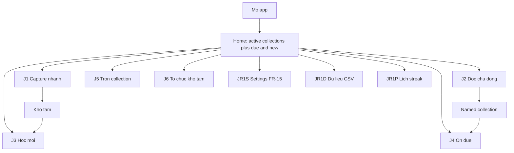
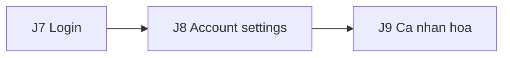
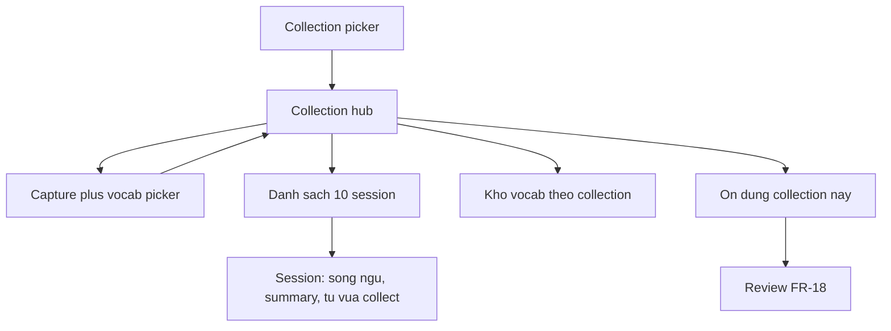

> Gộp từ customer-journeys.md + db-schema.md — nội dung không đổi, chỉ nhập làm một. 

## Phần 1 — Reado — Customer Journeys

| Field | Value |
|---|---|
| Product | Reado |
| Status | Draft |
| Created | 2026-09-14 |
| Last updated | 2026-09-18 |
| Related | [prd.md](docs/specs/prd.md), [vision.md](docs/specs/vision.md), [research/vocabulary.md](docs/research/vocabulary.md), [research/review.md](docs/research/review.md), [prompt-spec.md](docs/agent/prompt-spec.md) |
| Phạm vi | Flow spec trước UI: ai làm gì, màn nào, state nào. **Không** chốt màu, font, hay Design system |

**Tài liệu này tự chứa.** Session mới đọc được mà không cần chat history. Nó **không** thay PRD: FR, non-goals, và bảng "Đã chốt" ở research doc vẫn là source of truth. Journey chỉ **tách** [Core User Journey ở PRD mục 6](docs/specs/prd.md#6-core-user-journey) thành các lối đi dùng để prompt UI từng màn.

Hai việc journey R1 thêm so với mermaid PRD (không đổi FR):

1. **Hai lối capture** — nhanh (không chọn collection → kho tạm) và đọc chủ động (**collection hub**: capture, 10 session chọn được, kho vocab theo collection).
2. **Tối đa hai collection đang đọc trên Home** — shortcut do user chọn, không phải recent tự động và không pin session.
3. **Ba lối ôn** ánh xạ câu "học / ôn / trộn" của owner — xem mục 2; sai thì sửa **ở đây** trước khi prompt UI, đừng bịa chế độ thứ tư.

**Later** (sau R1+R2 chứng minh giá trị — [PRD mục 10](docs/specs/prd.md#10-release-scope)): J7 login, J8 settings theo tài khoản, J9 cá nhân hoá. **Không** prompt UI R1 cho J7–J9. R1 vẫn một người dùng (NG-05); màn Settings học tập (FR-15) **không** cần login — xem J-R1-S. FR-21 (agent phân tích) cũng nằm trên J-R1-S, không phải J8.



Later — không nối vào Home R1:



---

## 1. Persona và job

Primary persona = owner: developer, B1–B2, đọc sách giấy / báo / tài liệu chuyên ngành, điện thoại luôn bên cạnh. [PRD mục 4](docs/specs/prd.md#4-target-user).

| ID | Job |
|---|---|
| JTBD-01 | Hiểu trang ngay lúc đọc — segment song ngữ, không đứt mạch |
| JTBD-02 | Từ vừa khựng lại vào bộ ôn, kèm câu gốc, không gõ tay |

Mọi journey **R1** dưới đây phải truy được về một trong hai. J1 chỉ JTBD-02. J2 là JTBD-01 rồi JTBD-02. J3–J5 chỉ JTBD-02. J6 phục vụ G-03 (tổ chức collection), không phải job thứ ba. J-R1-S phục vụ FR-15 (núm học tập) và FR-21 (chọn agent phân tích trang). J-R1-D phục vụ NFR-05 / FR-16 + FR-20 (mang kho từ đi và gộp lại) — không phải path capture. J-R1-P là *lens* của FR-14 (xem lịch streak), không phải job thứ ba. J7–J9 phục vụ **tài khoản**, không phải job đọc/ôn — chúng chỉ tồn tại khi có người dùng thứ hai.

---

## 2. Ánh xạ "học / ôn / trộn"

Đây là hợp đồng ngôn ngữ với UI. **Không** đồng nghĩa với Cram.

| Câu owner | Nghĩa trong Reado | Không phải |
|---|---|---|
| **Học** | Thẻ `new` trong hạn `daily_new_limit` (FR-11, FR-14) | Cram thẻ chưa đến hạn |
| **Ôn** | Thẻ đến hạn FSRS; một collection hoặc tất cả | Tự đẩy thẻ chưa due để "lấp chỗ" |
| **Trộn** | FR-18: chọn **vài** collection; queue = due ∩ phạm vi; **vẫn** ghi FSRS | Trộn semantic set (R2); Cram |

Cram (`mode = cram`, không đụng FSRS state) đã có trong FR-18 và [structure §4.2](docs/research/vocabulary.md#42-lọc-hàng-đợi-có-thể-phá-vỡ-hợp-đồng-của-scheduler). **Không** có journey R1 cho Cram cho tới khi owner nói "học" = ôn chưa due.

---

## 3. Điểm đã chốt mà mọi journey kế thừa

Không tranh luận lại ở file này. Lý do nằm ở doc gốc.

| Điểm | Nguồn |
|---|---|
| Collection = bối cảnh đọc do user đặt tên; thay `book` | vision nguyên lý 4, structure §3 |
| **Kho tạm** = collection `is_default`; `collection_id` không bao giờ null; từ trong kho tạm **ôn được ngay** | structure §3.2, FR-17 |
| Input đúng **một** path: ảnh (camera hoặc thư viện) | NG-07 |
| Song ngữ + summary **persist** cho **10 phiên đọc gần nhất mỗi collection có tên** (text + dịch, **không ảnh**) — đọc lại được để dễ đọc sách; **kho tạm không lưu session**; session thứ 11 trôi; vocab đã confirm không bao giờ trôi | Q-10 chốt 2026-09-18 (ADR-029); NFR-04; FR-05/FR-06 qua hình dạng J2 (một capture = một session) |
| `example` phải trích nguyên văn; unverified **không** chọn sẵn; không loại trong im lặng | FR-02, prompt-spec |
| Item verified: mặc định **chọn tất cả**, user bỏ những cái đã biết | FR-09 |
| Lọc từ **đã thuộc** lúc trích xuất (FR-10); không `unique` trên `term` | structure §6.3 |
| Hai nhánh queue: new bị `daily_new_limit`, due thì không | FR-11 |
| Home hiện số **sẽ ôn hôm nay** (sau hạn mức), backlog là số **riêng** | FR-14 |
| Phạm vi hẹp vẫn cập nhật FSRS; hiện số due **ngoài** phạm vi | FR-18, structure §4.2 |
| `daily_new_limit` áp **toàn cục, trước** khi lọc phạm vi | FR-11 |
| Card: mặt trước `term` + `pos`; lật = nghĩa + IPA + câu gốc + tên collection | FR-12 |
| Kho tạm đổi tên được, **không xoá được**; move collection **không** reset FSRS | FR-17 |
| Home hiện tối đa **hai named collection do user chọn**; tap mở Collection Hub; collection thứ ba phải chọn shortcut để thay | FR-17 |
| Settings R1 = một hàng `settings`: `cefr_level`, `daily_new_limit`, `day_cutoff_hour` (mặc định 04:00); `request_retention` mặc định, **không** mở user | FR-15, FR-11, ADR-031 |
| Agent phân tích: builtin proxy mặc định; user thêm OpenAI-compat; **một** active cho cả FR-02; key không SQLite / không export | FR-21, NFR-07 |
| Multi-user / authentication = **Later**, không R1, không R2 | NG-05, PRD mục 10 |
| R1 **không tự chặn đường** Later: đừng hardcode "chỉ một người trên máy này" vào copy hay schema khiến tách user phải viết lại | PRD mục 10 Later |

---

## J1 — Capture nhanh

**Trigger:** Gặp chữ trên bàn, screenshot, menu quán — không muốn "mở phiên đọc sách".  
**Job:** JTBD-02 only.  
**Collection đích:** kho tạm (user **không** chọn collection).

### Happy path

1. Home hoặc FAB → Camera / chọn ảnh từ thư viện.
2. Không bước collection picker. Đích ngầm = kho tạm.
3. Processing (FR-02): OCR + dịch + vocab **một lần gọi**, dùng `settings.active_agent_id` (FR-21). Mặc định = proxy Reado. Segments có thể có trong payload nhưng J1 **không** bắt user ở lại đọc song ngữ, và **kho tạm không lưu session đọc** (Q-10).
4. Vocab picker: FR-10 đã lọc từ đã thuộc. Verified chọn sẵn (FR-09). Unverified badge, không preselect (FR-02). User sửa field / bỏ chọn (FR-03).
5. Confirm → lưu vào kho tạm, card `new`, `due_at` hôm nay (FR-09). Từ **ôn được ngay** (structure §3.2).
6. Toast / về Home. Số new trên Home đã áp `daily_new_limit` (FR-14).

### Màn UI (thứ tự prompt)

Capture · Processing · Vocab picker · Home (cập nhật count).

### Empty / error (J1)

| State | Hành vi | FR |
|---|---|---|
| Ảnh mờ / không đọc được | Báo cụ thể, gợi ý chụp lại, **không** bịa | FR-04 |
| Không phải tiếng Anh | Báo không hỗ trợ, không tính lần gọi vào lịch sử | FR-04 |
| Schema / parse fail | Lỗi + retry, không lưu bản ghi hỏng | FR-02 |
| BYOK 401 / timeout / JSON lệch schema | Lỗi rõ + CTA Settings; không lưu vocab dở | FR-21 |
| Submit trùng do mạng | Không lưu hai bộ vocab trùng | FR-02 |
| Vocab rỗng sau FR-10 | Nói rõ "không còn từ đáng học trên ảnh này", CTA chụp lại hoặc Home | FR-10 |
| Thoát picker chưa confirm | Cảnh báo mất kết quả analysis | FR-03 |
| Analysis cần mạng | Fail rõ, không giả offline. Ôn (J3–J5) **chạy được offline** (NFR-03, Q-02 local-first) — không cần journey ôn-khi-mất-mạng riêng nếu hàng đợi đã trên máy | NFR-03 |

---

## J2 — Đọc chủ động (collection hub)

**Trigger:** "Hôm nay đọc tiếp *Atomic Habits*" — hoặc tạo collection mới mang tên sách / mảng việc.  
**Job:** JTBD-01 rồi JTBD-02.  
**Collection đích:** collection **đã chọn** (hoặc vừa tạo). Chọn kho tạm = ứng xử J1 (không tạo session) — kho tạm **không bao giờ** lưu session (Q-10 chốt 2026-09-18).

J2 không phải một pipeline thẳng Capture → Read → Home. Nó là **hub của một collection**, bốn bề mặt sống cùng lúc:



| Bề mặt | Sống bao lâu | Job |
|---|---|---|
| Capture | Một lần gọi, rồi thành session mới | Cả hai JTBD |
| **10 session gần nhất** — chọn được | Bền (text + dịch + summary, **không ảnh** — NFR-04). Session thứ 11 **trôi** (song ngữ + summary mất). Vocab đã confirm thì **không** mất | JTBD-01 |
| **Kho vocab theo collection** | Durable, FR-08 lọc `collection_id` | JTBD-02 |
| **Ôn collection này** | Queue = due ∩ collection đang đứng; FSRS bình thường. Nợ ngoài phạm vi phải nhìn thấy | JTBD-02, FR-18 |

Một **session** = một lần capture thành công đã confirm picker (một ảnh → một session), **chỉ cho named collection**. Đây là hình dạng UX của FR-05 do owner chốt 2026-09-18 (Q-10, ADR-029): giữ **10 session gần nhất mỗi collection** để đọc lại trang cuối — mục đích dễ đọc sách — thay vì chỉ cuộn ngược một trang dài trong phiên.

### Happy path — vào hub

1. Collection picker: chọn collection có sẵn **hoặc** tạo mới (FR-17).
2. **Collection hub** mở. Trên hub, cùng lúc:
   - Control **Hiện trên Home** cho named collection này. Nếu Home đã đủ hai shortcut, mở chooser chọn collection bị thay; không tự thay ngầm.
   - CTA Capture (camera / thư viện — cùng path J1).
   - CTA **Ôn collection này** → hàng đợi due đã lọc `collection_id` (FR-18). 0 due trong bộ nhưng còn due ngoài → hiện số nợ + CTA ôn tất cả.
   - Danh sách **tối đa 10 session** gần nhất, **chọn được** từng cái.
   - Cửa **kho từ vựng theo collection** (mọi từ đã lưu vào collection này, kể cả từ session đã trôi).

### Happy path — capture thêm một session

3. Capture → Processing (FR-02).
4. Vocab picker — cùng rule J1 (FR-09 / FR-02 / FR-10 / FR-03) — lưu vào **collection này**.
5. Session mới **đứng đầu** danh sách 10. Nếu đã đủ 10: session cũ nhất trôi. Sắp trôi mà chưa confirm picker → cảnh báo (FR-05).
6. Về hub, không bắt về Home.

### Happy path — mở một session (chọn từ list)

7. Trong session:
   - Control **Hiện collection này trên Home** dùng chung state với Collection Hub; shortcut vẫn trỏ vào Hub, không trỏ vào session này.
   - **Song ngữ xen kẽ theo đoạn**, đúng thứ tự (FR-05, ADR-007) — bản dịch hiện sẵn ngay dưới bản gốc, 0 thao tác. **Nút nhỏ ở phía dưới màn:** 1 tap = ẩn/hiện toàn bộ bản dịch (ADR-030).
   - **Summary** nằm **dưới** phần đọc (FR-06: mặc định thu gọn trên list hoặc trên detail — không thay trang sách, vision nguyên lý 6).
   - **Từ session này collect thêm:** danh sách vocab đã confirm từ đúng lần capture đó (subset của kho collection). Unverified từng hiện lúc picker không nằm đây trừ khi user giữ.
8. List 10 session: mỗi hàng có thể hiện summary (snippet) để chọn đúng phiên, không bắt mở hết mới biết.

### Happy path — kho vocab theo collection

9. Từ hub, mở kho: `term`, `pos`, `ipa`, `meaning_vi`, `cefr`, câu gốc, collection (FR-08). Lọc trạng thái ôn **có thể** để R2 (PRD mục 10); R1 chỉ cần list theo collection. Cửa **Xuất bộ này** → J-R1-D với collection đang đứng đã chọn sẵn (FR-16).
10. Kho này **không** trôi khi session thứ 11 rơi. Đó là chỗ neo JTBD-02 trong J2.

### Màn UI (thứ tự prompt)

Collection picker · **Collection hub** (capture CTA + **ôn collection này** + list 10 session + cửa kho vocab) · Capture / Processing / Vocab picker (reuse J1) · **Session detail** (song ngữ + summary dưới + từ collect session này) · **Collection vocab** (FR-08).

### Empty / error (J2)

Mọi state capture của J1 cộng:

| State | Hành vi | FR |
|---|---|---|
| Chưa chọn collection, user vẫn capture | Đây là **J1**, không phải J2. Đừng hỏi collection sau khi đã chụp rồi "sửa nhầm lối" | — |
| Collection mới, 0 session | Hub empty: CTA Capture, kho vocab rỗng, không giả 10 hàng | — |
| User mở session đã trôi | Không còn song ngữ/summary — hành vi đúng. Vocab của lần đó vẫn trong kho collection | FR-06 |
| 0 due trong collection, ngoài còn due | Hiện số nợ + CTA ôn tất cả — không giấu FR-18 | FR-18 |
| Session 0 từ (user bỏ hết lúc picker) | Session vẫn có thể tồn tại để đọc song ngữ + summary; hàng "từ collect" empty | FR-03 |
| Đã có 2 shortcut, bật collection thứ ba | Cho chọn một trong hai shortcut hiện tại để thay; cancel giữ nguyên | FR-17 |
| Collection đang ghim bị xoá | Bỏ shortcut lỗi; không mở route chết | FR-17 |
| Kho tạm | Không hiện control "Hiện trên Home" | FR-17 |
| Tạo collection trùng tên / xoá collection còn từ | FR-17: không xoá theo; cho chuyển sang collection khác | FR-17 |

---

## J3 — Học từ mới

**Trigger:** Home hiện số **new hôm nay** — con số **sau** `daily_new_limit`, không phải tổng card `due_at` vừa capture (FR-14).  
**Job:** JTBD-02.  
**Queue:** nhánh `new` của FR-11.

### Happy path

1. Home → Học (nhánh new).
2. Mặt trước: `term` + `pos` only (FR-12).
3. Lật: `meaning_vi`, IPA, câu gốc, **tên collection** (kho tạm cũng hiện tên, không để trống).
4. Grade → FSRS + review log ảnh chụp **trước** khi chấm (FR-12). Undo về đúng state cũ.
5. Hết hạn mức new hôm nay → về Home. Backlog new **không** nhồi vào queue hôm nay; hiện số backlog **riêng**.

Leech (FR-19) không đếm vào số Home và không vào queue — badge, không journey riêng.

### Empty / error (J3)

| State | Hành vi |
|---|---|
| Hết new trong hạn mức, backlog > 0 | Home: "xong hạn mức hôm nay", backlog nhãn riêng, không CTA giả "học tiếp" cùng nhánh |
| Hết new trong hạn mức, backlog > 0, vừa chấm ≥1 thẻ trong phiên | `SessionDoneView` (J4 bước 4) thêm CTA "Học thêm 10 từ" — nới hạn mức new **riêng ngày học hiện tại** (Q-A bộ nhớ app, Q-B N=10 cố định, ADR-039); bấm → nạp lại đúng hàng đợi (vẫn áp toàn cục trước lọc phạm vi). Backlog = 0 (không còn thẻ new nào tồn) → **ẩn** CTA, không nới hạn mức vô nghĩa. Hệ thống không bao giờ tự nới. |
| Hết new và backlog = 0 | CTA sang J1/J2 |
| 0 new vì chưa capture | Cùng CTA capture; không empty-state chết |

---

## J4 — Ôn đến hạn

**Trigger:** Home hiện số **due**.  
**Job:** JTBD-02.  
**Queue:** nhánh review; **không** bị `daily_new_limit`.

### Happy path

1. Home → Ôn.
2. Cùng card UI với J3 (một component; khác nhánh queue).
3. Grade + undo như J3. Nút chấm hiện nhịp ôn kế tiếp (ước lượng, preview `swift-fsrs` — ux-polish-r1 T1).
4. Hết due → summary buổi: đã xong, streak theo **giờ chuyển ngày** FR-11 (mặc định 04:00), không nửa đêm hệ thống (FR-14). Vừa chấm hết ≥1 thẻ → `SessionDoneView` (ADR-038): số thẻ đã ôn, % không-Again, từ vừa "đã thuộc" Q-08 (≤5, "+N khác"), streak; vào due đã hết sẵn từ đầu thì giữ màn trung tính cũ, không ăn mừng.
5. **Không** tự đẩy card chưa due để lấp chỗ (FR-11).

Phạm vi mặc định của J4 = **tất cả** (`collection_ids` null). Muốn hẹp → J5.

### Empty / error (J4)

| State | Hành vi |
|---|---|
| 0 due | Home nói rõ đã xong ôn hôm nay. CTA J1/J2, **không** CTA Cram |
| Due > 0 nhưng user đang ở J5 hẹp | Không phải empty J4 — xem J5 "nợ ngoài phạm vi" |

---

## J5 — Trộn / ôn theo phạm vi

**Trigger:** "Chỉ ôn cuốn đang đọc" hoặc "trộn collection công việc + sách".  
**Job:** JTBD-02.  
**FR:** FR-18. Vẫn filtered study, **không** Cram.

### Happy path

1. Từ Home hoặc từ màn ôn: mở scope picker.
2. Ba chế độ: một collection · vài collection (trộn) · tất cả.
3. Queue = card due ∩ phạm vi. New trong phạm vi vẫn chịu `daily_new_limit` **toàn cục đã áp trước** (FR-11).
4. Chấm điểm → FSRS **bình thường**.
5. Hiện số card due **nằm ngoài** phạm vi. Nợ phải nhìn thấy.

### Empty / error (J5)

| State | Hành vi |
|---|---|
| Phạm vi không có due, ngoài phạm vi vẫn còn due | "Không còn trong phạm vi này" + số nợ ngoài + CTA nới phạm vi hoặc ôn tất cả |
| Chỉ còn kho tạm / một collection | Trộn vài collection disable hoặc ẩn — đừng hiện picker 2-slot rỗng |
| User muốn ôn chưa due | **Ngoài journey R1.** FR-18 gọi đó Cram; không nhánh UI ở đây |

---

## J6 — Tổ chức kho tạm

**Trigger:** Rảnh, muốn gắn lô từ "chiều hôm qua" vào tên sách.  
**Job:** không JTBD mới; điều kiện để FR-18 còn giá trị (FR-17).  
**Bắt buộc?** Không. Không làm J6 thì J3/J4 vẫn chạy — kho tạm thoái hoá thành một collection mặc định to (structure §3.2).

### Happy path

1. Mở kho tạm: từ sắp theo thời điểm thêm, chọn theo lô (FR-17).
2. Chuyển sang collection có tên (có thể tạo mới ngay đó).
3. FSRS state **giữ nguyên** — collection là nhãn, không phải danh tính thẻ.

### Empty / error (J6)

| State | Hành vi |
|---|---|
| Kho tạm trống | CTA J1, không màn dọn rỗng |
| Xoá collection đích còn từ | Cho chuyển, không xoá theo |
| Đòi xoá kho tạm | Không cho |

---

## J-R1-S — Settings học tập (R1, không login)

**Trigger:** Khối lượng ôn không hợp, capture đang trả từ quá dễ / quá khó, hoặc muốn quản lý shortcut collection đang đọc.  
**Job:** không JTBD mới; núm của JTBD-02 (FR-15), quản lý đường vào J2 (FR-17), và chọn agent phân tích trang (FR-21).  
**Bắt buộc trên R1:** có. Không có màn này thì `cefr_level` và `daily_new_limit` hardcode — phá FR-10 / FR-11. Không có chỗ chọn agent thì FR-21 không thi hành được — nhưng walking skeleton vẫn chạy vì seed = proxy.

Đây **không** phải account settings. Không email, không mật khẩu, không avatar.

### Happy path

1. Home → Settings.
2. Đặt CEFR (A2–C1). Capture **tiếp theo** dùng level mới; trang đã phân tích **không** chạy lại (FR-15).
3. Đặt `daily_new_limit` (mặc định 10). Home / J3 đổi ở **ngày học hiện tại** theo giờ cắt ngày FR-11.
4. Đặt **giờ chuyển ngày** `day_cutoff_hour` (mặc định 04:00, 0–23) — streak và số đếm "hôm nay" tính theo giờ này (FR-11, FR-14).
5. Mục **Đang đọc trên Home** liệt kê named collections và trạng thái hiện tại; bật/tắt ở đây dùng cùng rule tối đa hai và chooser thay thế của J2 (FR-17).
6. `request_retention` và tham số FSRS: **không** hiện cho user ở R1 (PRD mục 10).
7. Mục **Agent phân tích trang** (FR-21): list radio active; subtitle = `model` hoặc “Proxy Reado”. Thêm agent: tên, base URL, model, key (ô bảo mật). Sửa / xoá được agent user; **không** xoá proxy. Hint một dòng: OCR trên máy, agent dịch+từ (một lần gọi phân tích; không phải agent OCR riêng). Capture **tiếp theo** dùng agent mới; trang đã phân tích không chạy lại.
8. **Không** đặt export/import trên màn này. Cửa dữ liệu là J-R1-D. Export **không** kèm key.

### Empty / error (J-R1-S)

| State | Hành vi |
|---|---|
| CEFR trống lần đầu | Bắt chọn trước capture đầu — hoặc default B2 như schema, nhưng phải nhìn thấy được |
| `daily_new_limit` = 0 | Cấm hoặc cảnh báo: J3 chết |
| Giờ chuyển ngày ngoài 0–23 | Không lưu — schema `CHECK (day_cutoff_hour BETWEEN 0 AND 23)` |
| Không có named collection | Mục Đang đọc trên Home giải thích tạo collection ở tab Đọc; không đưa kho tạm vào danh sách |
| Thiếu tên / URL / model / key khi thêm agent | Không lưu; báo field thiếu |
| `base_url` không HTTPS (trừ loopback / RFC1918) | Không lưu |
| Đòi xoá agent `reado_proxy` | Không cho |
| Xoá agent đang active | Fallback về proxy |
| Agent BYOK thiếu key | Không cho chọn active; bắt sửa |

---

## J-R1-D — Dữ liệu từ vựng (CSV)

**Trigger:** Mang kho sang Anki / máy khác / file backup; hoặc gộp CSV Reado (cột giống file xuất) vào kho đang có.  
**Job:** không JTBD mới; điều kiện NFR-05 (FR-16 xuất, FR-20 nhập). Giống J6: không phải job đọc.  
**Bắt buộc trên R1:** có — FR-16 là bảo hiểm nếu R1 sai hướng; FR-20 là chiều ngược để round-trip được.  
**Không phải:** path capture thứ hai. NG-07 vẫn cấm PDF/ebook. Ảnh vẫn là **đúng một** lối đưa trang vào.

Cửa vào: Home, CTA thứ cấp **Dữ liệu** (không cạnh bánh răng Cài đặt, không tab thứ 4 — NFR-08: từ mở app tới chụp được trang ≤ 3 thao tác). Từ kho từ collection: **Xuất bộ này**.

### Happy path — xuất

1. Home → Dữ liệu, hoặc kho từ collection → Xuất bộ này (collection đó đã chọn).
2. Chọn phạm vi: tất cả / một / vài collection.
3. Tải CSV: `term`, `pos`, `ipa`, `meaning_vi`, `cefr`, `example`, `collection`. Định dạng nhập được vào Anki (FR-16).
4. JSON FSRS là nút phụ cùng màn: toàn bộ backup máy, **không** lọc collection. R1 **không** nhập JSON.

### Happy path — nhập

5. Chọn file CSV → parse → **preview** (checkbox, mặc định chọn hết; sửa 6 field + tên collection được).
6. `term` đã có trong kho: badge cảnh báo, **không** khoá — user tự bỏ chọn. Không `unique` (structure §6.3).
7. Xác nhận → **gộp**. Khớp collection theo tên, không phân biệt hoa thường, trim; tên trống → kho tạm; chưa có → tạo mới (FR-17). Không tạo session / song ngữ. `sessionId = null`, `verified = true`. Card `state = new`, `due_at` hôm nay — vào nhánh Học (J3). Không đụng FSRS thẻ cũ.
8. Toast số dòng đã nhập / về Home.

### Màn UI (thứ tự prompt)

Home (CTA Dữ liệu) · **Dữ liệu** (xuất theo collection + nhập file) · Preview nhập (reuse pattern picker FR-03) · kho từ collection (cửa xuất bộ này).

### Empty / error (J-R1-D)

| State | Hành vi | FR |
|---|---|---|
| Xuất khi 0 từ (hoặc 0 collection được chọn) | File header-only hợp lệ, không lỗi | FR-16 |
| Header sai / không parse được | Lỗi trên màn + chọn lại file. Không merge một phần | FR-20 |
| File chỉ có header, 0 dòng | Preview trống; xác nhận không ghi | FR-20 |
| Thoát preview chưa confirm | Cảnh báo: bỏ bản parse, không ghi | FR-20 |
| 0 dòng còn chọn lúc xác nhận | Không ghi; nói rõ | FR-20 |

---

## J-R1-P — Xem lịch streak

**Trigger:** User muốn biết chuỗi ngày ôn có thật sự liền, hay chỉ nhìn con số trên Home.  
**Job:** không JTBD mới — *lens* của FR-14, phục vụ M-02 (≥ 5 ngày ôn trong 7 ngày).  
**Bắt buộc trên R1?** Không. Con số streak trên Home đã thoả FR-14. Màn này làm streak *kiểm được*, không thêm metric mới.

Đây **không** phải social graph. Không share, không so sánh, không leaderboard (NG-04).

### Happy path

1. Home → tap ô Streak.
2. Màn lịch: streak hiện tại (ngày liên tục), streak dài nhất, heatmap **18 tuần** (7 hàng × 18 cột, vừa khít bề ngang phone, không scroll ngang).
3. Một ô = một ngày học theo **giờ chuyển ngày** FR-11 (mặc định 04:00), không nửa đêm hệ thống. Màu = số thẻ ôn hôm đó, đếm từ `review_logs` — không dùng cột counter ([review.md mục 6.1](docs/research/review.md#61-một-mệnh-đề-where-không-dựng-nổi-hàng-đợi)).
4. Tap một ô → dòng chi tiết **ngay dưới lưới** (không popover): ngày, số thẻ ôn, số trang chụp nếu có. Popover trên phone che mất lưới.
5. CTA: còn due → Ôn (J4). 0 due → Chụp trang (J1). **Không** CTA Cram.

### Màn UI (thứ tự prompt)

Home (ô Streak bấm được) · Lịch streak (heatmap + chi tiết ngày + CTA).

### Empty / error (J-R1-P)

| State | Hành vi |
|---|---|
| Chưa ôn ngày nào | Lưới toàn xám, CTA J1/J3 — không empty-state chết |
| Ngày trống giữa chuỗi | Ô xám **vẫn hiện**, không che, không gộp |
| Muốn "mua lại" ngày trượt | Không. Không streak freeze ở R1 |
| Share / so sánh với người khác | Không. NG-04 |
| Ngày chỉ capture, chưa ôn | **Chưa chốt** — xem dưới. Đề xuất R1: ô xám (chỉ ngày có ôn mới tô) |

### Chưa chốt

| Câu hỏi | Đề xuất R1 | Vì sao không tự chốt thành FR |
|---|---|---|
| Ngày chỉ-capture-không-ôn có tô màu không? | Không. FR-14 nói streak ngày **ôn** liên tục | Capture không chứng minh retention; tô màu sẽ làm M-02 đọc sai |
| Nâng J-R1-P thành FR riêng, hay đủ là lens của FR-14? | Giữ lens — PRD chưa đụng | Owner quyết. Journey không được tự viết FR |

---

## Later — J7 đến J9

Chỉ khi R1 (và R2) đã chứng minh giá trị. [PRD mục 10 Later](docs/specs/prd.md#10-release-scope): authentication (NG-05), không thiết kế provider ở R1. Journey dưới đây là **hợp đồng UX**, không phải solution design: không chốt OAuth / magic link / Cognito.

**Không tự chặn đường ở R1:** uuid do client sinh, `settings` một hàng có thể thành một hàng *mỗi user* sau này, FR-16 luôn export được. Đừng viết copy "dữ liệu chỉ sống trên máy này mãi".

### J7 — Login / tài khoản

**Trigger:** Người dùng thứ hai, hoặc cùng một người hai thiết bị (đồng bộ = cùng gói Later, chưa tách journey).  
**Job:** định danh — để collection, card, FSRS **không lẫn** giữa người.

#### Happy path

1. First launch Later: tạo tài khoản hoặc đăng nhập. Identity = một email (hoặc tương đương); **cách** xác thực không chốt ở đây.
2. Session còn hạn → Home như R1 (J1–J6, J-R1-S, J-R1-D, J-R1-P).
3. Logout → màn guest: không đọc/ghi kho của user khác; CTA login.
4. User A không thấy collection / card / review log của user B.

#### Empty / error (J7)

| State | Hành vi |
|---|---|
| Session hết hạn giữa Vocab picker | Cảnh báo FR-03 vẫn giữ: không mất analysis chưa confirm nếu còn local; cấm lưu vào account sai |
| Sai credential / từ chối identity | Retry, không tạo kho trống giả |
| Chưa login, mở J1 | Chặn hoặc kho local tạm — **chưa chốt**. Ghi nhận: đừng im lặng ghi vào user gần nhất |
| Xoá tài khoản | Cần confirm; dữ liệu học theo NFR-05 phải export được **trước** khi xoá |

Onboarding CEFR lần đầu (A-04) xảy ra **sau** identity, một lần, rồi vào J-R1-S. Không hỏi lại mỗi lần mở app.

### J8 — Settings theo tài khoản

**Trigger:** Đổi trình độ, hạn mức ôn, hoặc thông tin tài khoản.  
Kế thừa toàn bộ J-R1-S, cộng lớp account.

| Nhóm | Có trên R1? | Later |
|---|---|---|
| `cefr_level`, `daily_new_limit` | Có (FR-15) | Theo user, đồng bộ theo tài khoản |
| `day_cutoff_hour` | Có (FR-11) — núm ngay trong J-R1-S từ R1 (ADR-031) | Hiện rõ — streak/FR-14 phụ thuộc |
| `request_retention` | Không mở user | Vẫn **cân nhắc** ẩn; dễ tự bắn chân (FR-15) |
| Email / đổi identity / logout | Không | Có |
| Export / xoá dữ liệu trên account | Export có (FR-16, cửa J-R1-D) | Xoá account + export bắt buộc trước |
| Import CSV từ vựng | Có (FR-20, cửa J-R1-D) | Theo user; không phải path capture |
| API key sản phẩm | NFR-07: không trên client | Vẫn không nhúng key Reado vào user app |
| BYOK (FR-21) | Keychain trên máy | Metadata agent có thể sync; **key không upload** |

Một hàng `settings` thời R1 trở thành **một hàng per user**. Không đổi ý nghĩa núm.

### J9 — Cá nhân hoá

**Trigger:** App nhớ *lựa chọn của người này*, không phải AI đề xuất nội dung (NG-03 vẫn cấm kho bài soạn sẵn).

| Nhớ gì | Không nhớ / không làm |
|---|---|
| Collection J2 dùng gần nhất | Không đổi J1: capture nhanh vẫn **kho tạm**, trừ khi user **cố ý** đổi default — và đó là setting hiện rõ, không ngầm |
| Scope J5 gần nhất | Không biến thành Cram |
| CEFR và `daily_new_limit` (đã là J8) | Không personalize nghĩa từ / không graded reader |
| Giờ nhắc ôn (local notification / APNs) | Không social, leaderboard (NG-04) |

**Empty:** user mới — default như R1 (B2, limit 10, kho tạm, scope = tất cả). Cá nhân hoá là *ghi nhớ*, không phải màn wizard thứ hai.

---

## 4. Error / empty dùng chung

Nhét vào từng J ở trên. **Không** tạo journey riêng cho lỗi. Tóm tắt để prompt Home không sót:

- Ảnh mờ / không English → retry capture (FR-04)
- Analysis fail / mất mạng lúc analyze → retry; đừng bịa offline capture
- Vocab 0 sau CEFR / đã thuộc (FR-10)
- Unverified không preselect, không ẩn (FR-02)
- Leech: badge, loại khỏi count (FR-19)
- 0 due: CTA capture, không Cram

### Gesture (mock UI R1)

- **Màn ôn (J3/J4/J5):** vuốt trái = Again, vuốt phải = Good trên **cả hai mặt thẻ** (Tinder-style: bám tay + tilt + stamp "Quên"/"Được" + fly-off). Hard / Easy vẫn là nút. Không rút FSRS còn 2 giá trị. (Chốt 2026-09-18 — ADR-025, đảo ADR-009 cũ; nới "cả hai mặt" 2026-09-24 — ADR-033.)
- **Màn khác (trừ Home):** vuốt từ **mép trái ~24px** sang phải = back. Trên màn ôn, full-card swipe là grade — back chỉ lấy dải mép, không đụng thẻ.
- Vocab picker (FR-03) **không** dùng Tinder — vẫn list + sửa 6 field.

---

## 5. Thứ tự prompt UI

Một prompt = một màn (hoặc một flow ngắn). Khoá Design system **ngoài** file này.

| # | Prompt | Journey cover |
|---|---|---|
| 1 | Home — tối đa 2 shortcut collection đang đọc, số due / new tách, backlog nhãn riêng, streak (tap → lịch), CTA capture + học + ôn + Dữ liệu | FR-14, FR-17; cửa vào J1–J5, J-R1-P, J-R1-D |
| 2 | J1 — Capture · Processing · Vocab picker | J1 |
| 3 | J2 — Collection hub + Session detail + kho vocab collection + control Hiện trên Home | J2; FR-17; reuse Capture + picker của #2 |
| 4 | Session card — J3+J4 chung một card UI, hai nhánh queue | J3, J4, FR-12 |
| 5 | J5 scope picker + nợ ngoài phạm vi | J5 |
| 6 | J6 kho tạm + move lô | J6, FR-17 — **sau** happy path 1–5 |
| 7 | J-R1-S Settings — CEFR + `daily_new_limit` + giờ chuyển ngày + quản lý collection đang đọc trên Home + agent phân tích trang | FR-15, FR-17, FR-21; **không** login; **không** FR-16 |
| 8 | J-R1-D Dữ liệu — xuất CSV theo collection + JSON FSRS; nhập CSV preview rồi gộp | FR-16, FR-20 |
| 9 | J-R1-P lịch streak — heatmap 18 tuần, tap ô xem ngày | FR-14 lens; **không** FR mới — open question |
| — | J7–J9 | **Không prompt ở R1** |

---

## 6. Không nằm trong file này

- Sửa FR, schema, FSRS, prompt baseline, **đảo NG-05**
- Chốt Auth provider, đồng bộ realtime, billing (NG-06)
- Cram / Feature B (PVO, Phân biệt) — R2
- Import PDF / ebook (NG-07)
- Generate UI, code `web/`, hay token Design system

---

## 7. Đối chiếu PRD mục 6

Mermaid PRD là **một** vòng: Read → Capture → Analyze → Verify → Study → Summary → Pick → Store → Queue → Daily.

Journey file này **không huỷ** vòng đó. Nó nói vòng đó sống **trong J2 collection hub**: Capture → Analyze → Pick → Store(collection) vẫn chạy, nhưng song ngữ + summary ở lại dưới dạng **session chọn được** (tối đa 10), và kho vocab theo collection là cửa durable. J1 là lối tắt: không hub, không session list, Store = kho tạm. J3–J5 là phần `Daily`. J6 dọn kho tạm. J-R1-S và J-R1-D là Epic E5 (núm học tập tách khỏi cửa dữ liệu). J-R1-P là lens của FR-14 trên Home. J7–J9 là **Later** (NG-05).

## Phần 2 — DB Schema — Reado R1 (SQLite, local-first)

| Field | Value |
|---|---|
| Created | 2026-09-08 |
| Nguồn DDL **thật** | `app/src/storage/schema.sql` (migration v1); các migration sau ở `app/src/storage/migrate.ts`: v2 `analyses` · v3 rich vocab (tags/synonyms/antonyms) · v4 `reading_sessions` |
| Nơi PRAGMA + migrate + seed chạy | `app/src/storage/syncDb.ts` |
| Phạm vi | Chỉ R1. `word_relations` không nằm ở đây (R2 — archive/mvp-plan-pwa-gen task 4.1) |
| Quy tắc nguồn | File này **chỉ giải thích**, không phải nguồn DDL. Mâu thuẫn với code → code thắng, ghi vào archive/mvp-plan-pwa-gen mục 4 (không im lặng sửa) |

## 1. Đọc khi nào

- Làm bất kỳ task nào đụng `storage/`, migration, seed, export, hay thêm FR mới có dữ liệu.
- Muốn biết *vì sao* một cột/constraint tồn tại — mỗi bảng ở mục 4 đều ghi lý do dẫn nguồn docs sản phẩm.
- Agent ở session khác: đây là cổng vào duy nhất cho phần DB; DDL nguyên văn luôn ở
  `app/src/storage/schema.sql` (file ngắn, tự comment kỹ).

## 2. Sơ đồ quan hệ

```
collections 1 ─── n vocab_items 1 ─── n cards 1 ─── n review_logs
                                              └─ 1 vocab_item có TỐI ĐA 2 cards:
                                                 receptive + productive (unique constraint)
collections 1 ─── n reading_sessions (migration v4 — kho phiên đọc bền, task 3.15)
settings: đúng MỘT dòng (id = 1)
analyses: sự kiện "đã phân tích một trang" — đứng ngoài chuỗi FK
          (migration v2, 2026-09-08 — FR-14 + NFR-02); reading_sessions.id
          trùng analyses.id của cùng lần gọi — provenance 1:1, không cột FK riêng
```

- **9 bảng vật lý khi DB mở:** 7 bảng sản phẩm (5 gốc + `analyses` +
  `reading_sessions`) + `_migrations` + `_boot_probe` (mục 6.1). Không có gì khác.

## 3. Ba quyết định dialect (bắt buộc từ AGENTS mục 5)

| Vấn đề | Quyết định |
|---|---|
| `uuid` lưu dạng gì | **TEXT, 32 ký tự hex không dấu gạch**, client tự sinh (`domain/utils.ts` `newId()` — không hỏi server, NFR-03 offline) |
| timestamp lưu dạng gì, giữ timezone không | **TEXT ISO-8601 UTC `...Z`** — giữ tính tuyệt đối; "ngày" chỉ tính ở tầng đọc bằng múi giờ device + `day_cutoff_hour` (`domain/time.ts` `dayBounds()`) |
| `fsrs_params` lưu dạng gì | **TEXT chứa JSON** (mảng 19 phần tử FSRS-5 hoặc 21 FSRS-6); R1 không query bên trong JSON |

Hệ quả khác của SQLite: `boolean` → `integer 0/1` + `check`; `jsonb`/`timestamptz`/`uuid`
không tồn tại nên toàn TEXT.

### PRAGMA (không nằm trong `schema.sql` — chạy ở `syncDb.ts` lúc mở DB)

```
PRAGMA foreign_keys = ON;      -- bắt buộc: các `references` mới thực sự ràng buộc
PRAGMA journal_mode = WAL;     -- thử; VFS không hỗ trợ (OPFS) thì rơi `delete` + cảnh báo hiển thị, KHÔNG nuốt
```

Cảnh báo này là cột vận hành của `SyncDb` ("journal_mode/WAL") — phải được hiển thị,
không nuốt im lặng (bài học archive/mvp-plan-pwa-gen mục 5: OPFS thực tế là `journal_mode = delete`,
an toàn nhờ transaction chứ không nhờ WAL).

## 4. Bảng sản phẩm — DDL + vì sao

### 4.1 `collections`

```sql
create table collections (
  id          text primary key,
  name        text not null,
  is_default  integer not null default 0 check (is_default in (0,1)),
  created_at  text not null
);
```

- `is_default` = kho tạm (FR-17 phần is_default): nơi tiếp nhận từ chưa phân loại.
  **Bất biến hệ thống: đúng một dòng `is_default=1`**, do `seed.ts` đảm bảo idempotent
  mỗi lần boot (tên mặc định "Kho tạm").
- `vocab_items.collection_id` không bao giờ null → bảng này luôn phải có ít nhất kho tạm.

### 4.2 `vocab_items`

```sql
create table vocab_items (
  id               text primary key,
  collection_id    text not null references collections(id),
  term             text not null,          -- đúng dạng đã gặp, KHÔNG đưa về nguyên thể
  term_normalized  text not null,          -- lowercase + trim; KHÔNG lemmatize (Q-06)
  pos              text not null check (pos in ('noun','verb','adj','adv','phrase','other')),
  ipa              text,
  meaning_vi       text not null,
  example          text not null,          -- câu thật trên trang (đã qua xác minh FR-02)
  cefr             text check (cefr in ('A2','B1','B2','C1')),
  created_at       text not null
);
create index idx_vocab_collection on vocab_items (collection_id);
create index idx_vocab_termnorm   on vocab_items (term_normalized);
```

**Migration v3 (2026-09-09, task 3.12 — rich vocab):** 3 cột TEXT JSON gắn THÊM,
additive-only, có ở `app/src/storage/migrate.ts` (KHÔNG sửa DDL v1 ở trên — quy ước
bất di bất dịch của migration):

```sql
alter table vocab_items add column tags     text not null default '[]';
alter table vocab_items add column synonyms text not null default '[]';
alter table vocab_items add column antonyms text not null default '[]';
```

- Giá trị là JSON array of string (`'["IELTS","B2"]'`); rỗng = `'[]'`; ghi thì serialize,
  đọc thì parse với guard `json_valid` — dòng hỏng đọc ra `[]` chứ không vỡ
  (`storage/repos/richJson.ts`). Vì sao 3 cột JSON thay vì bảng junction đã cân nhắc ở
  `docs/research/review.md` Phần 3 mục 2 (sync nhẹ, quy mô cá nhân).
- Giới hạn mỗi từ: 3 synonyms / 3 antonyms / 4 tags (RV-1 owner 2026-09-09) — enforce ở
  client (`RICH_LIMITS` trong `domain/verify.ts`), AI báo thêm thì cắt chứ không từ chối.
- Truy vấn tag (màn chọn tag của cram 3.13) dùng `json_each(v.tags)` + `json_valid`
  guard — xem `listAllTags`/`listByTags` trong repos. `countIntroducedNew`
  (FR-11) **chỉ đếm `mode='srs'`** từ 3.13 — log cram thẻ mới không được ăn hạn mức.

- ⚠️ **CỐ Ý không có `unique(collection_id, term_normalized)`** — một từ nhiều nghĩa được
  nhiều dòng; một dòng = một nghĩa (research/vocabulary-structure mục 6.3). Chống trùng
  là việc của bộ lọc lúc trích xuất (FR-10), không phải của DB. **Đây là điều cấm #4
  trong coding-conventions — đừng "sửa cho đúng".**
- `term` giữ nguyên dạng đã gặp (ví dụ `running` không đổi thành `run`) — chỉ
  `term_normalized` (lowercase + trim) dùng để so khớp, và **không lemmatize** (Q-06).
- `example` phải đối chiếu được với câu thật trên trang (điều cấm #10: AI không tự đặt câu).

### 4.3 `cards` — giữ state FSRS

```sql
create table cards (
  id             text primary key,
  vocab_item_id  text not null references vocab_items(id) on delete cascade,
  direction      text not null default 'receptive'
                 check (direction in ('receptive','productive')),

  -- fsrs state — BỐN giá trị, không gộp (research/review-scheduling mục 3.2)
  state          text not null default 'new'
                 check (state in ('new','learning','review','relearning')),
  stability      real not null default 0,
  difficulty     real not null default 0,
  reps           integer not null default 0,
  lapses         integer not null default 0,
  learning_steps integer not null default 0,  -- Q-12: tắt → luôn 0 ở R1
  scheduled_days integer not null default 0,
  last_review_at text,                        -- null khi state='new'
  due_at         text not null,               -- UTC; KHÔNG tính lại on the fly (fuzz!)

  suspended_at   text,                        -- FR-19 leech (ngưỡng MỞ)
  unique (vocab_item_id, direction)
);
create index idx_cards_due on cards (due_at) where suspended_at is null;
```

- ⚠️ **`state` phải đủ BỐN giá trị** (`new/learning/review/relearning`) — gộp bớt là
  FSRS chấm `difficulty` sai và sai đó tích luỹ (điều cấm #2).
- `direction`: một vocab item có thể thành tối đa 2 cards (`unique` bảo đảm);
  `receptive` = nhìn EN nhớ nghĩa; `productive` = nghĩ câu quanh từ.
- `due_at` **lưu sẵn**, cột này là nguồn sự thật — không trường nào tính lại on-the-fly
  vì `enable_fuzz` có thể làm ngày nhảy giữa hai lần đọc (điều cấm #8).
- `learning_steps` luôn 0 ở R1 (Q-12 tắt learning steps: thẻ mới sau lần chấm đầu đi
  thẳng vào review, interval ≥ 1 ngày); **code R1 không bao giờ ghi `state='learning'`**
  (điều cấm #6). Các cột hai cái này giữ nguyên hình dạng để R2 bật lại không cần migrate.
- `suspended_at`: dành cho FR-19 leech — **cột đã có, code R1 chưa ghi** (task 3.10).
  Index `idx_cards_due` là partial (`where suspended_at is null`) nên đúng từ đầu.
- `on delete cascade`: xoá vocab item → card đi theo; log đi theo card (4.4). Xoá
  collection không tự xoá từ (FR-17: chỉ chuyển từ, chưa có cascade collection).

### 4.4 `review_logs`

```sql
create table review_logs (
  id                    text primary key,
  card_id               text not null references cards(id) on delete cascade,
  mode                  text not null check (mode in ('srs','cram','distinguish','recall')),
  rating                integer not null check (rating between 1 and 4), -- 1 Again .. 4 Easy

  -- ảnh chụp TRƯỚC khi chấm — nguồn của undo và training data
  state_before          text not null,
  stability_before      real not null,
  difficulty_before     real not null,
  learning_steps_before integer not null,
  due_before            text not null,
  elapsed_days          integer not null,
  scheduled_days        integer not null,

  reviewed_at           text not null
);
create index idx_logs_card_time on review_logs (card_id, reviewed_at);
```

- ⚠️ **Log là ảnh chụp TRƯỚC khi chấm** — không có nó thì mất undo và mất training data
  FSRS (điều cấm #1). Mọi cột `*_before` đều đọc từ card trước khi áp kết quả chấm.
- `mode` ở R1 hiện chỉ mang giá trị `srs` — 3 giá trị còn lại để sẵn cho R2. **Cập nhật 2026-09-08:** `cram` được kéo sớm về cuối R1 (task 3.13 — log `mode='cram'` KHÔNG đụng state, xem `docs/research/review.md` Phần 3); sau 3.13 chỉ `distinguish`/`recall` còn thuộc R2. Thấy code ghi mode khác ngoài hai đường đó → bug (solution-design mục 5).
- Nguồn đếm của hạn mức thẻ mới (FR-11): `state_before='new'` trong ngày học.

### 4.5 `settings`

```sql
create table settings (
  id               integer primary key default 1 check (id = 1),
  cefr_level       text not null default 'B1',  -- owner chốt B1 2026-09-08
  daily_new_limit  integer not null default 10,

  -- BYOK (Q-03) — key của CHÍNH user, lưu local (NFR-07)
  ai_provider      text not null default 'gemini',
  ai_base_url      text not null default 'https://generativelanguage.googleapis.com',
  ai_api_key       text,                     -- null = chưa nhập; app nhắc khi capture đầu tiên
  ai_model         text,

  request_retention real not null default 0.9,
  maximum_interval  integer not null default 36500,
  enable_fuzz       integer not null default 1 check (enable_fuzz in (0,1)),
  day_cutoff_hour   integer not null default 4 check (day_cutoff_hour between 0 and 23),

  fsrs_params       text,   -- JSON: 19 (FSRS-5) hoặc 21 (FSRS-6) phần tử; null = default
  fsrs_version      text    -- version đi cùng params — tránh silent breakage
);
```

- `id = 1` có `check` → **vĩnh viễn đúng một dòng**; `seed.ts` chèn `insert into settings
  (id) values (1)` (các cột khác lấy DEFAULT). Mọi lần đọc/ghi settings đều theo `id=1`.
- Hệ quả trực tiếp của **Q-03 (BYOK)**: 4 cột `ai_*` là bổ sung DUY NHẤT so với research
  schema. `ai_api_key` là secret (điều cấm #9) — export/commit/whitelist đều phải chặn nó.
- `cefr_level` mặc định **'B1'** — owner chốt ở task 0.5. Bản nháp solution-design mục 5
  ghi `'B2'` là typo — mâu thuẫn đã ghi archive/mvp-plan-pwa-gen mục 4, code đúng theo chốt (mục 8).

### 4.6 `analyses` — migration v2 (2026-09-08, task 3.5)

```sql
create table analyses (
  id             text primary key,
  analyzed_at    text not null,   -- UTC ISO-8601
  cefr           text,            -- cefr_level dùng cho lần gọi này
  provider       text,
  model          text,
  prompt_version integer,
  latency_ms     integer,
  tokens_in      integer,
  tokens_out     integer
);
create index idx_analyses_time on analyses (analyzed_at);
```

- Một dòng = MỘT trang đã phân tích **thành công**. FR-14 "số trang đã phân tích" =
  `count(*)` ở đây — đếm từ sự kiện thật, KHÔNG phải counter trong `settings`, cùng
  luật của FR-11 ("đếm từ log, counter và log lệch nhau là lỗi không ai quan sát được").
- Đây cũng là nơi NFR-02 "đo và ghi lại" lắng xuống (solution-design 10.3): latency +
  token + provider/model/cefr/prompt_version → dữ liệu cho M-03 về sau.
- **Không ai đụng bảng này** ngoài `recordAnalyzedPage` (domain/usecases/analyze.ts),
  gọi từ AnalyzePanel SAU runId-guard — StrictMode dev chạy hiệu ứng 2 lần nên phải
  chốt sau guard mới không đếm đúp một trang.
- KHÔNG chứa `ai_api_key` (điều cấm #9) và KHÔNG chứa ảnh (NFR-04).

### 4.7 `reading_sessions` — migration v4 (2026-09-09, task 3.15)

```sql
create table reading_sessions (
  id             text primary key,           -- = analyses.id của lần gọi AI
  collection_id  text not null references collections(id) on delete cascade,
  segments       text not null,              -- JSON [{sourceEn, translationVi}]
  vocabulary     text not null default '[]', -- JSON AnalyzedItem[]
  summary_vi     text not null default '',
  vocab_count    integer not null default 0,
  created_at     text not null,              -- UTC ISO-8601
  saved_at       text,                       -- null = trang CHƯA "Chọn từ → Lưu"
  saved_count    integer not null default 0
);
create index idx_rsessions_coll_time on reading_sessions (collection_id, created_at desc);
create index idx_rsessions_time on reading_sessions (created_at desc);
```

- Nhà của **Q-10-reopen (owner 2026-09-09)**: A-08 của PRD ("người dùng không cần
  đọc lại trang đã đọc") bị bác bỏ bằng thực tế — lưu lại text + dịch của trang đã
  phân tích, 10 phiên mới nhất **mỗi collection**. Phần ảnh của NFR-04 VẪN giữ
  (không cột ảnh nào), chỉ nới phần text (archive/mvp-plan-pwa-gen mục 1/4). Một dòng = một lần gọi
  AI thành công.
- `id` trùng `analyses.id` — hai bảng ghi cùng lúc sau runId-guard, provenance 1:1
  không cần cột FK riêng.
- `segments` TEXT JSON — đủ vẽ lại màn đọc song ngữ; KHÔNG lưu `page_text` thô.
- `vocabulary` bắt buộc: gloss tô từ ở màn đọc VÀ nút "Chọn từ" của trang CHƯA lưu
  đều cần nó. Bản này có thể **stale** sau khi user sửa từ ở màn duyệt — chấp nhận
  có chủ ý (gloss là trợ giúp đọc, nguồn sự thật là `vocab_items`).
- `saved_at` null = chưa lưu từ — luật "lưu 1 lần" của bug 6723302 giờ **persist**
  theo DB: F5/mở lại app vẫn nhớ trang nào đã lưu, khoá nút "Chọn từ".
- Trim "10 mới nhất/collection" chạy trong **cùng transaction với insert** (repo
  `storage/repos/readingSessions.ts`) — không đường nào làm vượt giới hạn, kể cả hai
  tab cùng boot; test chứng minh invariant trên SQLite thật.
- Parse JSON có guard: dòng hỏng (JSON vỡ) trả segments/vocabulary rỗng thay vì sập
  màn đọc — cùng tinh thần guard `json_valid` của rich vocab (3.12).
- Xoá collection → cascade xoá phiên đọc của collection đó (`on delete cascade`).

## 5. Indexes — toàn bộ R1

| Index | Bảng / cột | Phục vụ |
|---|---|---|
| `idx_vocab_collection` | `vocab_items(collection_id)` | lọc theo collection (FR-08, export FR-16) |
| `idx_vocab_termnorm` | `vocab_items(term_normalized)` | bộ lọc "đã thuộc" FR-10 (chưa bật — Q-08/Q-09 mở) |
| `idx_cards_due` | `cards(due_at) where suspended_at is null` | hàng đợi hai nhánh (FR-11) — partial index |
| `idx_logs_card_time` | `review_logs(card_id, reviewed_at)` | undo, export, thống kê theo card |
| `idx_analyses_time` | `analyses(analyzed_at)` | thống kê trang theo ngày (FR-14, M-03) — migration v2 |
| `idx_rsessions_coll_time` | `reading_sessions(collection_id, created_at desc)` | tab "Phiên đọc" của Collection Detail (task 3.15) — migration v4 |
| `idx_rsessions_time` | `reading_sessions(created_at desc)` | màn đọc — 10 phiên gần nhất mọi collection |

## 6. Hạ tầng đi kèm DB

### 6.1 Hai bảng hạ tầng (tạo trong `migrate.ts`, KHÔNG nằm `schema.sql`)

| Bảng | Cột | Vai trò |
|---|---|---|
| `_migrations` | `version` PK, `name`, `applied_at` | migration đánh số tăng dần; **không bao giờ sửa DDL của version cũ** — mỗi lần đổi schema là một file migration mới gắn sau (kỷ luật giống backend) |
| `_boot_probe` | `key` PK, `value` | marker "sống qua F5" — `bootProbe.ts` dùng chứng minh dữ liệu persist qua reload |

### 6.2 Seed mỗi lần mở DB (`seed.ts`, idempotent)

1. Kho tạm: nếu chưa có dòng `is_default=1` → chèn `("Kho tạm", is_default=1)`.
2. `settings` dòng `id=1` → chèn nếu thiếu.

Chạy chung nơi DB sống (Worker / in-process) ngay sau migrate — không đi qua RPC.

### 6.3 DB sống ở đâu (kiến trúc storage — tóm tắt bài học archive/mvp-plan-pwa-gen mục 5)

- SQLite-WASM **bắt buộc mở trong Web Worker** (`storage/dbWorker.ts`): VFS `opfs` cần
  `Atomics.wait()` (main thread bị lib từ chối *trong im lặng*), `opfs-sahpool` cần
  `createSyncAccessHandle` (Chrome chỉ expose trong Worker). Mở ở main thread → âm thầm
  rơi `:memory:` → mất dữ liệu sau F5.
- Thứ tự lựa chọn kernel: `opfs` → `opfs-sahpool` → `:memory:` kèm cảnh báo hiển thị.
- Tầng repo (`storage/repos/`) là chỗ DUY NHẤT chạy SQL (coding-conventions mục 2);
  worker nói chuyện với main qua RPC; `syncDb.ts` là lõi SQL dùng chung cho
  Worker (browser) và Node (vitest).

## 7. Ba chỗ dễ implement sai (đọc trước khi code DB)

| # | Sai thường gặp | Đúng | Hậu quả nếu sai |
|---|---|---|---|
| 1 | `cards.state` chỉ làm `new` + `review` | **Bốn** giá trị, `learning`/`relearning` là hai pha khác | FSRS chấm `difficulty` sai, sai tích luỹ |
| 2 | `review_logs` lưu state **sau** khi chấm | Ảnh chụp **trước** khi chấm (`state_before`, …) | Mất undo, mất training data |
| 3 | Thêm `unique(collection_id, term_normalized)` vào `vocab_items` | Cố ý **không có** — chống trùng ở FR-10 | Chặn từ đa nghĩa, đảo quyết định đã chốt |
| 4 | Tách `update cards` và `insert review_logs` thành hai transaction | Luôn **cùng một transaction** (điều cấm #3; see `repos/cards.ts`) | Log mất vĩnh viễn, không gì báo |
| 5 | `due_at` tính lại on-the-fly | Đọc cột DB — ghi sẵn lúc chấm | Fuzz làm ngày "nhảy", lịch ôn loạn |
| 6 | Timestamp không kèm timezone | Mọi cột time là TEXT ISO-8601 UTC `...Z` | Đổi múi giờ → lệch toàn bộ lịch |

## 8. Khác biệt so với bản NHÁP solution-design mục 5

`docs/archive/solution-design-pwa-gen.md` mục 5 là DDL thiết kế (Postgres → SQLite), **không phải nguồn
áp dụng**. `schema.sql` (migration v1) mới là thứ chạy. Hai khác biệt đã biết:

| Chỗ | solution-design (nháp) | `schema.sql` (thật) |
|---|---|---|
| `settings.cefr_level` default | `'B2'` (typo) | **`'B1'`** — owner chốt task 0.5, comment tại chỗ |
| PRAGMA `journal_mode`/`foreign_keys` | để trong khối DDL | không nằm trong `schema.sql` — chạy ở `syncDb.ts` lúc mở DB; OPFS thực tế rơi `delete` + cảnh báo hiển thị |
| bảng `analyses` | không có trong nháp | **migration v2 (2026-09-08)** — bảng sự kiện FR-14/NFR-02, xem mục 4.6. Ra đời sau khi bản nháp đã được duyệt |
| bảng `reading_sessions` | không có trong nháp (nháp chọn buffer in-memory, Q-10 cũ) | **migration v4 (2026-09-09)** — Q-10-reopen, xem mục 4.7. Bia mộ của Q-10 cũ ở solution-design mục 11 |

Ngoài hai chỗ đó, cột/constraint hai bên khớp nhau. Thấy khác thêm → ghi archive/mvp-plan-pwa-gen mục 4.

## 9. Chưa có trong schema này (đừng tìm)

- **`word_relations`** — bảng liên kết từ vựng (PVO) thuộc R2, archive/mvp-plan-pwa-gen task 4.1. Chưa
  có DDL.
- **Nhãn verification / status của vocab item** — R1 không lưu cột trạng thái verify;
  nhãn verified/suspect/unverified chỉ sống trong phiên phân tích FR-02 (xem archive/mvp-plan-pwa-gen
  mục 4: chip chỉ là hiển thị, save không đọc verification).
- ~~**Bảng nào cho buffer cuộn** — buffer 10 trang sống trong bộ nhớ phiên, không
  persist (Q-10), nên không có bảng.~~ **BIA MỘ (Q-10-reopen, owner 2026-09-09):**
  buffer in-memory đã BỎ — giờ có bảng `reading_sessions` (migration v4, mục 4.7):
  10 phiên mới nhất **mỗi collection**, chỉ text + dịch. Chi tiết quyết định:
  archive/mvp-plan-pwa-gen mục 1/4.
- **Ngưỡng leech (FR-19)** — cột `suspended_at` đã có nhưng ngưỡng `lapses` chưa chốt
  (chốt cùng lượt Q-08/Q-09 khi có dữ liệu thật). Code R1 không viết cột này.
- **Starred/priority, note, audio** — không tồn tại ở R1. `tags`/`synonyms`/`antonyms`
  **đã có từ 3.12** (migration v3, commit `3e6b951`) — thiết kế ở
  `docs/research/review.md` Phần 3; doc này không mở lại các cột đó (xem bảng
  `docs/research/vocabulary.md` mục 6.1 + `docs/research/review.md` Phần 3). Migration v4 dùng cho
  `reading_sessions` (mục 4.7).

## 10. Đã chốt & chưa chốt liên quan tới schema

| Việc | Trạng thái |
|---|---|
| 7 bảng sản phẩm + cột như trong file này | ✅ Đã chốt + đã triển khai (5 bảng gốc 2026-09-08; `analyses` migration v2 cùng ngày; `reading_sessions` migration v4 2026-09-09, archive/mvp-plan-pwa-gen task 3.15) |
| Dạng lưu uuid / timestamp / fsrs_params | ✅ Đã chốt (AGENTS mục 5) |
| Không có `unique` trên `vocab_items` | ✅ Đã chốt (structure mục 6.3) |
| Ngưỡng "đã thuộc" (Q-08) + phạm vi lọc (Q-09) | 📌 Để sau — chốt cùng lúc ngưỡng leech FR-19, khi có vài tuần review log |
| `word_relations` schema | ⬜ R2 — chưa thiết kế, chỉ không tự chặn đường |
