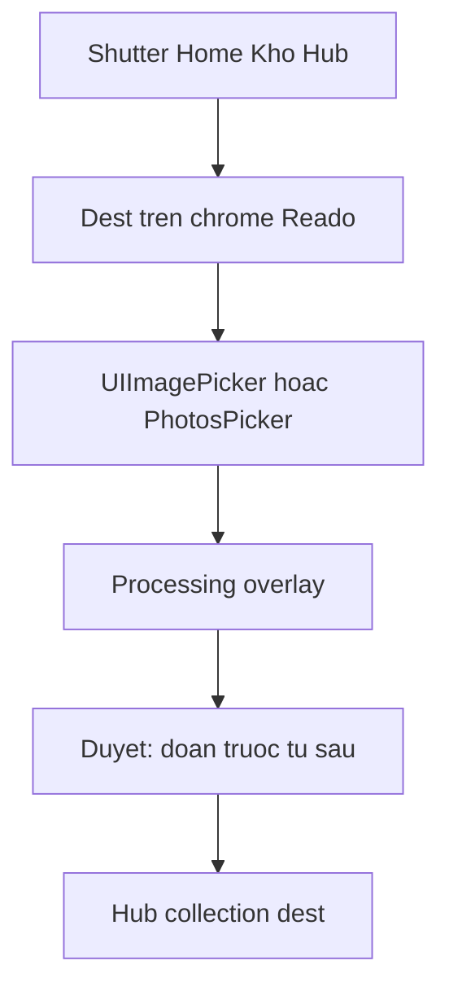

# Port UI lab → SwiftUI (full IA)

**Nguồn UI:** [implementation/ui-lab/index.html](implementation/ui-lab/index.html) (đã QR về máy). **Nguồn data/FSRS:** [docs/db.md](docs/db.md) + code trong [app/Reado](app/Reado). **Không** port `web/` (tech-stack 8.1). **Không** viết viewfinder custom (tech-stack 8.2 đã chốt `UIImagePicker` / `PhotosUI`).

App đã có walking skeleton: SQLite, `swift-fsrs` `defaultWv6`, mock FR-02, FR-18 `outsideDue`, undo. Việc này **đổi lớp IA + visual + vài rule chủ (dest, pin, CEFR, màn sau Lưu)** — không viết lại engine.

---

## 1. Impact business / docs (đọc trước khi code)

Chủ đã chốt trên lab **lệch giấy**. Implement theo lab; ghi lệch vào đầu PR / commit, **không** im lặng đảo PRD.

| Chốt lab (2026-09-23) | Giấy hiện tại | Làm gì trên iOS |
|---|---|---|
| Tab **Home / Ôn / Kho** | Tab Home / Đọc / Ôn | Đổi tên + thứ tự tab. Tab Ôn giữ `ReviewView` |
| Shutter nổi, không tab Chụp | Home có CTA "Chụp trang" to | Bỏ CTA to. NFR-08: Home → shutter = 1 tap → camera hệ thống |
| Lưu → **Hub bộ vừa chọn** | `confirmPicker` J1 → Home, J2 → Hub | **Luôn** `.hub(target)`, kể cả kho tạm. Luôn `prepend` session (J1 cũ không tạo session) |
| Dest trên **màn chụp**, không chọn lại lúc duyệt | Dest ẩn / `beginCapture` | Overlay dest trên camera hệ thống + chip trên preview |
| Không đụng dest → kho tạm | Đúng FR-01 | Giữ. Hub shutter prefill `hubId` |
| Đọc/dịch **trước**, từ phụ | J1: đừng bắt ở lại đọc dịch | Làm theo chủ. Journeys J1 phải vá sau |
| CEFR **nhiều** (A, B1, B2, C1, C2) | FR-15 một `cefr_level` A2–C1 | Cột JSON `cefr_levels`. Mock analysis: preselect item nếu `item.cefr` ∈ set |
| Pin Home **5**, kho tạm không tính | FR-17 / schema **2** cột | `home_pin_ids` TEXT JSON, max 5. Đừng thêm shortcut_3..5 |
| Ôn nhanh 1–3 collection trên Kho | Review chips trên màn Ôn | Cả hai: default scope lưu settings; màn Ôn đổi session. **Giữ dòng FR-18** `outsideDue` (lab thiếu, app đã có — không được xoá) |
| Settings: `daily_new_limit` + `day_cutoff_hour` | Limit đã có; cutoff trong schema | Mở cả hai. **Không** port `maximum_interval` / 21 trọng số / nút reset FSRS |
| `request_retention` hiện trên lab | PRD R1 **không mở** | **Không port.** Để 0.9 trong DB |
| 4 theme chấm màu | Light/dark + blur | Accent 4 màu (Rừng `#2F6B4F` mặc định). Bỏ liquid-glass xanh `#007AFF` của [design-system/reado/MASTER.md](design-system/reado/MASTER.md) — file đó **cũ hơn lab** |
| BYOK dropdown + float | Settings chưa có FR-21 | UI + Keychain stub; **không** gọi OpenAI. Proxy vẫn mock |

**Không impact M-07 nếu:** vòng chụp vẫn 1–3 tap, Lưu không đẩy ra Kho chung, analysis mock ghi rõ. **Có risk M-07 nếu:** làm custom Camera 3 tuần, hoặc Settings FSRS/theme trước khi dest+Hub chạy.

**Không làm trong plan này:** proxy Gemini thật, A-01/A-02, crop library custom, APNs, sync.

---

## 2. Visual + mượt (công thức, không trang trí)

Mục tiêu: **iOS grouped native**, không clone HTML. Lab = layout + IA; Swift = SF Symbol, `List`/`Form`, Dynamic Type, 44pt.

**Tokens** — thay [app/Reado/DesignSystem/Theme.swift](app/Reado/DesignSystem/Theme.swift):

- Accent mặc định `#2F6B4F`; 3 accent còn lại lab: `#2B6B8A`, `#6B4F72`, `#1C1C1E`
- Ink `#1C1C1E`, bg `#F2F2F7`, card trắng, hairline `#C6C6C8`, due `#FF9F0A`
- Font: SF Pro (không Inter). Term ôn: `.largeTitle.bold()`
- Corner: grouped 12, card collection 14, shutter 64 concentric **chỉ** nút nổi Reado; shutter máy ảnh = hệ thống
- `AccentColor` trong asset catalog = rừng
- Xoá `ReadoBackground` gradient blob (liquid-glass). Dùng `Color(.systemGroupedBackground)`

**Motion (mặc định tinh, `accessibilityReduceMotion` = 0):**

- Spring: `response: 0.32, dampingFraction: 0.86` cho sheet dest, expand từ, lật thẻ
- Shutter: `scaleEffect` 0.92 → 1, haptic `.impact(.medium)` lúc chụp, `.selection` lúc đổi dest
- Lật thẻ: `rotation3DEffect` axis Y, không stack 3D giả Anki
- Tab switch: system `TabView` iOS 18, không custom matchedGeometry toàn app
- Overlay processing: `ProgressView` + copy 1 dòng, không spinner HTML
- Toast: đã có; để capsule top, auto-dismiss 2s

**Touch / a11y (lab đang fail):**

- Checkbox duyệt từ **44×44** (lab 24px)
- Pill Ghim / Ôn nhanh: `minHeight: 36`, hit 44
- Mọi icon `frame(44)`
- `.accessibilityLabel` shutter, dest, grades tiếng Việt
- Dynamic Type: đừng `.font(.system(size: 28))` cứng cho đoạn đọc — dùng `.title2` / `.body`

---

## 3. Chrome: tab + shutter

Sửa [app/Reado/Navigation/AppShell.swift](app/Reado/Navigation/AppShell.swift):

- `AppTab`: `home | review | kho` (đổi `read` → `kho`)
- Labels: `house` / `brain` / `archivebox` (SF Symbol, không SVG lab)
- `TabView` + **overlay** `FloatShutter` `safeAreaInset` / `ZStack` bottom ~84pt trên tab, **chỉ** khi stack đang Home root, Kho root, hoặc Hub (không Ôn, không Settings, không picker, không session đọc)
- Shutter **không** `toolbar(.hidden)` trên Capture — Capture vẫn full-screen; tab ẩn như hiện tại lúc `.capture` / `.vocab` / `.session`
- Home: bỏ `PrimaryButton("Chụp trang")` và nút "Đọc chủ động"
- Data: giữ icon `tray` trên Home nav (không tab 4)

`openCapture()`:

- Từ Hub: `captureTargetId = hubId`
- Từ Home/Kho: `captureTargetId = inbox.id` trừ khi user đã chọn trên overlay
- `path.append(.capture(...))` rồi **ngay** present camera (xem mục 4)

---

## 4. Capture — dest + camera hệ thống (không clone Apple)

Không vẽ lưới 3×3 / shutter trắng. Dùng `UIImagePickerController` + `cameraOverlayView`:

1. Thanh dest (tên bộ + `+`) **overlay** trên camera hệ thống
2. `+` → sheet tạo tên (`.sheet`, không `alert`)
3. Tap tên → sheet list collection, radio, kho tạm ghi “mặc định”
4. Hủy camera → dismiss Capture, dest quên
5. Ảnh xong → preview crop/xoay (FR-01, code đã có) + chip dest vẫn sửa được + "Phân tích"
6. Library: `PhotosPicker` từ overlay trái (lab thumbnail)

Files: [CaptureView.swift](app/Reado/Features/Capture/CaptureView.swift) — `CameraPicker` thêm `overlay`. Đừng AVFoundation session.

Processing: giữ overlay hiện tại; copy “OCR + dịch + vocab · mock”.

---

## 5. Duyệt từ — thứ tự chủ, dest chỉ đọc

[VocabPickerView.swift](app/Reado/Features/Vocab/VocabPickerView.swift):

1. Nav: Đóng (về preview/camera) · title · **Lưu (n)**
2. Một dòng: `Lưu vào «{name}». Đổi bộ lúc chụp.`
3. **Bản gốc:** `ForEach(analysisSegments)` — EN luôn; VI tap đoạn hoặc nút `dịch` (opacity ~0.45, accent khi mở). State `Set<Int>` local
4. **Từ vựng:** Chọn tất cả / Bỏ chọn · `Đã chọn n/m` · hàng 44pt check · pos + cefr pill · meaning · expand editor
5. Preselect: `verified && cefr ∈ settings.cefrLevels` (unverified vẫn không preselect — FR-02)
6. **Ý chính:** `analysisSummary`
7. `confirmPicker` luôn session + `.hub(id)`

---

## 6. Home / Kho / Hub / Đọc phiên

**Home** [HomeView.swift](app/Reado/Features/Home/HomeView.swift): một group trên cùng Ôn (scope title + due) → Kho tạm → Streak (nhỏ hơn ôn, không cam át CTA). Dưới: `Đang đọc · k/5`. Pin không đẩy 3 hàng trên.

**Kho** (đổi [CollectionsView.swift](app/Reado/Features/Collections/CollectionsView.swift)): hàng Ôn nhanh “Tất cả kho”; mỗi thẻ pill Ôn (max 3) + Ghim (max 5, ẩn trên inbox). `+` nav = sheet tạo. Không CTA Chụp trên thẻ.

**Hub:** bỏ "Chụp thêm phiên". Shutter overlay. Giữ Ôn bộ này (session scope). List 10 session. Ghim.

**Session đọc** [SessionDetailView.swift](app/Reado/Features/Session/SessionDetailView.swift): cùng tap-to-reveal đoạn như picker (component dùng chung `SegmentBlock`).

Scope ôn: persist `review_priority_ids` JSON + `review_all` bool trên `settings`. Tab Ôn đọc default đó. Title màn Ôn vẫn đổi live (lab).

---

## 7. Ôn / Settings / Streak / Data

**Ôn:** giữ FR-18 `outsideDue` (footnote, không badge hét). Grade: một hàng 4 nút Quên/Khó/Được/Dễ (lab), haptic. Mặt trước chỉ term+pos. Bỏ English Again/Good layout 2×2. Undo giữ.

**Settings Form:**

- Giao diện: 4 `theme-dot`
- Agent: `Picker` + sheet thêm/sửa/xoá; proxy không xoá; key `kSecClassGenericPassword` id = agent id; **không** persist key SQLite
- Học tập: CEFR chip multi (min 1); `daily_new_limit` 1–99 onSubmit không nút Lưu rác; `day_cutoff_hour` Stepper 0–23 hiện `04:00`
- Nhắc: toggle local notification stub (chưa APNs)
- **Không** section “Khoảng cách tối đa”, không 21 w, không reset FSRS
- Gỡ pin list khỏi Settings (đã ở Kho)
- Gỡ nút Lưu trên nav Settings (autosave)

**Streak / Data:** restyle grouped; logic giữ. Streak ranked collection = query `review_logs` group by collection (app streak service đã có số; bổ sung rank nếu thiếu).

---

## 8. Schema / store (nhỏ, có test)

[Schema.swift](app/Reado/Persistence/Schema.swift) + migrate:

- `settings.cefr_levels` TEXT JSON default `["B2"]` (giữ `cefr_level` một field sync = join, hoặc deprecate sau)
- `settings.home_pin_ids` TEXT JSON default `[]` (migrate từ shortcut_1/2)
- `settings.review_priority_ids` TEXT JSON; `review_all` INTEGER default 0
- `analysis_agents` như [docs/db.md](docs/db.md) A.2 — metadata only
- `active_agent_id` nếu chưa có

[AppStore.swift](app/Reado/Store/AppStore.swift): `togglePin` max 5; `togglePriority` max 3; `confirmPicker` luôn hub+session; `analyzePreview` nhận `[String]` levels.

Cập nhật test [ReadoTests.swift](app/ReadoTests/ReadoTests.swift): pin 6th fails; CEFR multi preselect; confirmPicker dest hub inbox; dailyNewLimit không đổi.

`xcodegen generate` sau khi thêm file.

---

## 9. Component tách (tránh View 500 dòng)

Trong `DesignSystem/`:

- `FloatShutter`, `DestChip`, `SegmentBlock`, `LevelChips`, `CollectionCard`, `ThemeDots`
- `#Preview` Light/Dark mỗi màn chính

Giữ `@Observable AppStore` — không MVVM class mới.

---

## 10. Thứ tự làm (để máy nhà implement)

Làm xong bước n mới n+1. Mỗi bước build Simulator iPhone 16.

1. Theme tokens + grouped bg + AccentColor — app vẫn chạy
2. AppShell tabs + FloatShutter + Home layout (chưa dest)
3. Kho pills + Hub bỏ CTA chụp + pin 5 schema
4. Capture overlay dest + create sheet + PhotosPicker
5. VocabPicker layout + `confirmPicker` luôn Hub + session inbox
6. SegmentBlock trên picker + session
7. Settings CEFR multi, cutoff, agents Keychain stub, gỡ FSRS/pin
8. Review 4 nút VI + title picker; **giữ outsideDue**
9. Streak/Data restyle + motion/haptic/44pt pass
10. Tests + `#Preview` + chạy `xcodebuild test`

**Definition of done (một buổi sách):** Home shutter → (không chọn dest) chụp → đọc đoạn/dịch → tick từ → Lưu → Hub kho tạm. Lặp từ Hub *một sách* → dest sẵn tên sách → Lưu về đúng hub. Ôn tab thấy due. Pin 5 được, 6 không.

---

## 11. Cố ý không port từ lab

- Khung điện thoại HTML, chip lab-bar
- Lưới Camera Apple, shutter trắng trong tab
- `maximum_interval`, reset FSRS, 21 trọng số
- `alert()` iOS — dùng `.alert` / sheet
- SVG path lab — SF Symbols
- Analysis “thật” / baseline prompt

---

## File đụng chính

- [app/Reado/Navigation/AppShell.swift](app/Reado/Navigation/AppShell.swift)
- [app/Reado/DesignSystem/Theme.swift](app/Reado/DesignSystem/Theme.swift)
- [app/Reado/Features/Home/HomeView.swift](app/Reado/Features/Home/HomeView.swift)
- [app/Reado/Features/Capture/CaptureView.swift](app/Reado/Features/Capture/CaptureView.swift)
- [app/Reado/Features/Vocab/VocabPickerView.swift](app/Reado/Features/Vocab/VocabPickerView.swift)
- [app/Reado/Features/Collections/CollectionsView.swift](app/Reado/Features/Collections/CollectionsView.swift)
- [app/Reado/Features/Review/ReviewView.swift](app/Reado/Features/Review/ReviewView.swift)
- [app/Reado/Features/Settings/SettingsView.swift](app/Reado/Features/Settings/SettingsView.swift)
- [app/Reado/Store/AppStore.swift](app/Reado/Store/AppStore.swift)
- [app/Reado/Persistence/Schema.swift](app/Reado/Persistence/Schema.swift) / Records / AppDatabase
- [app/ReadoTests/ReadoTests.swift](app/ReadoTests/ReadoTests.swift)

Đối chiếu mắt: lab HTML cạnh Simulator, không pixel-match.
